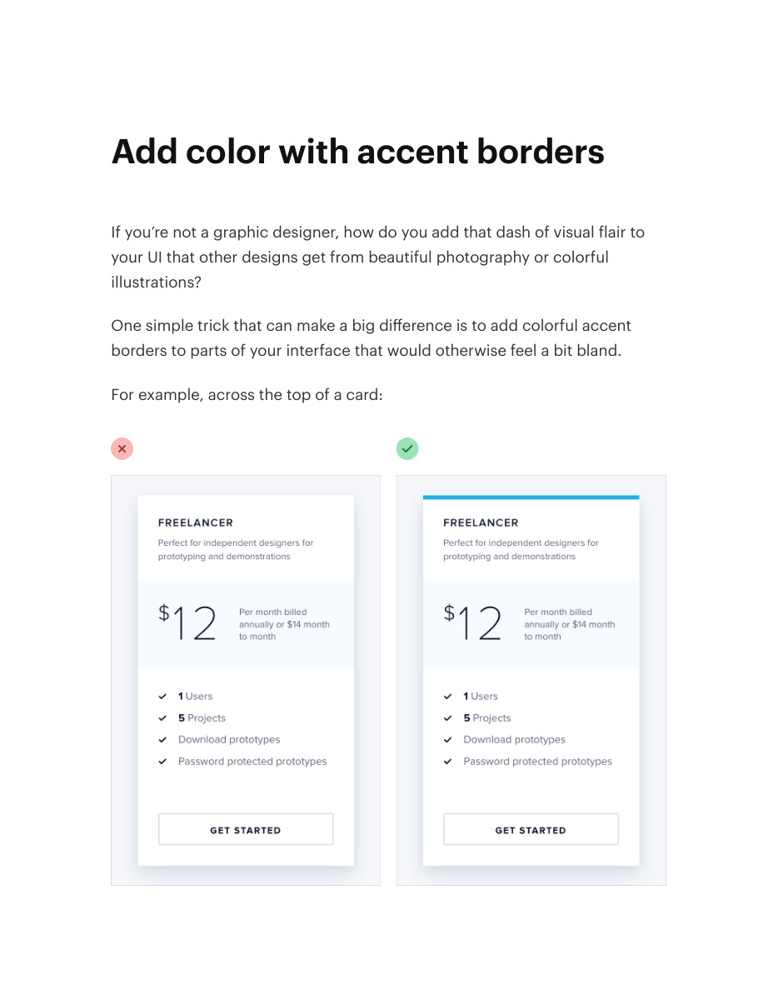
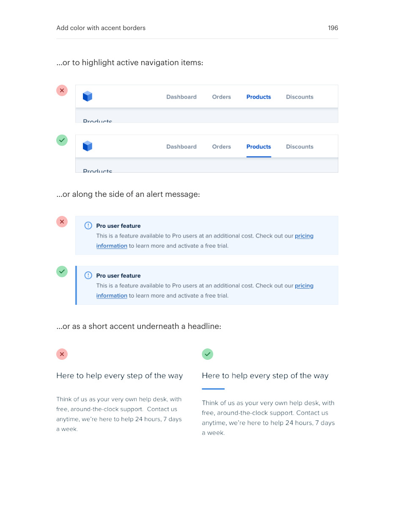
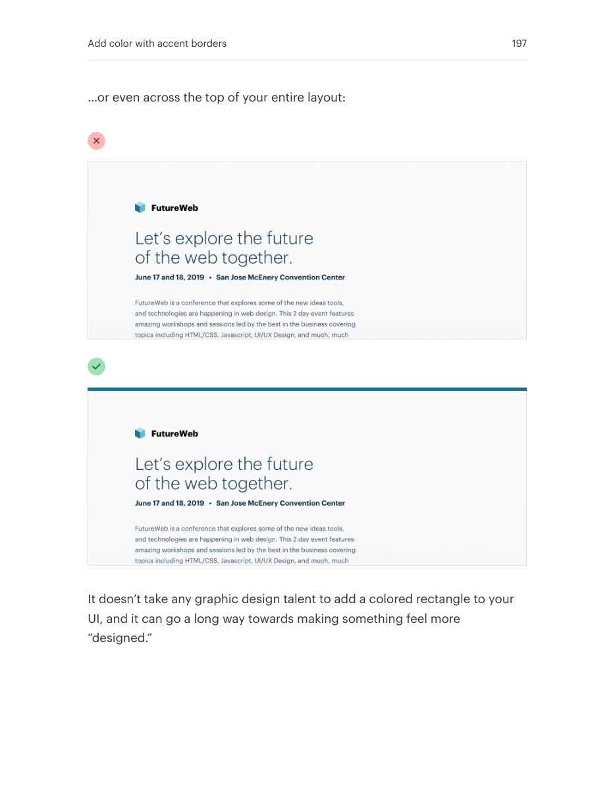

# Add restrained color with accent borders

## Apply this

- If a panel needs identity without a full color fill, add a selective accent border.
- Use a consistent edge treatment for highlighted cards, messages, or active states.
- Check emphasis against nearby elements and include non-color cues when the border conveys status.

## Source

Source: `Refactoring UI v1.0.2.pdf`, version 1.0.2, PDF pages 195–197.
Apply this is new guidance; the source blocks below preserve the supplied pypdf extraction verbatim.
Page images preserve the original visual content, including text absent from extraction.

### Source outline

- Add color with accent borders (source page 195)

## Source pages

### Source page 195



```text
Add color with accent borders
If you’re not a graphic designer, how do you add that dash of visual flair to
your UI that other designs get from beautiful photography or colorful
illustrations?
One simple trick that can make a big difference is to add colorful accent
borders to parts of your interface that would otherwise feel a bit bland.
For example, across the top of a card:

```

### Source page 196



```text
…or to highlight active navigation items:
…or along the side of an alert message:
…or as a short accent underneath a headline:
Add color with accent borders 196
```

### Source page 197



```text
…or even across the top of your entire layout:
It doesn’t take any graphic design talent to add a colored rectangle to your
UI, and it can go a long way towards making something feel more
“designed.”
Add color with accent borders 197
```
