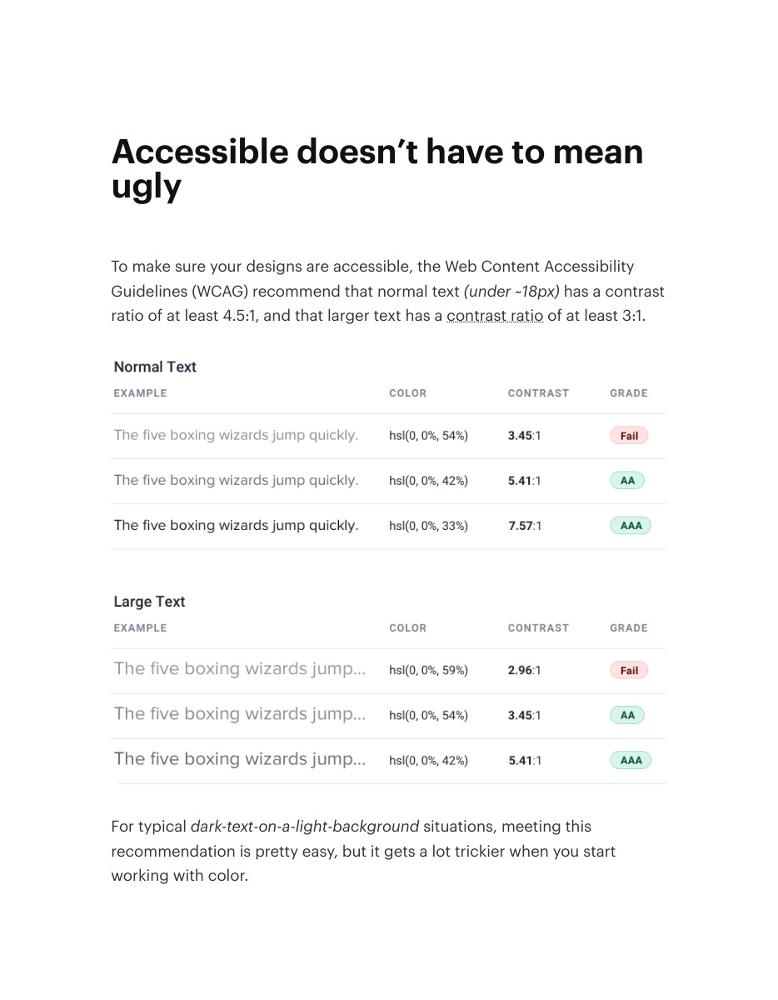
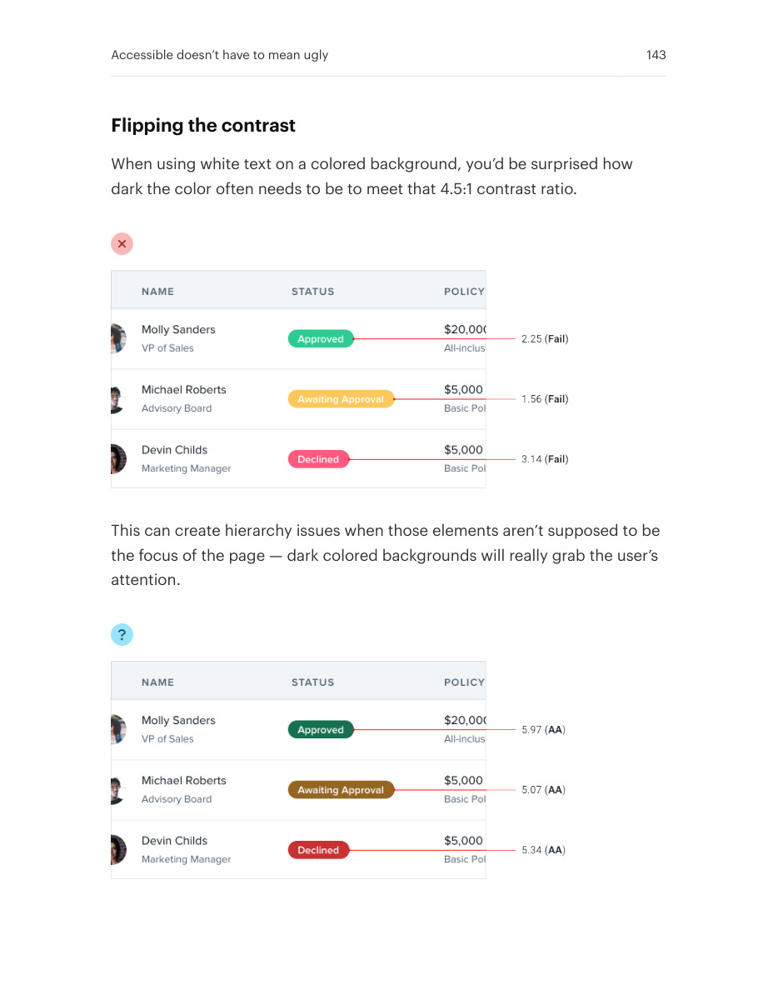
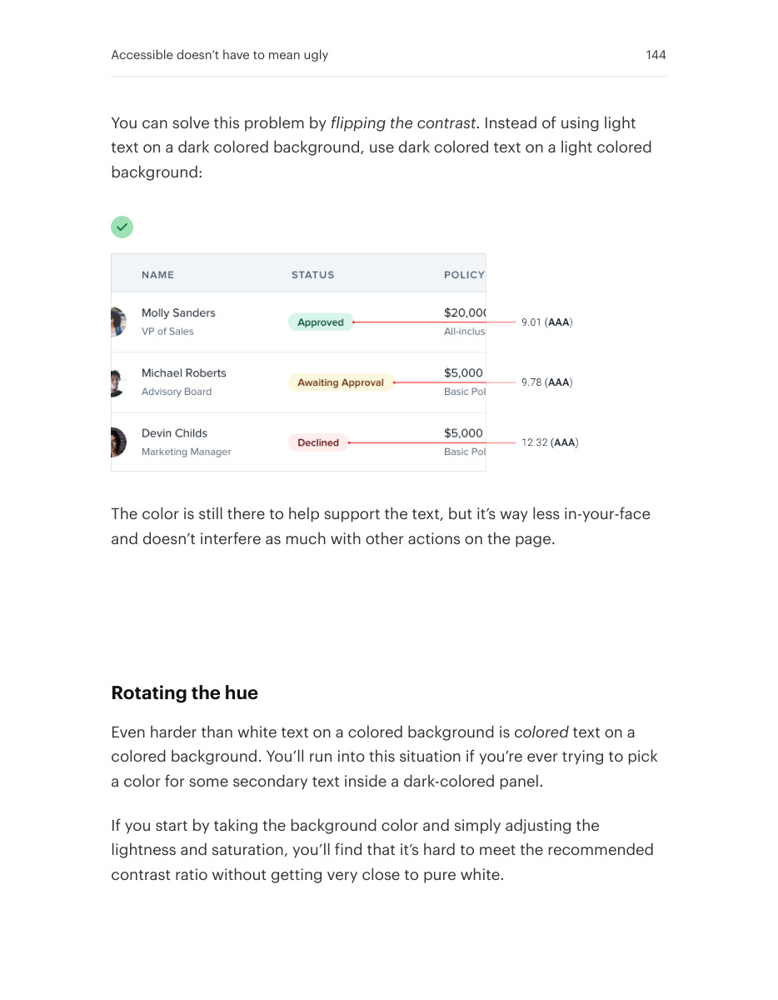
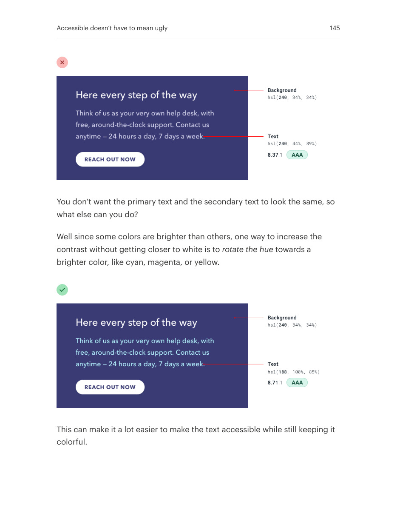

# Keep color accessible without flattening the design

## Apply this

- If a desired color pair fails contrast, rethink foreground/background roles.
- Try a light tinted surface with dark text or adjust the hue instead of merely darkening everything.
- Measure actual contrast for the content and state; visual appeal does not waive readability requirements.
- Apply current [WCAG 2.2 contrast requirements](https://www.w3.org/TR/WCAG22/#contrast-minimum): 4.5:1 for normal text; 3:1 only for large text of at least 18pt (24 CSS px), or 14pt bold (about 18.67 CSS px). The source's approximate 18px cutoff is not correct for regular-weight text.

## Source

Source: `Refactoring UI v1.0.2.pdf`, version 1.0.2, PDF pages 142–145.
Apply this is new guidance; the source blocks below preserve the supplied pypdf extraction verbatim.
Page images preserve the original visual content, including text absent from extraction.

### Source outline

- Accessible doesn’t have to mean ugly (source page 142)
  - Flipping the contrast (source page 143)
  - Rotating the hue (source page 144)

## Source pages

### Source page 142



```text
Accessible doesn’t have to mean
ugly
To make sure your designs are accessible, the Web Content Accessibility
Guidelines (WCAG) recommend that normal text(under ~18px) has a contrast
ratio of at least 4.5:1, and that larger text has acontrast ratioof at least 3:1.
For typicaldark-text-on-a-light-background situations, meeting this
recommendation is pretty easy, but it gets a lot trickier when you start
working with color.
```

### Source page 143



```text
Flipping the contrast
When using white text on a colored background, you’d be surprised how
dark the color often needs to be to meet that 4.5:1 contrast ratio.
This can create hierarchy issues when those elements aren’t supposed to be
the focus of the page — dark colored backgrounds will really grab the user’s
attention.
Accessible doesn’t have to mean ugly 143
```

### Source page 144



```text
You can solve this problem byflipping the contrast. Instead of using light
text on a dark colored background, use dark colored text on a light colored
background:
The color is still there to help support the text, but it’s way less in-your-face
and doesn’t interfere as much with other actions on the page.
Rotating the hue
Even harder than white text on a colored background iscolored text on a
colored background. You’ll run into this situation if you’re ever trying to pick
a color for some secondary text inside a dark-colored panel.
If you start by taking the background color and simply adjusting the
lightness and saturation, you’ll find that it’s hard to meet the recommended
contrast ratio without getting very close to pure white.
Accessible doesn’t have to mean ugly 144
```

### Source page 145



```text
You don’t want the primary text and the secondary text to look the same, so
what else can you do?
Well since some colors are brighter than others, one way to increase the
contrast without getting closer to white is torotate the hue towards a
brighter color, like cyan, magenta, or yellow.
This can make it a lot easier to make the text accessible while still keeping it
colorful.
Accessible doesn’t have to mean ugly 145
```
