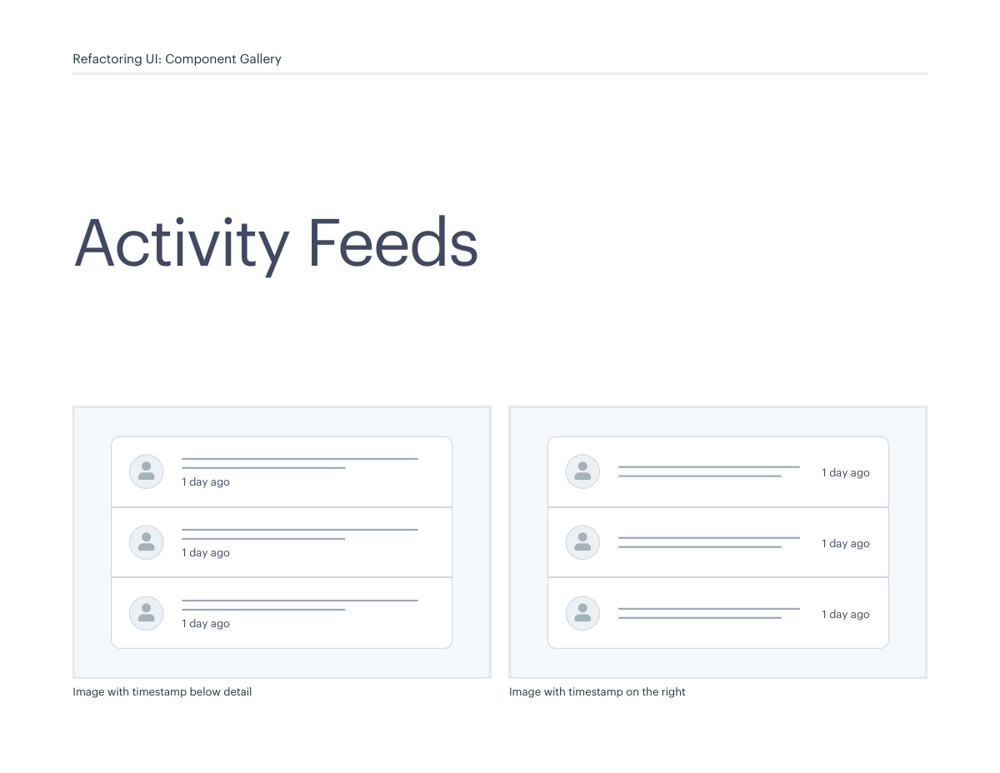
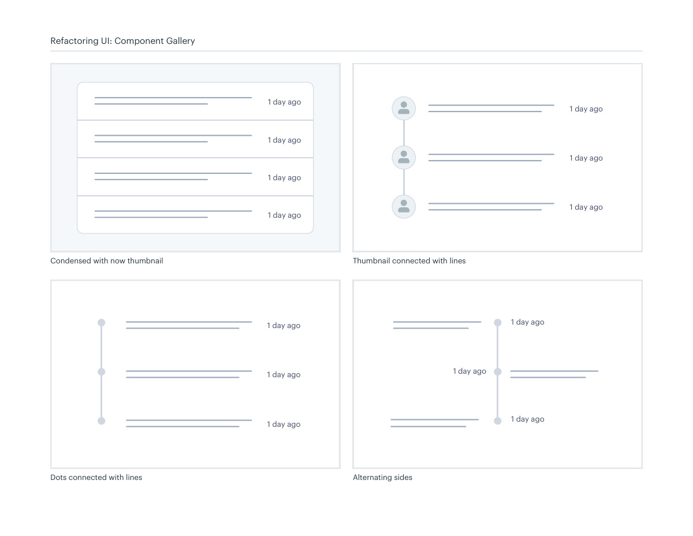

# Activity feed layouts

## Apply this

- If an event stream is hard to follow, prioritize event meaning and chronological cues.
- Compare compact rows, thumbnails, timestamps, and connected timeline markers.
- Check long events and repeated times; decorative connectors must not be the only ordering cue.

## Source

Source: `Component Gallery v1.1.0.pdf`, version 1.1.0, PDF pages 80–81.
Apply this is new guidance; the source blocks below preserve the supplied pypdf extraction verbatim.
Page images preserve the original visual content, including text absent from extraction.

## Source pages

### Source page 80



```text
Image with timestamp below detail Image with timestamp on the right
Activity Feeds
Refactoring UI: Component Gallery
1 day ago
1 day ago
1 day ago
1 day ago
1 day ago
1 day ago
```

### Source page 81



```text
Condensed with now thumbnail Thumbnail connected with lines
Dots connected with lines Alternating sides
1 day ago
1 day ago
1 day ago
1 day ago
1 day ago
1 day ago
1 day ago
1 day ago
1 day ago
1 day ago
1 day ago
1 day ago
1 day ago
Refactoring UI: Component Gallery
```
