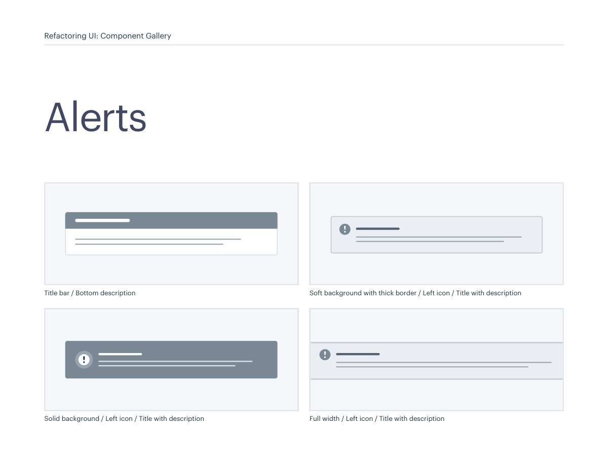
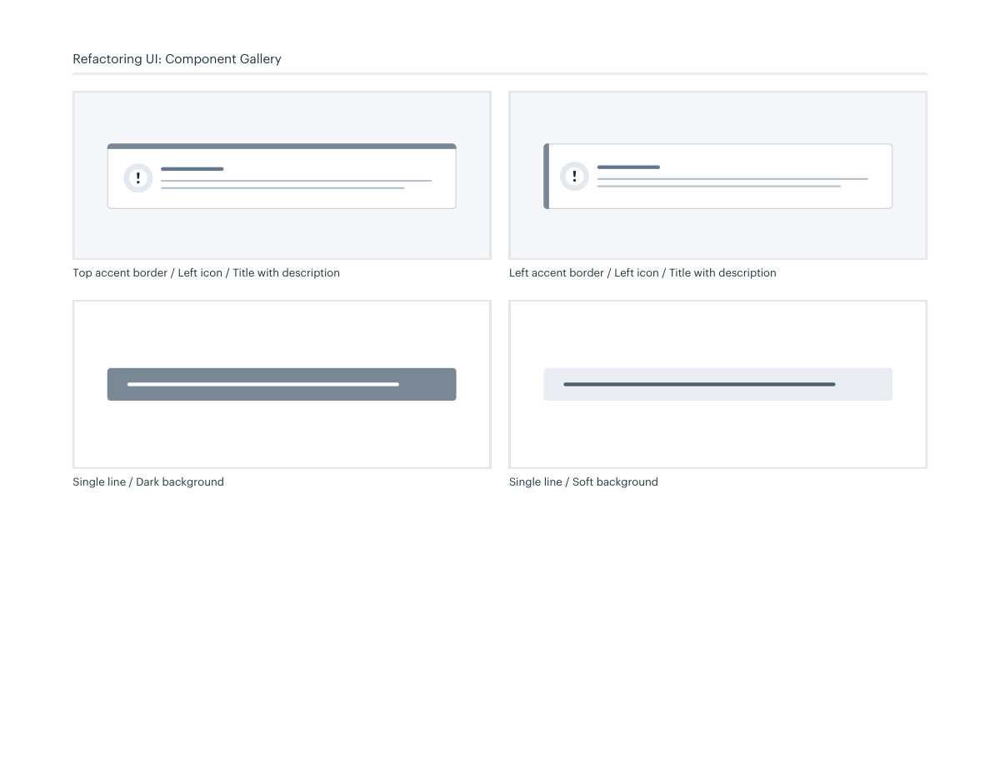

# Alert surface patterns

## Apply this

- If messages compete equally with content, rank their urgency and persistence.
- Choose a quiet fill or accent edge and pair the message with a relevant icon and clear text.
- Verify announcement behavior and dismissibility; reserve interruptive treatment for genuinely urgent information.

## Source

Source: `Component Gallery v1.1.0.pdf`, version 1.1.0, PDF pages 42–43.
Apply this is new guidance; the source blocks below preserve the supplied pypdf extraction verbatim.
Page images preserve the original visual content, including text absent from extraction.

## Source pages

### Source page 42



```text
Title bar / Bottom description Soft background with thick border / Left icon / Title with description
Full width / Left icon / Title with descriptionSolid background / Left icon / Title with description
Alerts
Refactoring UI: Component Gallery
```

### Source page 43



```text
Top accent border / Left icon / Title with description Left accent border / Left icon / Title with description
Refactoring UI: Component Gallery
Single line / Dark background Single line / Soft background
```
