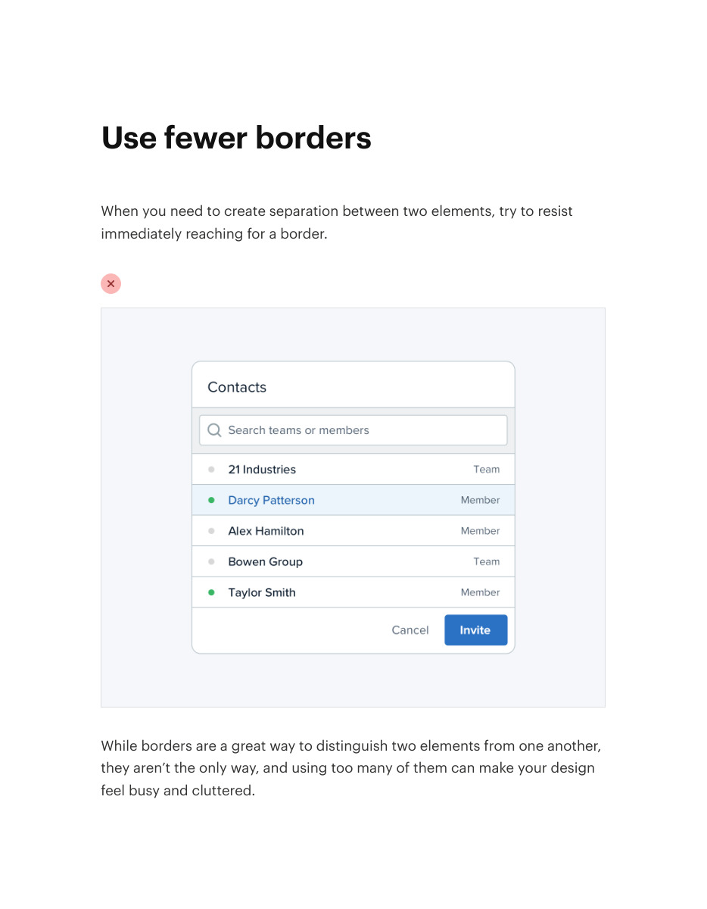
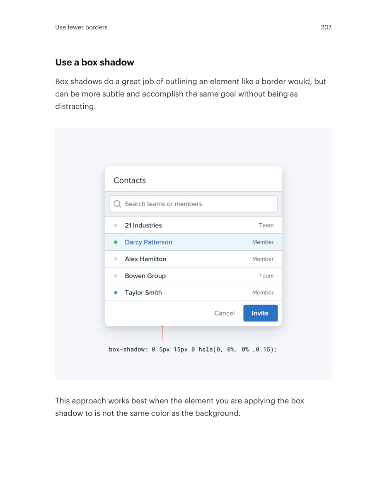
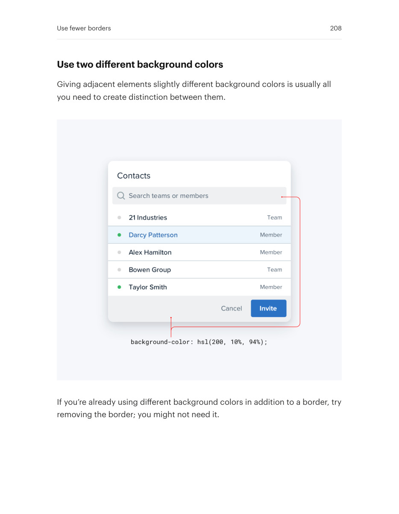
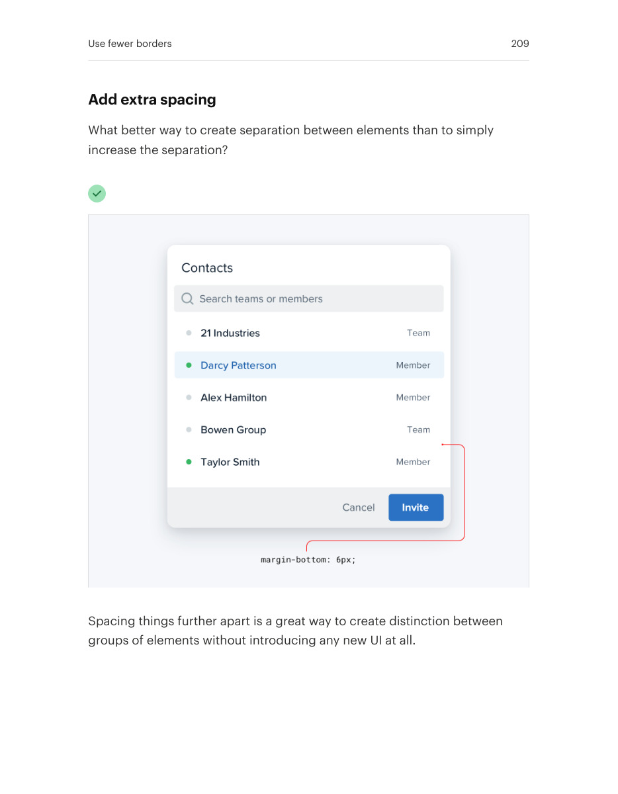

# Separate content with fewer borders

## Apply this

- If every region is boxed, remove redundant boundaries.
- Try whitespace, background contrast, or a subtle shadow to clarify groups.
- Keep borders when comparison or interaction needs them; verify the grouping still reads without the line.

## Source

Source: `Refactoring UI v1.0.2.pdf`, version 1.0.2, PDF pages 206–209.
Apply this is new guidance; the source blocks below preserve the supplied pypdf extraction verbatim.
Page images preserve the original visual content, including text absent from extraction.

### Source outline

- Use fewer borders (source page 206)
  - Use a box shadow (source page 207)
  - Use two different background colors (source page 208)
  - Add extra spacing (source page 209)

## Source pages

### Source page 206



```text
Use fewer borders
When you need to create separation between two elements, try to resist
immediately reaching for a border.
While borders are a great way to distinguish two elements from one another,
they aren’t the only way, and using too many of them can make your design
feel busy and cluttered.
```

### Source page 207



```text
Use a box shadow
Box shadows do a great job of outlining an element like a border would, but
can be more subtle and accomplish the same goal without being as
distracting.
This approach works best when the element you are applying the box
shadow to is not the same color as the background.
Use fewer borders 207
```

### Source page 208



```text
Use two different background colors
Giving adjacent elements slightly different background colors is usually all
you need to create distinction between them.
If you’re already using different background colors in addition to a border, try
removing the border; you might not need it.
Use fewer borders 208
```

### Source page 209



```text
Add extra spacing
What better way to create separation between elements than to simply
increase the separation?
Spacing things further apart is a great way to create distinction between
groups of elements without introducing any new UI at all.
Use fewer borders 209
```
