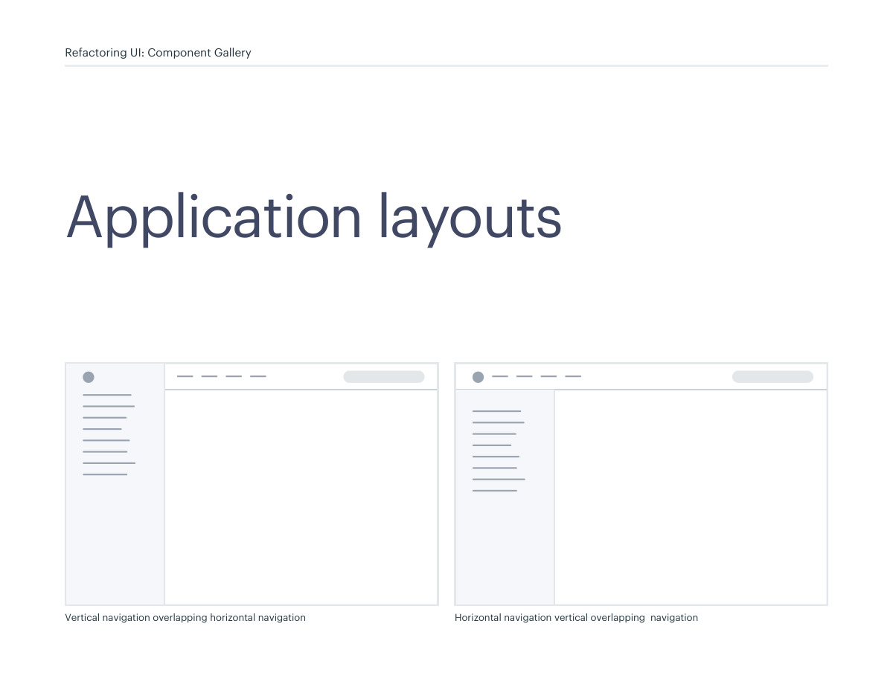
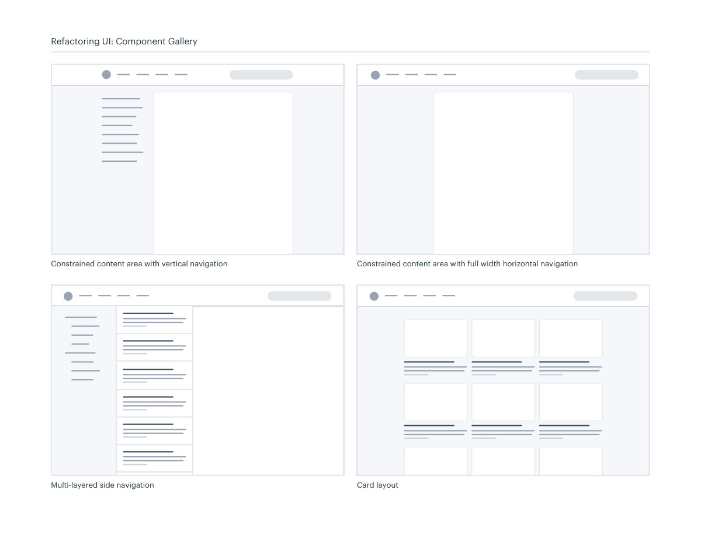
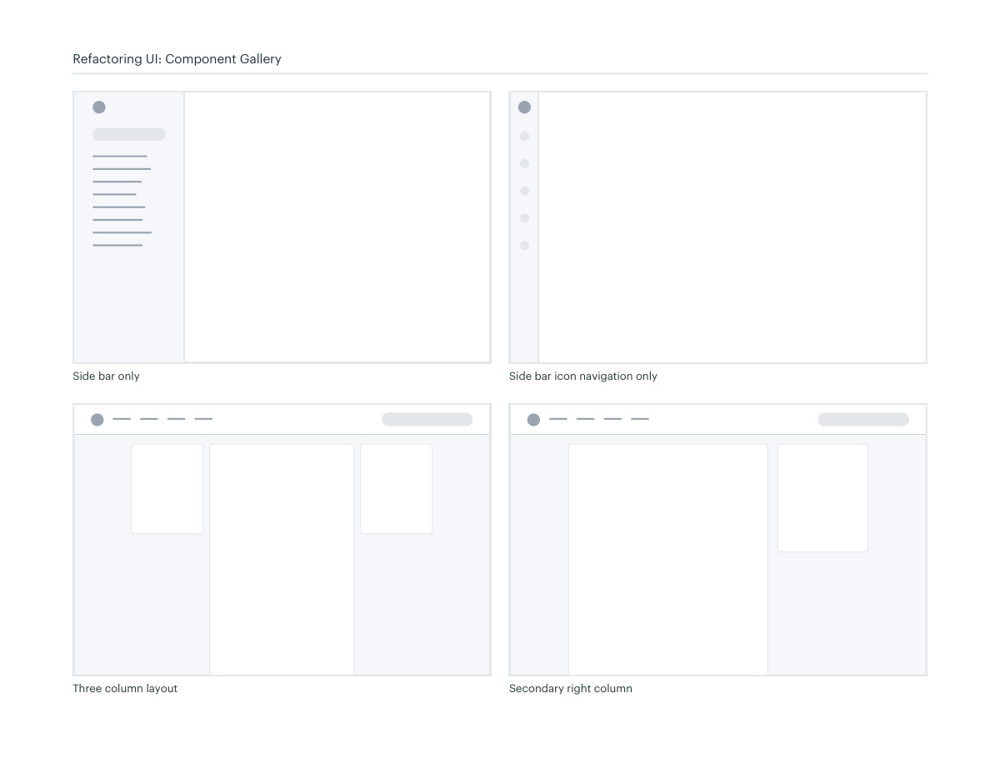

# Application shell layouts

## Apply this

- If application navigation crowds the work area, classify global, local, and supporting regions.
- Compare a sidebar, constrained content area, layered navigation, or a secondary column.
- Check task completion and responsive transitions; more panes are not automatically more productive.

## Source

Source: `Component Gallery v1.1.0.pdf`, version 1.1.0, PDF pages 72–75.
Apply this is new guidance; the source blocks below preserve the supplied pypdf extraction verbatim.
Page images preserve the original visual content, including text absent from extraction.

## Source pages

### Source page 72



```text
Vertical navigation overlapping horizontal navigation Horizontal navigation vertical overlapping  navigation
Application layouts
Refactoring UI: Component Gallery
```

### Source page 73



```text
Constrained content area with vertical navigation
Multi-layered side navigation
Constrained content area with full width horizontal navigation
Card layout
Refactoring UI: Component Gallery
```

### Source page 74



```text
Refactoring UI: Component Gallery
Side bar only
 Side bar icon navigation only
Three column layout
 Secondary right column
```

### Source page 75


```text

```
