# Article font pairings and reading texture

## Apply this

- If articles feel tiring, compare body texture with the heading and metadata treatments.
- Trial the displayed serif and sans-serif pairings at a realistic line length and body size.
- Check multi-paragraph reading, italics, glyph coverage, and current licensing before changing tokens.

## Source

Source: `Font Recommendations v1.0.1.pdf`, version 1.0.1, PDF pages 26–40.
Apply this is new guidance; the source blocks below preserve the supplied pypdf extraction verbatim.
Page images preserve the original visual content, including text absent from extraction.

## Source pages

### Source page 26

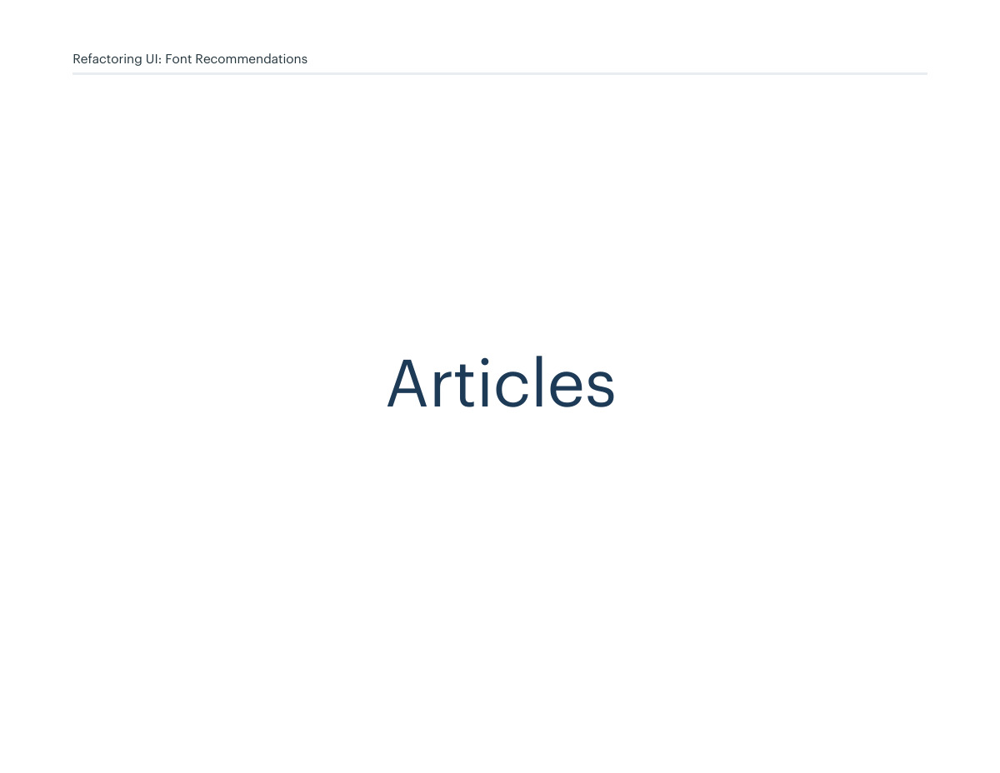

```text
Articles
Refactoring UI: Font Recommendations
```

### Source page 27

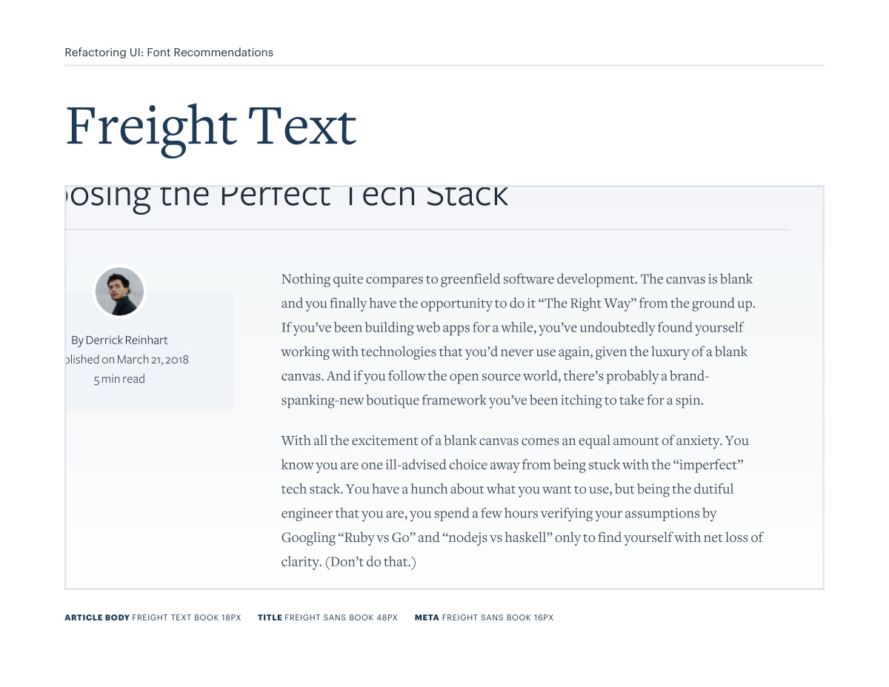

```text
Refactoring UI: Font Recommendations
ARTICLE BODY FREIGHT TEXT BOOK 18PX TITLE FREIGHT SANS BOOK 48PX META FREIGHT SANS BOOK 16PX 
```

### Source page 28

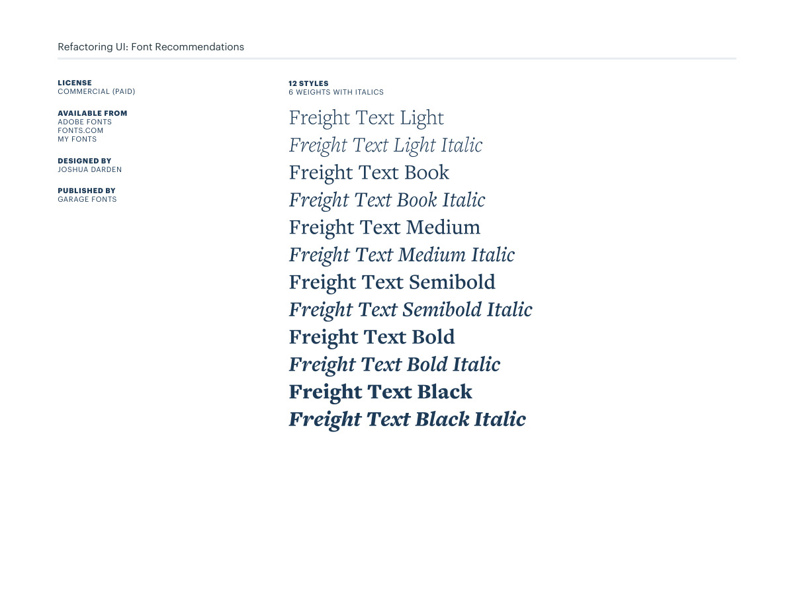

```text
Refactoring UI: Font Recommendations
12 STYLES
6 WEIGHTS WITH ITALICS
LICENSE
COMMERCIAL (PAID)
AVAILABLE FROM
ADOBE FONTS
FONTS.COM
MY FONTS
DESIGNED BY
JOSHUA DARDEN
PUBLISHED BY 
GARAGE FONTS
```

### Source page 29

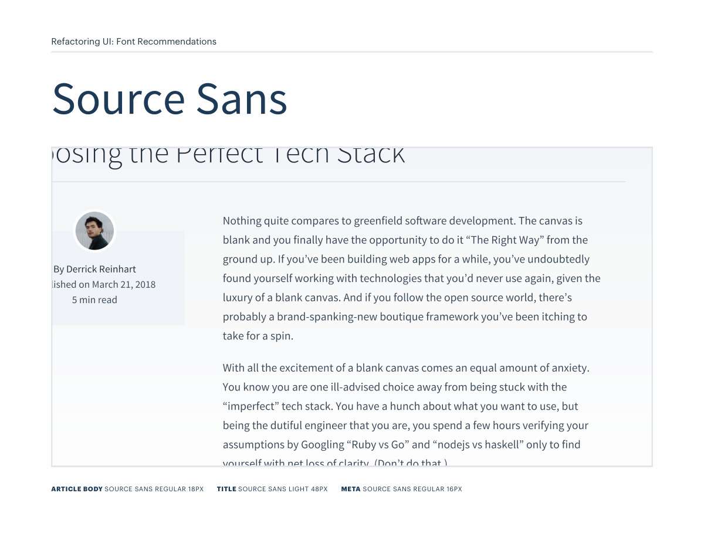

```text
Refactoring UI: Font Recommendations
ARTICLE BODY SOURCE SANS REGULAR 18PX TITLE SOURCE SANS LIGHT 48PX META SOURCE SANS REGULAR 16PX 
```

### Source page 30

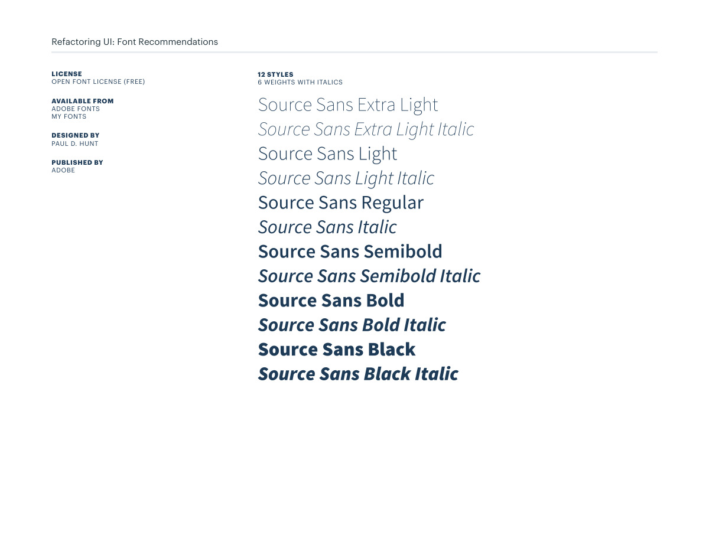

```text
Refactoring UI: Font Recommendations
12 STYLES
6 WEIGHTS WITH ITALICS
LICENSE
OPEN FONT LICENSE (FREE)
AVAILABLE FROM
ADOBE FONTS
MY FONTS
DESIGNED BY
PAUL D. HUNT
PUBLISHED BY 
ADOBE
```

### Source page 31

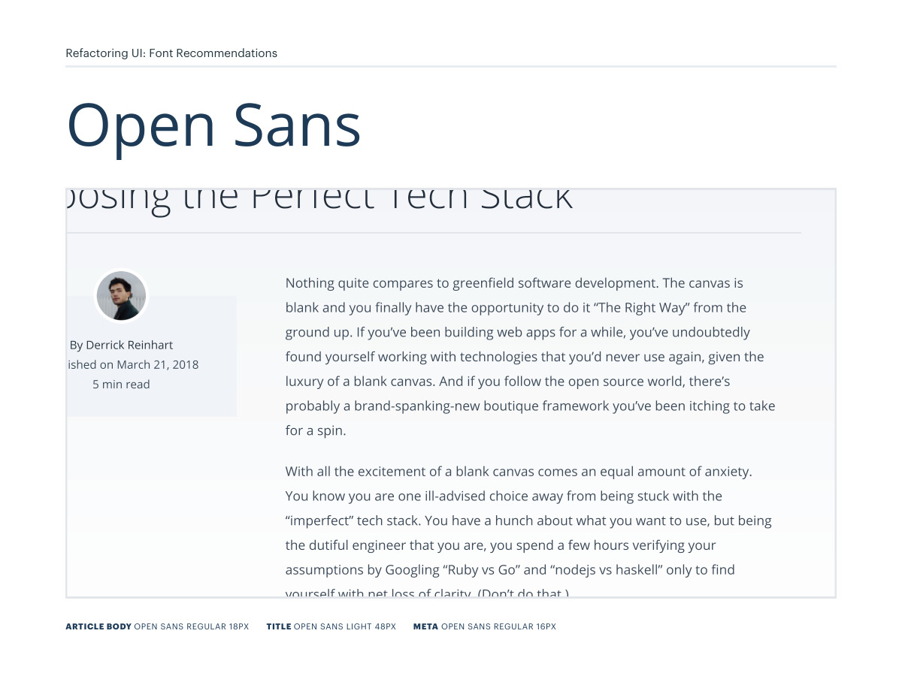

```text
Refactoring UI: Font Recommendations
ARTICLE BODY OPEN SANS REGULAR 18PX TITLE OPEN SANS LIGHT 48PX META OPEN SANS REGULAR 16PX 
```

### Source page 32

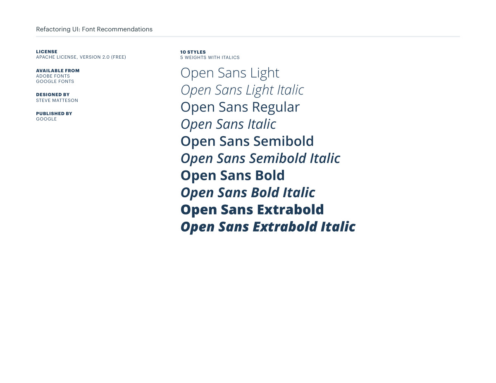

```text
Refactoring UI: Font Recommendations
10 STYLES
5 WEIGHTS WITH ITALICS
LICENSE
APACHE LICENSE, VERSION 2.0 (FREE)
AVAILABLE FROM
ADOBE FONTS
GOOGLE FONTS
DESIGNED BY
STEVE MATTESON
PUBLISHED BY 
GOOGLE
```

### Source page 33

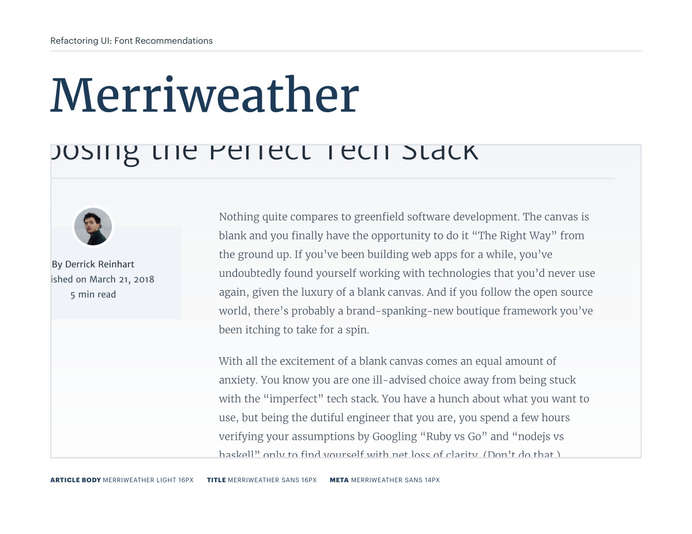

```text
Refactoring UI: Font Recommendations
ARTICLE BODY MERRIWEATHER LIGHT 16PX TITLE MERRIWEATHER SANS 16PX META MERRIWEATHER SANS 14PX
```

### Source page 34

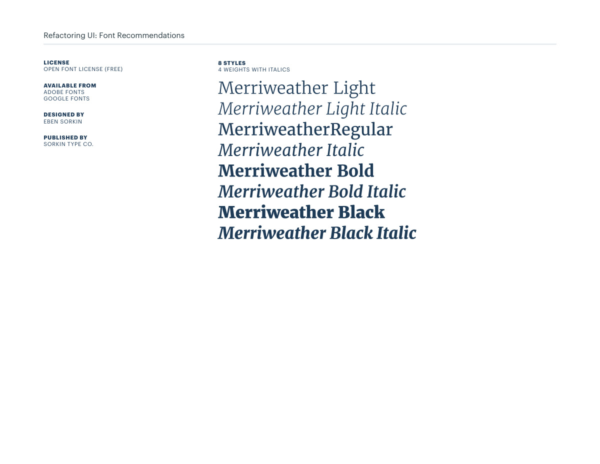

```text
Refactoring UI: Font Recommendations
8 STYLES
4 WEIGHTS WITH ITALICS
LICENSE
OPEN FONT LICENSE (FREE)
AVAILABLE FROM
ADOBE FONTS
GOOGLE FONTS
DESIGNED BY
EBEN SORKIN
PUBLISHED BY 
SORKIN TYPE CO.
```

### Source page 35

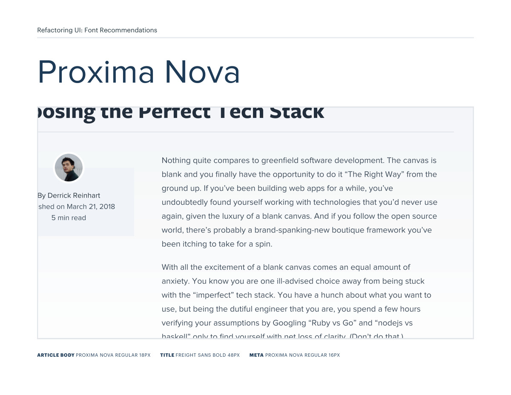

```text
Refactoring UI: Font Recommendations
ARTICLE BODY PROXIMA NOVA REGULAR 18PX TITLE FREIGHT SANS BOLD 48PX META PROXIMA NOVA REGULAR 16PX
```

### Source page 36


```text
Refactoring UI: Font Recommendations
LICENSE
COMMERCIAL (PAID)
AVAILABLE FROM
ADOBE FONTS
FONTS.COM
FONTSHOP
MY FONTS
DESIGNED BY
MARK SIMONSON
PUBLISHED BY 
MARK SIMONSON STUDIO
16 STYLES
8 WEIGHTS WITH ITALICS
```

### Source page 37

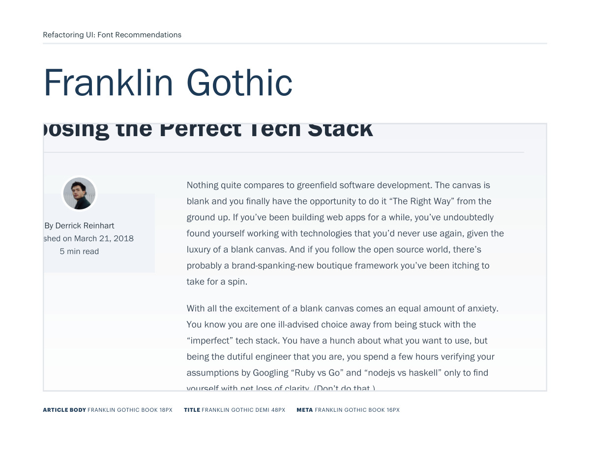

```text
Refactoring UI: Font Recommendations
ARTICLE BODY FRANKLIN GOTHIC BOOK 18PX TITLE FRANKLIN GOTHIC DEMI 48PX META FRANKLIN GOTHIC BOOK 16PX
```

### Source page 38

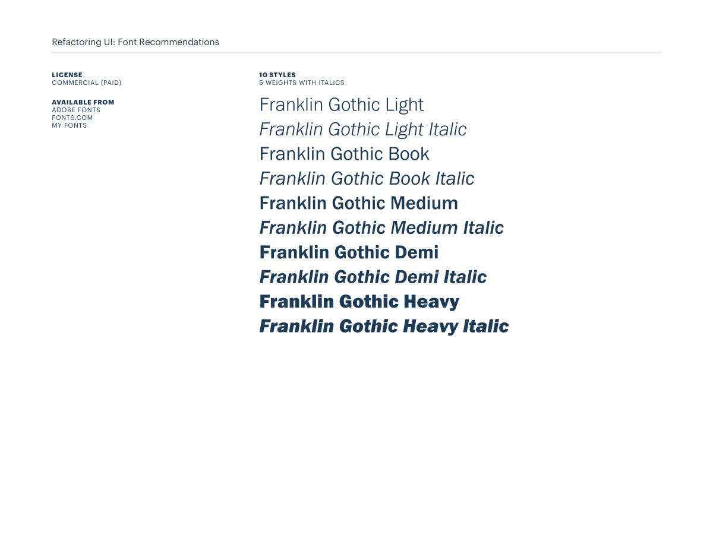

```text
Refactoring UI: Font Recommendations
LICENSE
COMMERCIAL (PAID)
AVAILABLE FROM
ADOBE FONTS
FONTS.COM
MY FONTS
10 STYLES
5 WEIGHTS WITH ITALICS
```

### Source page 39

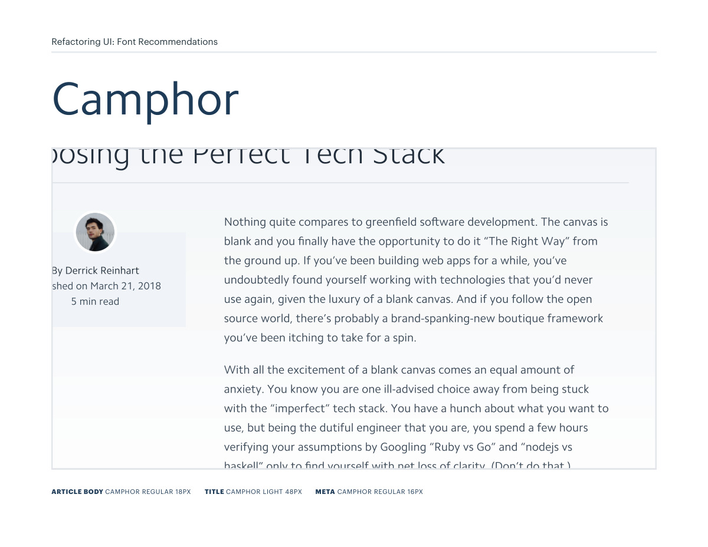

```text
Refactoring UI: Font Recommendations
ARTICLE BODY CAMPHOR REGULAR 18PX TITLE CAMPHOR LIGHT 48PX META CAMPHOR REGULAR 16PX
```

### Source page 40


```text
Refactoring UI: Font Recommendations
10 STYLES
5 WEIGHTS WITH ITALICS
LICENSE
COMMERCIAL (PAID)
AVAILABLE FROM
FONTS.COM
MY FONTS
FONT SHOP
DESIGNED BY
NICK JOB
PUBLISHED BY 
MONOTYPE
```
