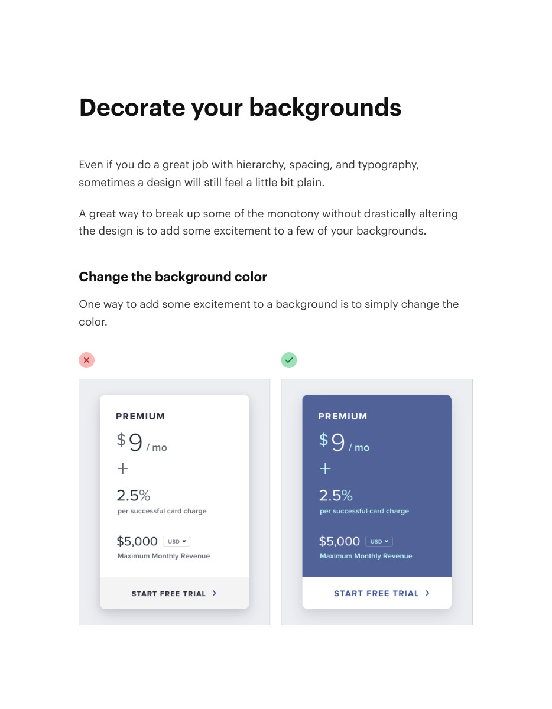
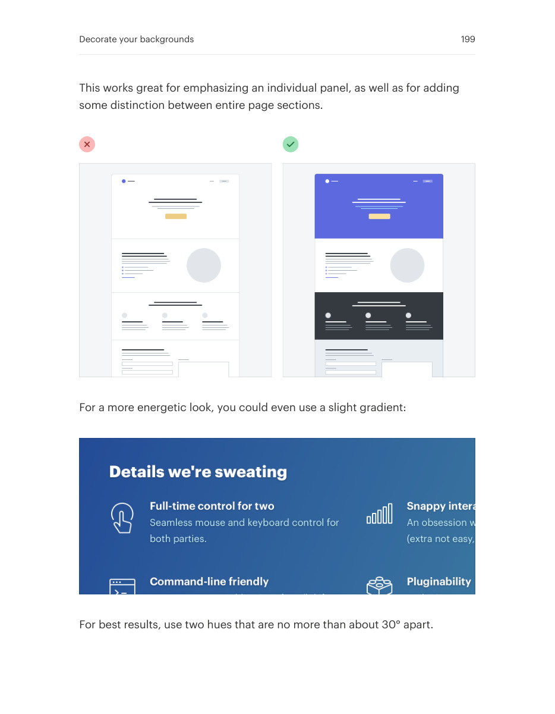
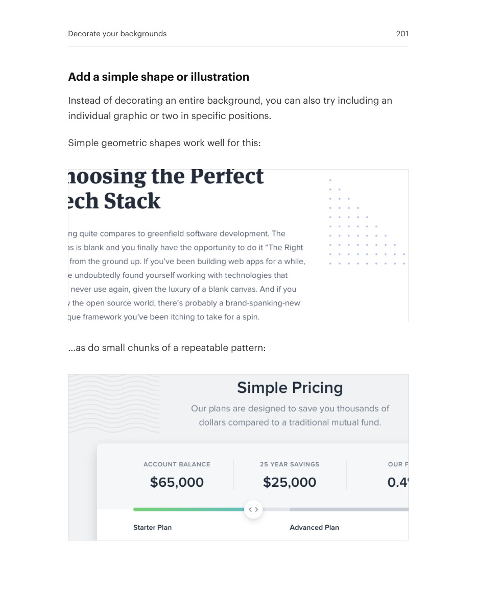

# Decorate backgrounds without competing with content

## Apply this

- If a broad surface feels empty, try a quiet background tone, pattern, or simple shape.
- Keep decorative content behind the reading and interaction hierarchy.
- Verify contrast and responsive crops; leave the surface plain when decoration reduces clarity.

## Source

Source: `Refactoring UI v1.0.2.pdf`, version 1.0.2, PDF pages 198–202.
Apply this is new guidance; the source blocks below preserve the supplied pypdf extraction verbatim.
Page images preserve the original visual content, including text absent from extraction.

### Source outline

- Decorate your backgrounds (source page 198)
  - Change the background color (source page 198)
  - Use a repeating pattern (source page 200)
  - Add a simple shape or illustration (source page 201)

## Source pages

### Source page 198



```text
Decorate your backgrounds
Even if you do a great job with hierarchy, spacing, and typography,
sometimes a design will still feel a little bit plain.
A great way to break up some of the monotony without drastically altering
the design is to add some excitement to a few of your backgrounds.
Change the background color
One way to add some excitement to a background is to simply change the
color.

```

### Source page 199



```text
This works great for emphasizing an individual panel, as well as for adding
some distinction between entire page sections.
For a more energetic look, you could even use a slight gradient:
For best results, use two hues that are no more than about 30° apart.
Decorate your backgrounds 199
```

### Source page 200


```text
Use a repeating pattern
Another approach is to add a subtle repeatable pattern, like this one from
Hero Patterns:
You don’t have to necessarily repeat it across the entire background, either
— a pattern designed to repeat along a single edge can look great, too.
Keep the contrast between the background and the pattern pretty low to
ensure readability.
Decorate your backgrounds 200
```

### Source page 201



```text
Add a simple shape or illustration
Instead of decorating an entire background, you can also try including an
individual graphic or two in specific positions.
Simple geometric shapes work well for this:
…as do small chunks of a repeatable pattern:
Decorate your backgrounds 201
```

### Source page 202


```text
You can even do something more complex, like a simplified world map:
Just like with a full background pattern, it’s best to keep the contrast low so
nothing interferes with the content.
Decorate your backgrounds 202
```
