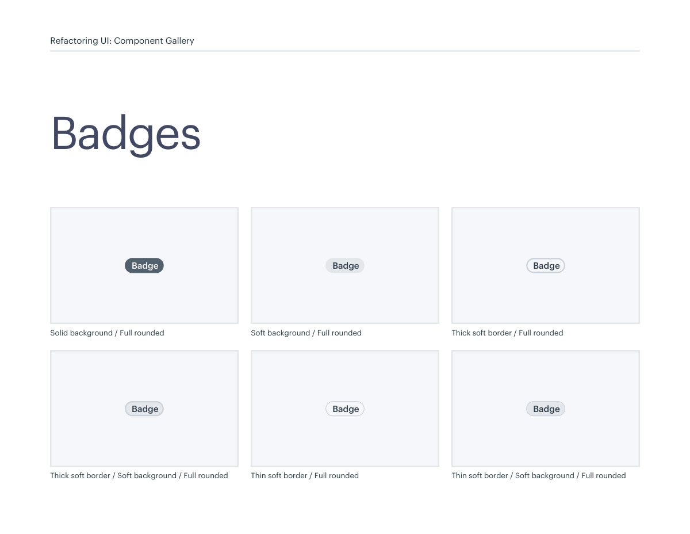
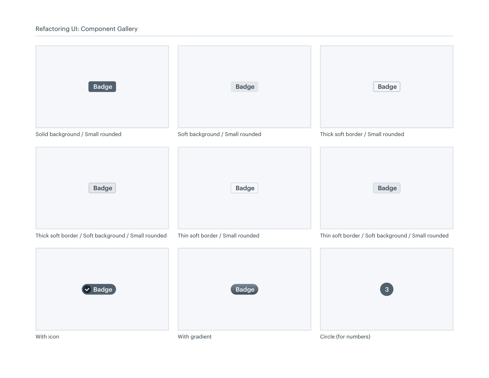

# Badge treatments

## Apply this

- If small statuses overpower content, choose a restrained badge fill and boundary.
- Use consistent padding and corners for soft, solid, or outlined variants.
- Check tiny text contrast and pair status color with a readable label.

## Source

Source: `Component Gallery v1.1.0.pdf`, version 1.1.0, PDF pages 16–17.
Apply this is new guidance; the source blocks below preserve the supplied pypdf extraction verbatim.
Page images preserve the original visual content, including text absent from extraction.

## Source pages

### Source page 16



```text
Solid background / Full rounded Soft background / Full rounded Thick soft border / Full rounded
Thin soft border / Full rounded Thin soft border / Soft background / Full roundedThick soft border / Soft background / Full rounded
Badge Badge
 Badge
Badge
 Badge
 Badge
Badges
Refactoring UI: Component Gallery
```

### Source page 17



```text
Thin soft border / Small rounded Thin soft border / Soft background / Small roundedThick soft border / Soft background / Small rounded
Badge
 Badge
 Badge
Badge
Soft background / Small rounded Thick soft border / Small rounded
Badge 3
Badge Badge
 Badge
Solid background / Small rounded
With gradient Circle (for numbers)With icon
Refactoring UI: Component Gallery
```
