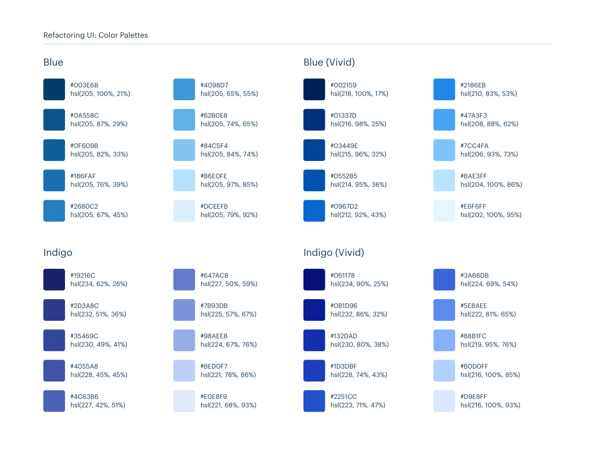
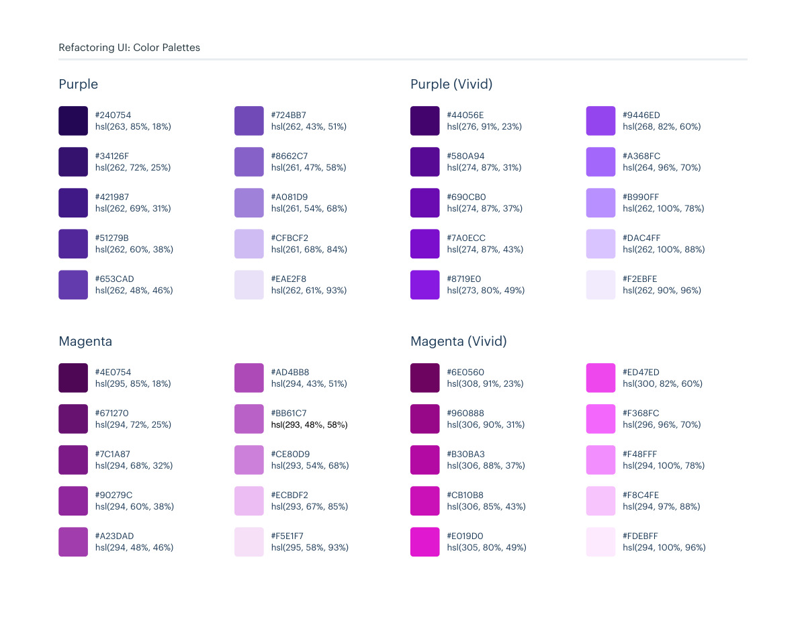

# Blue, indigo, purple, and magenta swatches

## Apply this

- If you need to extend an existing color system, compare the blue, indigo, purple, and magenta swatches in these pages.
- Select a coherent shade family and map it to existing semantic token roles; preserve palette-specific variants separately.
- Verify foreground/background contrast and temperature across components; same-named shades in a palette may differ from this swatch catalog.

## Source

Source: `Color Palettes v1.1.0.pdf`, version 1.1.0, PDF pages 149–150.
Apply this is new guidance; the source blocks below preserve the supplied pypdf extraction verbatim.
Page images preserve the original visual content, including text absent from extraction.

Palette originals retain source comments and trailing commas (JSONC), despite their `.json` extension.
The `.strict.json` companion removes only that syntax; keys and values remain unchanged.
- [swatches.json](../assets/swatches.json)
- [swatches.strict.json](../assets/swatches.strict.json)

## Source pages

### Source page 149



```text
Refactoring UI: Color Palettes
hsl(234, 62%, 26%)
#19216C
hsl(232, 51%, 36%)
#2D3A8C
hsl(230, 49%, 41%)
#35469C
hsl(228, 45%, 45%)
#4055A8
hsl(227, 42%, 51%)
#4C63B6
hsl(227, 50%, 59%)
#647ACB
hsl(225, 57%, 67%)
#7B93DB
hsl(224, 67%, 76%)
#98AEEB
hsl(221, 78%, 86%)
#BED0F7
hsl(221, 68%, 93%)
#E0E8F9
Indigo
hsl(205, 100%, 21%)
#003E6B
hsl(205, 87%, 29%)
#0A558C
hsl(205, 82%, 33%)
#0F609B
hsl(205, 76%, 39%)
#186FAF
hsl(205, 67%, 45%)
#2680C2
hsl(205, 65%, 55%)
#4098D7
hsl(205, 74%, 65%)
#62B0E8
hsl(205, 84%, 74%)
#84C5F4
hsl(205, 97%, 85%)
#B6E0FE
hsl(205, 79%, 92%)
#DCEEFB
Blue
hsl(218, 100%, 17%)
#002159
hsl(216, 98%, 25%)
#01337D
hsl(215, 96%, 32%)
#03449E
hsl(214, 95%, 36%)
#0552B5
hsl(212, 92%, 43%)
#0967D2
hsl(210, 83%, 53%)
#2186EB
hsl(208, 88%, 62%)
#47A3F3
hsl(206, 93%, 73%)
#7CC4FA
hsl(204, 100%, 86%)
#BAE3FF
hsl(202, 100%, 95%)
#E6F6FF
Blue (Vivid)
hsl(234, 90%, 25%)
#061178
hsl(232, 86%, 32%)
#0B1D96
hsl(230, 80%, 38%)
#132DAD
hsl(228, 74%, 43%)
#1D3DBF
hsl(223, 71%, 47%)
#2251CC
hsl(224, 69%, 54%)
#3A66DB
hsl(222, 81%, 65%)
#5E8AEE
hsl(219, 95%, 76%)
#88B1FC
hsl(216, 100%, 85%)
#B0D0FF
hsl(216, 100%, 93%)
#D9E8FF
Indigo (Vivid)
```

### Source page 150



```text
Refactoring UI: Color Palettes
hsl(263, 85%, 18%)
#240754
hsl(262, 72%, 25%)
#34126F
hsl(262, 69%, 31%)
#421987
hsl(262, 60%, 38%)
#51279B
hsl(262, 48%, 46%)
#653CAD
hsl(262, 43%, 51%)
#724BB7
hsl(261, 47%, 58%)
#8662C7
hsl(261, 54%, 68%)
#A081D9
hsl(261, 68%, 84%)
#CFBCF2
hsl(262, 61%, 93%)
#EAE2F8
Purple
hsl(295, 85%, 18%)
#4E0754
hsl(294, 72%, 25%)
#671270
hsl(294, 68%, 32%)
#7C1A87
hsl(294, 60%, 38%)
#90279C
hsl(294, 48%, 46%)
#A23DAD
hsl(294, 43%, 51%)
#AD4BB8
hsl(293, 48%, 58%)
#BB61C7
hsl(293, 54%, 68%)
#CE80D9
hsl(293, 67%, 85%)
#ECBDF2
hsl(295, 58%, 93%)
#F5E1F7
Magenta
hsl(308, 91%, 23%)
#6E0560
hsl(306, 90%, 31%)
#960888
hsl(306, 88%, 37%)
#B30BA3
hsl(306, 85%, 43%)
#CB10B8
hsl(305, 80%, 49%)
#E019D0
hsl(300, 82%, 60%)
#ED47ED
hsl(296, 96%, 70%)
#F368FC
hsl(294, 100%, 78%)
#F48FFF
hsl(294, 97%, 88%)
#F8C4FE
hsl(294, 100%, 96%)
#FDEBFF
Magenta (Vivid)
hsl(276, 91%, 23%)
#44056E
hsl(274, 87%, 31%)
#580A94
hsl(274, 87%, 37%)
#690CB0
hsl(274, 87%, 43%)
#7A0ECC
hsl(273, 80%, 49%)
#8719E0
hsl(268, 82%, 60%)
#9446ED
hsl(264, 96%, 70%)
#A368FC
hsl(262, 100%, 78%)
#B990FF
hsl(262, 100%, 88%)
#DAC4FF
hsl(262, 90%, 96%)
#F2EBFE
Purple (Vivid)
```
