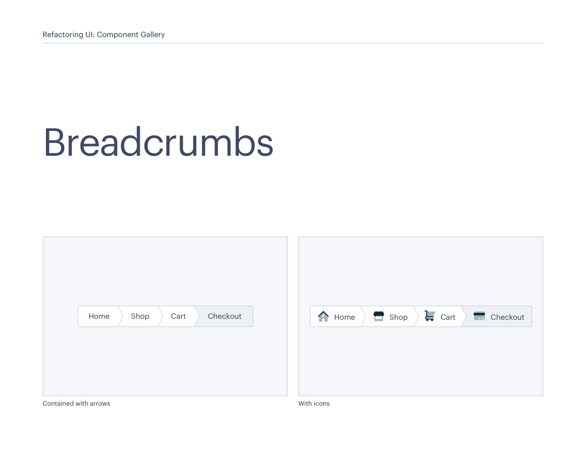
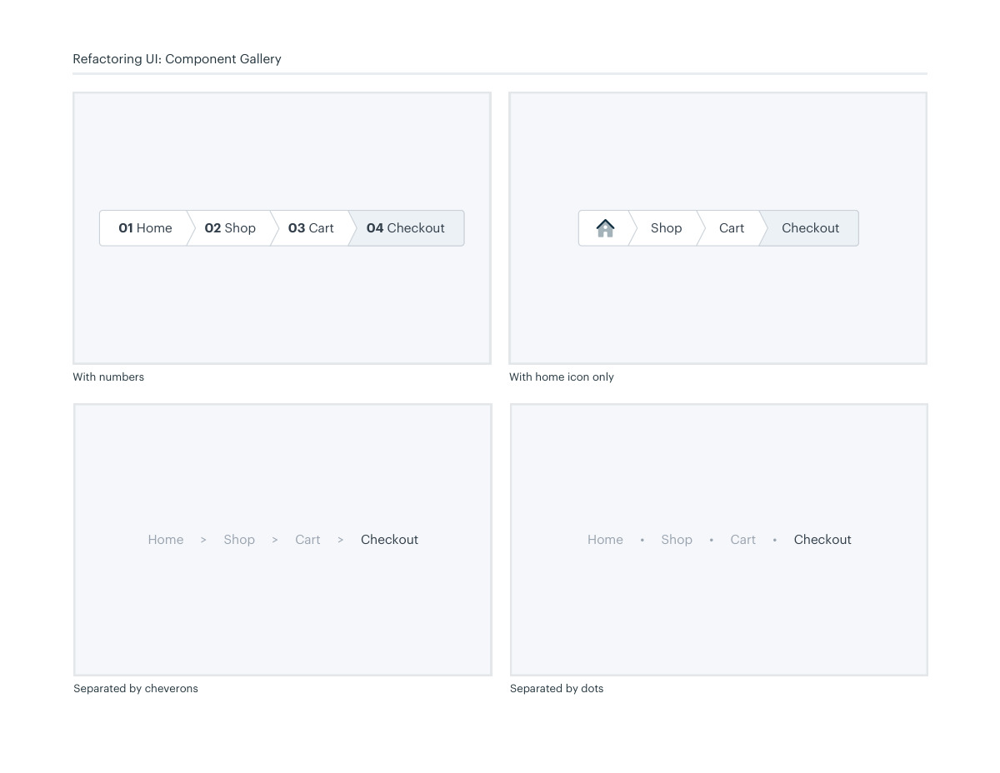
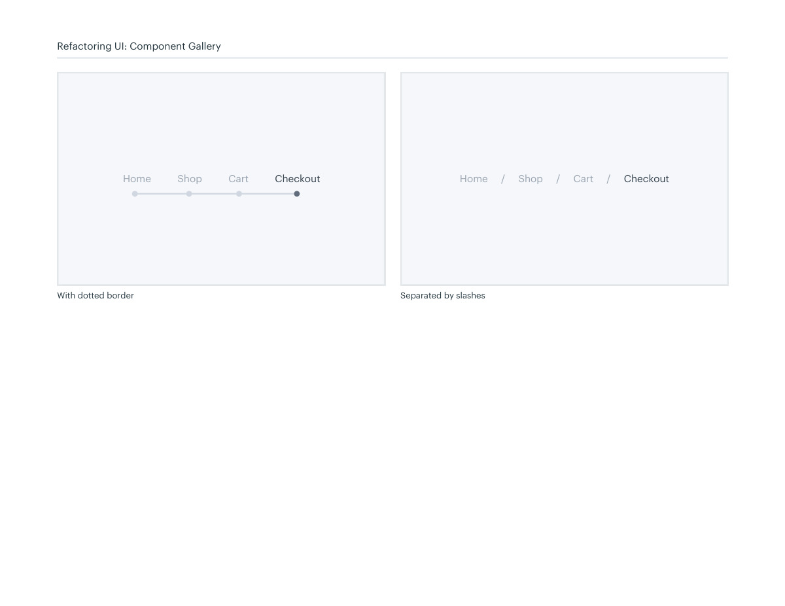

# Breadcrumb navigation

## Apply this

- If users lose their place in a hierarchy, expose a concise breadcrumb trail.
- Choose readable separators and distinguish the current location from links.
- Verify navigation semantics and truncation; do not use breadcrumbs as the only way to move between peers.

## Source

Source: `Component Gallery v1.1.0.pdf`, version 1.1.0, PDF pages 18–21.
Apply this is new guidance; the source blocks below preserve the supplied pypdf extraction verbatim.
Page images preserve the original visual content, including text absent from extraction.

## Source pages

### Source page 18



```text
Breadcrumbs
Contained with arrows With icons
Home Shop Cart Checkout
 Home Shop Cart Checkout
Refactoring UI: Component Gallery
```

### Source page 19



```text
Refactoring UI: Component Gallery
With home icon only
Home     >     Shop     >     Cart     >     Checkout
Separated by cheverons
Home     •     Shop     •     Cart     •     Checkout
Separated by dots
Shop Cart
 Checkout
With numbers
01 Home 02 Shop 03 Cart 04 Checkout
```

### Source page 20



```text
Refactoring UI: Component Gallery
Home          Shop          Cart          Checkout
With dotted border
Home     /     Shop     /     Cart     /     Checkout
Separated by slashes
```

### Source page 21


```text

```
