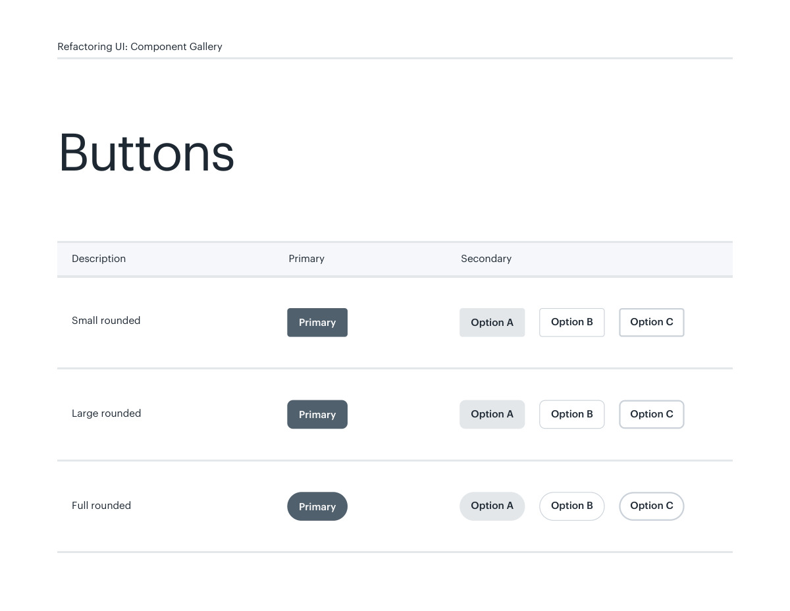
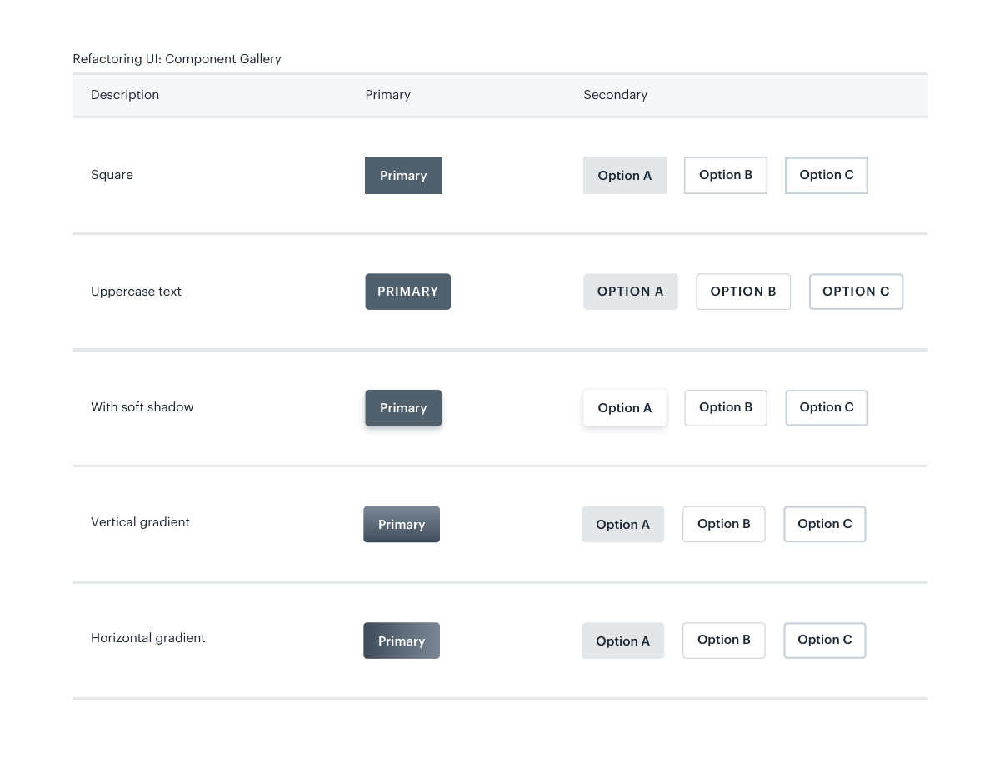
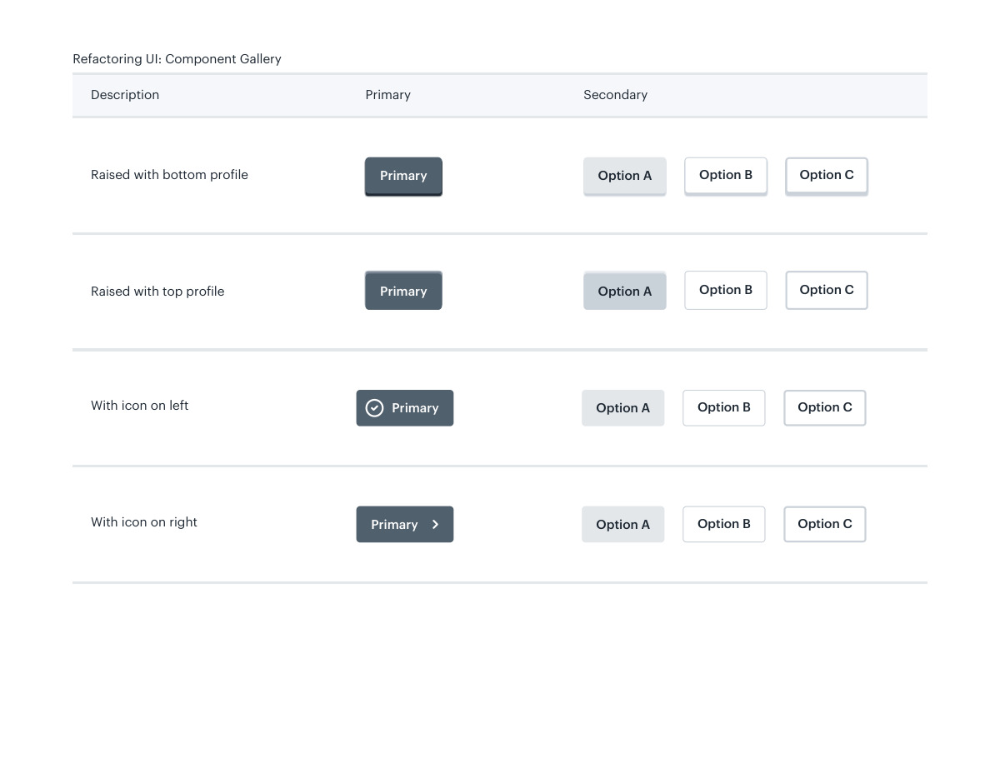

# Button shapes and states

## Apply this

- If actions look inconsistent, choose one corner and surface treatment for each priority.
- Compare rounded, square, raised, and icon variants against existing control tokens.
- Verify focus, disabled, and pressed states; a different shape alone must not encode priority.

## Source

Source: `Component Gallery v1.1.0.pdf`, version 1.1.0, PDF pages 2–5.
Apply this is new guidance; the source blocks below preserve the supplied pypdf extraction verbatim.
Page images preserve the original visual content, including text absent from extraction.

## Source pages

### Source page 2



```text
Small rounded
PrimaryDescription Secondary
Large rounded
Full rounded
Primary
Primary
Primary
Option A
Option A
Option A
Option B
Option B
Option B
Option C
Option C
Option C
Buttons
Refactoring UI: Component Gallery
```

### Source page 3



```text
PrimaryDescription Secondary
Square
Uppercase text PRIMARY
Primary
OPTION A
 OPTION B
 OPTION C
Option A Option B Option C
Option A
 Option B
 Option C
Vertical gradient Primary Option A
 Option B
 Option C
Horizontal gradient Primary Option A
 Option B
 Option C
With soft shadow
 Primary
Refactoring UI: Component Gallery
```

### Source page 4



```text
PrimaryDescription Secondary
Raised with bottom profile
 Primary
 Option A
 Option B
 Option C
Raised with top profile
With icon on left Primary Option A
 Option B
 Option C
With icon on right Primary Option A
 Option B
 Option C
Primary
 Option A
 Option B
 Option C
Refactoring UI: Component Gallery
```

### Source page 5


```text

```
