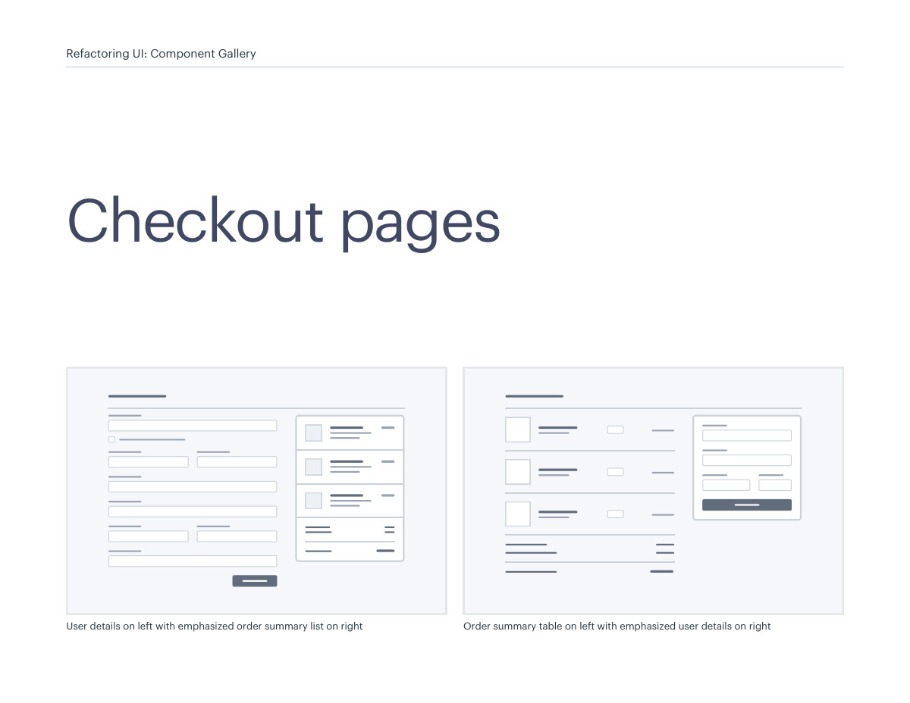
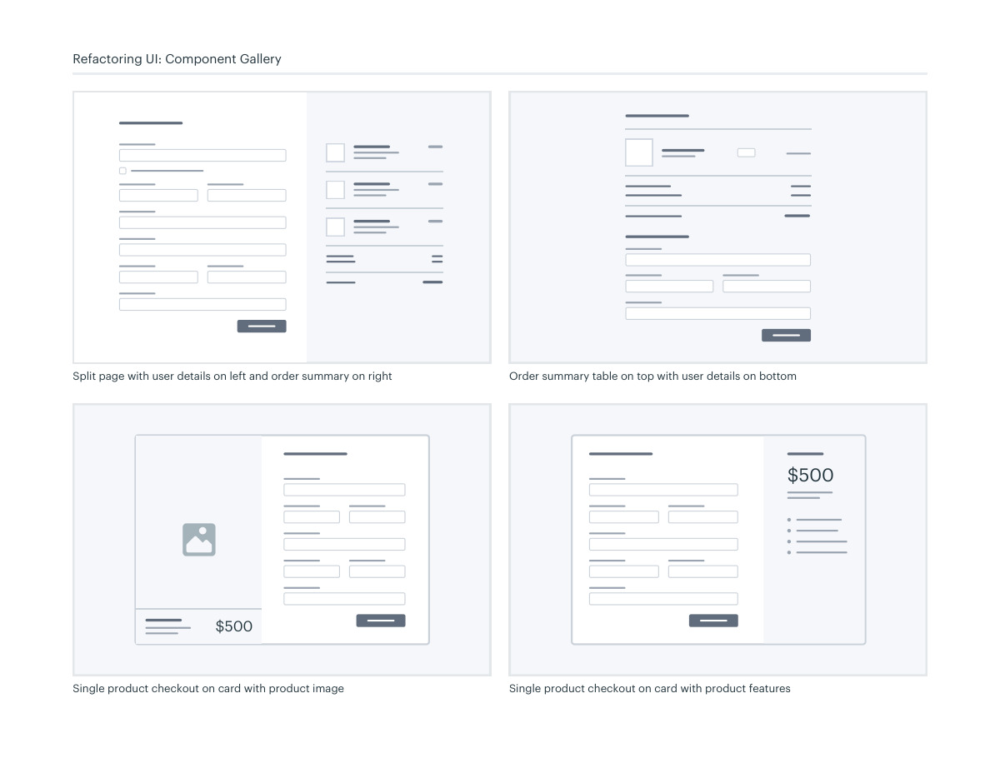

# Checkout and order-summary layouts

## Apply this

- If checkout users lose track of the purchase, keep the order summary near the required inputs.
- Compare split, stacked, and single-product layouts for the amount of information.
- Verify totals, error recovery, and narrow-screen reading order before adding product imagery.

## Source

Source: `Component Gallery v1.1.0.pdf`, version 1.1.0, PDF pages 82–83.
Apply this is new guidance; the source blocks below preserve the supplied pypdf extraction verbatim.
Page images preserve the original visual content, including text absent from extraction.

## Source pages

### Source page 82



```text
Checkout pages
User details on left with emphasized order summary list on right
 Order summary table on left with emphasized user details on right
Refactoring UI: Component Gallery
```

### Source page 83



```text
Split page with user details on left and order summary on right
$500
Single product checkout on card with product features
$500
Single product checkout on card with product image
Order summary table on top with user details on bottom
Refactoring UI: Component Gallery
```
