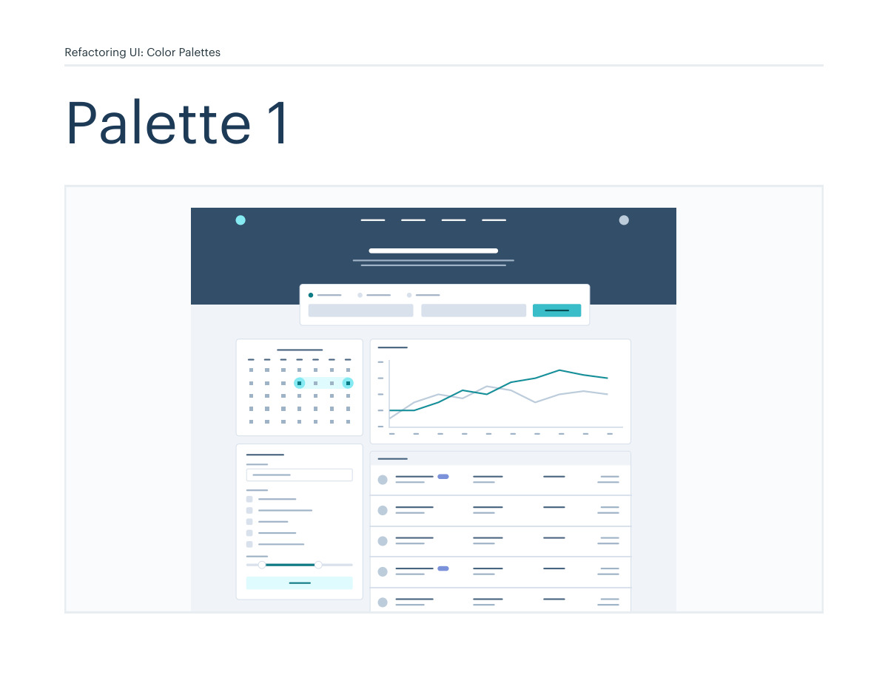
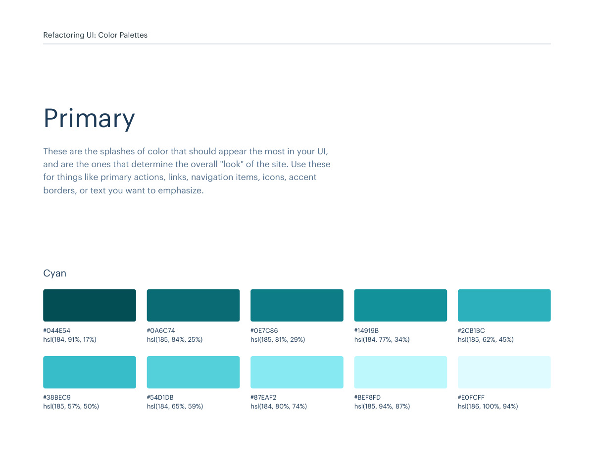
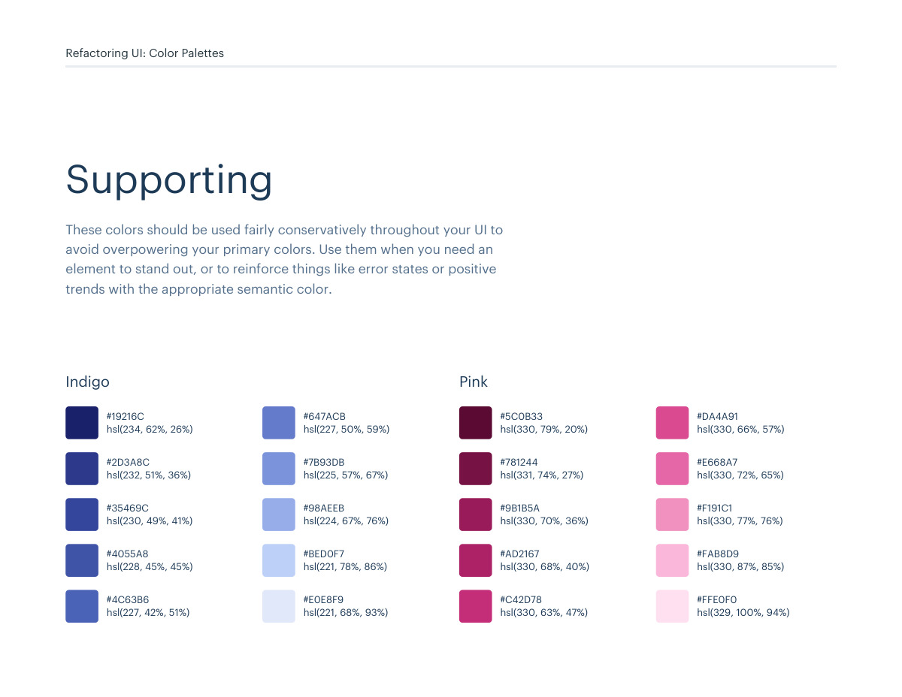

# Color palette 01: cyan

## Apply this

- If a coherent cyan color system fits the task, use palette 01 as a complete candidate.
- Map these source roles to existing semantic tokens, not new component literals: Primary: cyan; Neutrals: grey; Supporting: indigo, pink, red, yellow.
- Keep palette-specific values intact; do not substitute matching names from swatches.json. Test text, surface, focus, hover, and status contrast, and pair status colors with another cue.

## Source

Source: `Color Palettes v1.1.0.pdf`, version 1.1.0, PDF pages 4–9.
Apply this is new guidance; the source blocks below preserve the supplied pypdf extraction verbatim.
Page images preserve the original visual content, including text absent from extraction.

Palette originals retain source comments and trailing commas (JSONC), despite their `.json` extension.
The `.strict.json` companion removes only that syntax; keys and values remain unchanged.
- [palette-01.json](../assets/palette-01.json)
- [palette-01.strict.json](../assets/palette-01.strict.json)

## Source pages

### Source page 4



```text
Refactoring UI: Color Palettes
Palette 1
```

### Source page 5



```text
Refactoring UI: Color Palettes
These are the splashes of color that should appear the most in your UI, 
and are the ones that determine the overall "look" of the site. Use these 
for things like primary actions, links, navigation items, icons, accent 
borders, or text you want to emphasize.
Primary
hsl(184, 91%, 17%)
hsl(185, 57%, 50%)
hsl(185, 84%, 25%)
hsl(184, 65%, 59%)
hsl(185, 81%, 29%)
hsl(184, 80%, 74%)
hsl(184, 77%, 34%)
hsl(185, 94%, 87%)
hsl(185, 62%, 45%)
hsl(186, 100%, 94%)
#044E54
#38BEC9
#0A6C74
#54D1DB
#0E7C86
#87EAF2
#14919B
#BEF8FD
#2CB1BC
#E0FCFF
Cyan
```

### Source page 6


```text
Refactoring UI: Color Palettes
These are the colors you will use the most and will make up the majority 
of your UI. Use them for most of your text, backgrounds, and borders, 
as well as for things like secondary buttons and links.
Neutrals
hsl(209, 61%, 16%)
hsl(209, 23%, 60%)
hsl(211, 39%, 23%)
hsl(211, 27%, 70%)
hsl(209, 34%, 30%)
hsl(210, 31%, 80%)
hsl(209, 28%, 39%)
hsl(212, 33%, 89%)
hsl(210, 22%, 49%)
hsl(210, 36%, 96%)
#102A43
#829AB1
#243B53
#9FB3C8
#334E68
#BCCCDC
#486581
#D9E2EC
#627D98
#F0F4F8
Blue Grey
```

### Source page 7



```text
Refactoring UI: Color Palettes
These colors should be used fairly conservatively throughout your UI to 
avoid overpowering your primary colors. Use them when you need an 
element to stand out, or to reinforce things like error states or positive 
trends with the appropriate semantic color.
Supporting
hsl(330, 79%, 20%)
#5C0B33
hsl(331, 74%, 27%)
#781244
hsl(330, 70%, 36%)
#9B1B5A
hsl(330, 68%, 40%)
#AD2167
hsl(330, 63%, 47%)
#C42D78
hsl(330, 66%, 57%)
#DA4A91
hsl(330, 72%, 65%)
#E668A7
hsl(330, 77%, 76%)
#F191C1
hsl(330, 87%, 85%)
#FAB8D9
hsl(329, 100%, 94%)
#FFE0F0
Pink
hsl(234, 62%, 26%)
#19216C
hsl(232, 51%, 36%)
#2D3A8C
hsl(230, 49%, 41%)
#35469C
hsl(228, 45%, 45%)
#4055A8
hsl(227, 42%, 51%)
#4C63B6
hsl(227, 50%, 59%)
#647ACB
hsl(225, 57%, 67%)
#7B93DB
hsl(224, 67%, 76%)
#98AEEB
hsl(221, 78%, 86%)
#BED0F7
hsl(221, 68%, 93%)
#E0E8F9
Indigo
```

### Source page 8


```text
hsl(360, 92%, 20%)
#610404
hsl(360, 85%, 25%)
#780A0A
hsl(360, 79%, 32%)
#911111
hsl(360, 72%, 38%)
#A61B1B
hsl(360, 67%, 44%)
#BA2525
hsl(360, 64%, 55%)
#D64545
hsl(360, 71%, 66%)
#E66A6A
hsl(360, 77%, 78%)
#F29B9B
hsl(360, 82%, 89%)
#FACDCD
hsl(360, 100%, 97%)
#FFEEEE
Red
Refactoring UI: Color Palettes
hsl(43, 86%, 17%)
#513C06
hsl(43, 77%, 27%)
#7C5E10
hsl(43, 72%, 37%)
#A27C1A
hsl(42, 63%, 48%)
#C99A2E
hsl(42, 78%, 60%)
#E9B949
hsl(43, 89%, 70%)
#F7D070
hsl(43, 90%, 76%)
#F9DA8B
hsl(45, 86%, 81%)
#F8E3A3
hsl(45, 90%, 88%)
#FCEFC7
hsl(45, 100%, 96%)
#FFFAEB
Yellow
```

### Source page 9


```text

```
