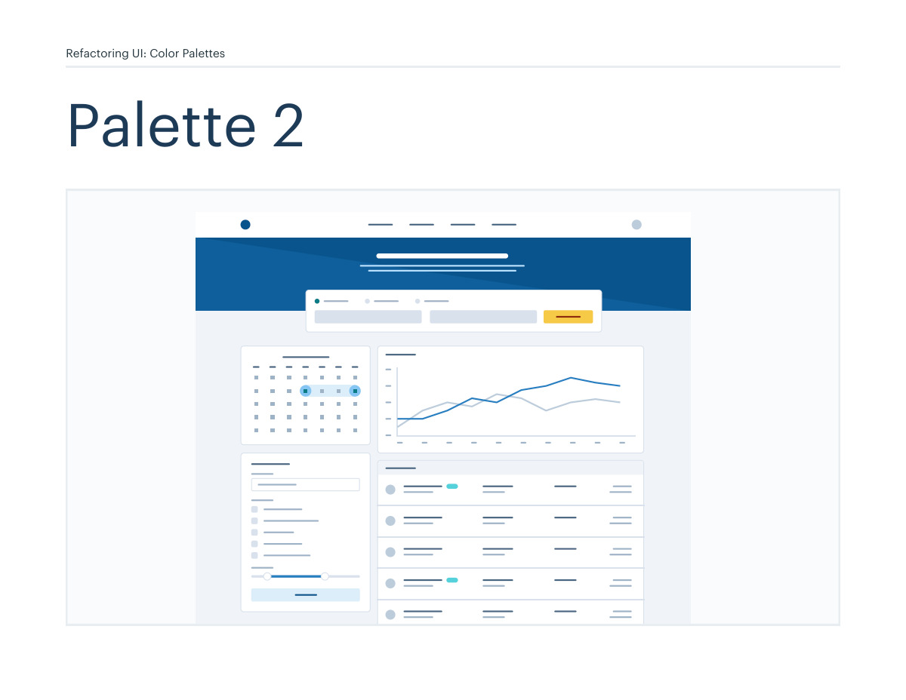
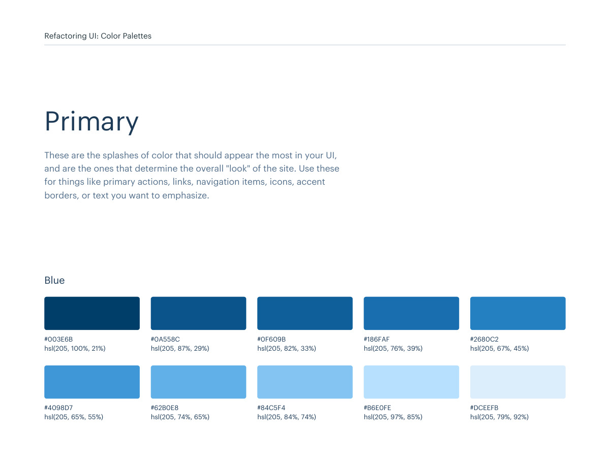
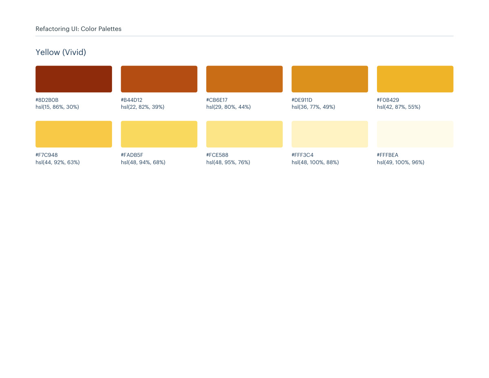
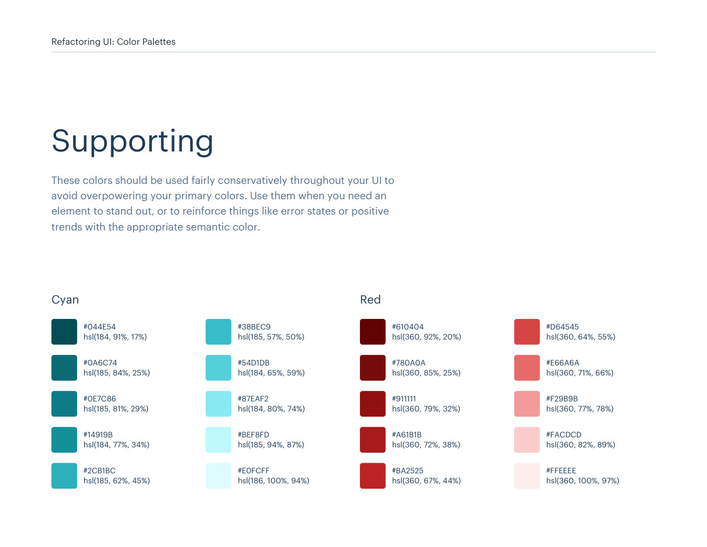

# Color palette 02: blue, yellow-vivid

## Apply this

- If a coherent blue, yellow-vivid color system fits the task, use palette 02 as a complete candidate.
- Map these source roles to existing semantic tokens, not new component literals: Primary: blue, yellow-vivid; Neutrals: blue-grey; Supporting: cyan, red.
- Keep palette-specific values intact; do not substitute matching names from swatches.json. Test text, surface, focus, hover, and status contrast, and pair status colors with another cue.

## Source

Source: `Color Palettes v1.1.0.pdf`, version 1.1.0, PDF pages 10–15.
Apply this is new guidance; the source blocks below preserve the supplied pypdf extraction verbatim.
Page images preserve the original visual content, including text absent from extraction.

Palette originals retain source comments and trailing commas (JSONC), despite their `.json` extension.
The `.strict.json` companion removes only that syntax; keys and values remain unchanged.
- [palette-02.json](../assets/palette-02.json)
- [palette-02.strict.json](../assets/palette-02.strict.json)

## Source pages

### Source page 10



```text
Refactoring UI: Color Palettes
Palette 2
```

### Source page 11



```text
Refactoring UI: Color Palettes
These are the splashes of color that should appear the most in your UI, 
and are the ones that determine the overall "look" of the site. Use these 
for things like primary actions, links, navigation items, icons, accent 
borders, or text you want to emphasize.
Primary
hsl(205, 100%, 21%)
hsl(205, 65%, 55%)
hsl(205, 87%, 29%)
hsl(205, 74%, 65%)
hsl(205, 82%, 33%)
hsl(205, 84%, 74%)
hsl(205, 76%, 39%)
hsl(205, 97%, 85%)
hsl(205, 67%, 45%)
hsl(205, 79%, 92%)
#003E6B
#4098D7
#0A558C
#62B0E8
#0F609B
#84C5F4
#186FAF
#B6E0FE
#2680C2
#DCEEFB
Blue
```

### Source page 12



```text
Refactoring UI: Color Palettes
hsl(15, 86%, 30%)
hsl(44, 92%, 63%)
hsl(22, 82%, 39%)
hsl(48, 94%, 68%)
hsl(29, 80%, 44%)
hsl(48, 95%, 76%)
hsl(36, 77%, 49%)
hsl(48, 100%, 88%)
hsl(42, 87%, 55%)
hsl(49, 100%, 96%)
#8D2B0B
#F7C948
#B44D12
#FADB5F
#CB6E17
#FCE588
#DE911D
#FFF3C4
#F0B429
#FFFBEA
Yellow (Vivid)
```

### Source page 13


```text
Refactoring UI: Color Palettes
These are the colors you will use the most and will make up the majority 
of your UI. Use them for most of your text, backgrounds, and borders, 
as well as for things like secondary buttons and links.
Neutrals
hsl(209, 61%, 16%)
hsl(209, 23%, 60%)
hsl(211, 39%, 23%)
hsl(211, 27%, 70%)
hsl(209, 34%, 30%)
hsl(210, 31%, 80%)
hsl(209, 28%, 39%)
hsl(212, 33%, 89%)
hsl(210, 22%, 49%)
hsl(210, 36%, 96%)
#102A43
#829AB1
#243B53
#9FB3C8
#334E68
#BCCCDC
#486581
#D9E2EC
#627D98
#F0F4F8
Blue Grey
```

### Source page 14



```text
Refactoring UI: Color Palettes
These colors should be used fairly conservatively throughout your UI to 
avoid overpowering your primary colors. Use them when you need an 
element to stand out, or to reinforce things like error states or positive 
trends with the appropriate semantic color.
Supporting
hsl(360, 92%, 20%)
#610404
hsl(360, 85%, 25%)
#780A0A
hsl(360, 79%, 32%)
#911111
hsl(360, 72%, 38%)
#A61B1B
hsl(360, 67%, 44%)
#BA2525
hsl(360, 64%, 55%)
#D64545
hsl(360, 71%, 66%)
#E66A6A
hsl(360, 77%, 78%)
#F29B9B
hsl(360, 82%, 89%)
#FACDCD
hsl(360, 100%, 97%)
#FFEEEE
Red
hsl(184, 91%, 17%)
#044E54
hsl(185, 84%, 25%)
#0A6C74
hsl(185, 81%, 29%)
#0E7C86
hsl(184, 77%, 34%)
#14919B
hsl(185, 62%, 45%)
#2CB1BC
hsl(185, 57%, 50%)
#38BEC9
hsl(184, 65%, 59%)
#54D1DB
hsl(184, 80%, 74%)
#87EAF2
hsl(185, 94%, 87%)
#BEF8FD
hsl(186, 100%, 94%)
#E0FCFF
Cyan
```

### Source page 15


```text

```
