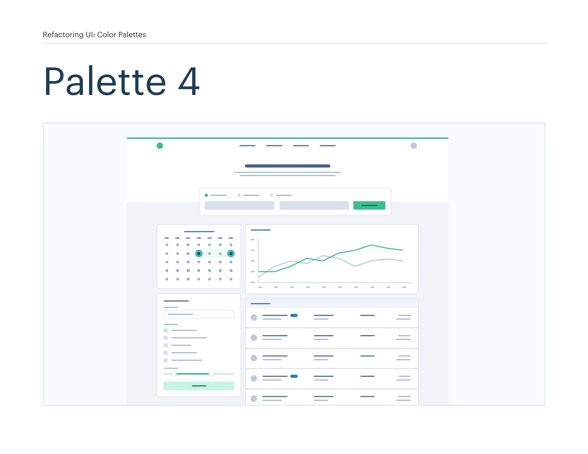
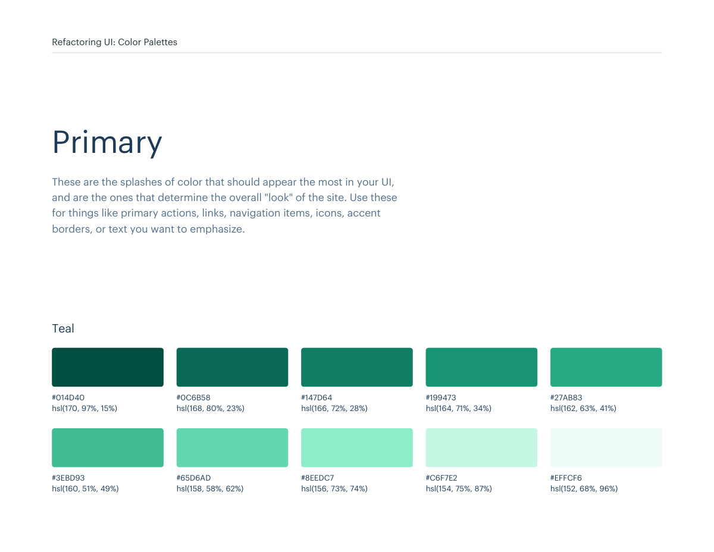
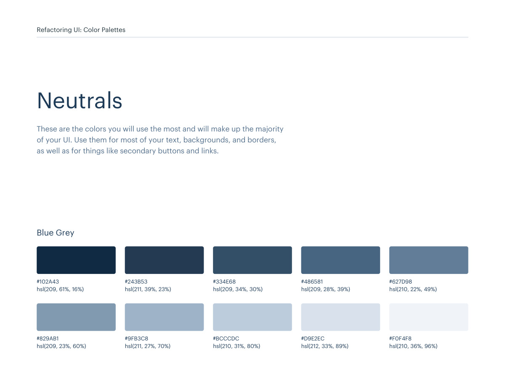
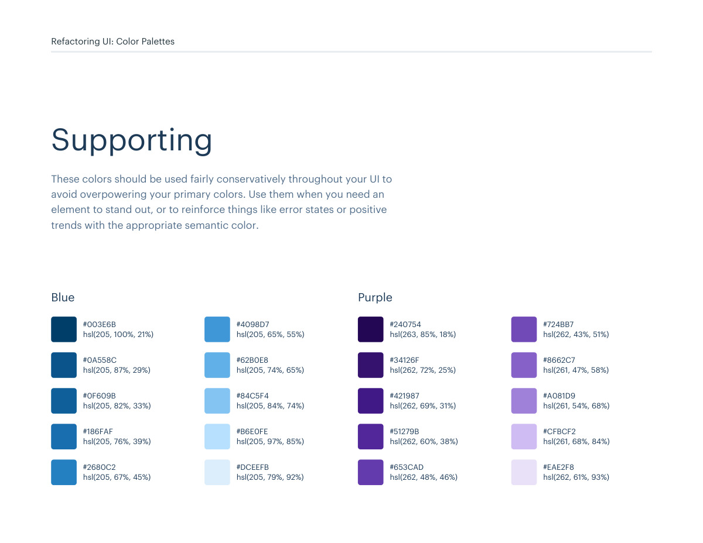
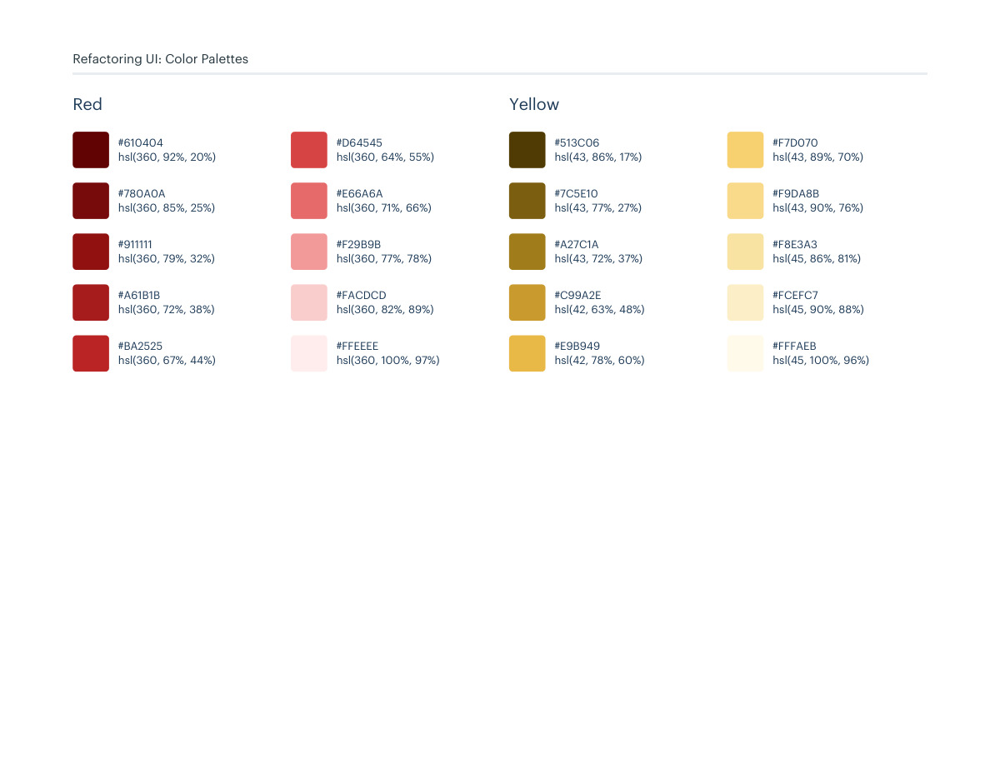

# Color palette 04: teal

## Apply this

- If a coherent teal color system fits the task, use palette 04 as a complete candidate.
- Map these source roles to existing semantic tokens, not new component literals: Primary: teal; Neutrals: blue-grey; Supporting: blue, purple, red, yellow.
- Keep palette-specific values intact; do not substitute matching names from swatches.json. Test text, surface, focus, hover, and status contrast, and pair status colors with another cue.

## Source

Source: `Color Palettes v1.1.0.pdf`, version 1.1.0, PDF pages 22–27.
Apply this is new guidance; the source blocks below preserve the supplied pypdf extraction verbatim.
Page images preserve the original visual content, including text absent from extraction.

Palette originals retain source comments and trailing commas (JSONC), despite their `.json` extension.
The `.strict.json` companion removes only that syntax; keys and values remain unchanged.
- [palette-04.json](../assets/palette-04.json)
- [palette-04.strict.json](../assets/palette-04.strict.json)

## Source pages

### Source page 22



```text
Refactoring UI: Color Palettes
Palette 4
```

### Source page 23



```text
Refactoring UI: Color Palettes
These are the splashes of color that should appear the most in your UI, 
and are the ones that determine the overall "look" of the site. Use these 
for things like primary actions, links, navigation items, icons, accent 
borders, or text you want to emphasize.
Primary
hsl(170, 97%, 15%)
hsl(160, 51%, 49%)
hsl(168, 80%, 23%)
hsl(158, 58%, 62%)
hsl(166, 72%, 28%)
hsl(156, 73%, 74%)
hsl(164, 71%, 34%)
hsl(154, 75%, 87%)
hsl(162, 63%, 41%)
hsl(152, 68%, 96%)
#014D40
#3EBD93
#0C6B58
#65D6AD
#147D64
#8EEDC7
#199473
#C6F7E2
#27AB83
#EFFCF6
Teal
```

### Source page 24



```text
Refactoring UI: Color Palettes
These are the colors you will use the most and will make up the majority 
of your UI. Use them for most of your text, backgrounds, and borders, 
as well as for things like secondary buttons and links.
Neutrals
hsl(209, 61%, 16%)
hsl(209, 23%, 60%)
hsl(211, 39%, 23%)
hsl(211, 27%, 70%)
hsl(209, 34%, 30%)
hsl(210, 31%, 80%)
hsl(209, 28%, 39%)
hsl(212, 33%, 89%)
hsl(210, 22%, 49%)
hsl(210, 36%, 96%)
#102A43
#829AB1
#243B53
#9FB3C8
#334E68
#BCCCDC
#486581
#D9E2EC
#627D98
#F0F4F8
Blue Grey
```

### Source page 25



```text
Refactoring UI: Color Palettes
These colors should be used fairly conservatively throughout your UI to 
avoid overpowering your primary colors. Use them when you need an 
element to stand out, or to reinforce things like error states or positive 
trends with the appropriate semantic color.
Supporting
hsl(205, 100%, 21%)
#003E6B
hsl(205, 87%, 29%)
#0A558C
hsl(205, 82%, 33%)
#0F609B
hsl(205, 76%, 39%)
#186FAF
hsl(205, 67%, 45%)
#2680C2
hsl(205, 65%, 55%)
#4098D7
hsl(205, 74%, 65%)
#62B0E8
hsl(205, 84%, 74%)
#84C5F4
hsl(205, 97%, 85%)
#B6E0FE
hsl(205, 79%, 92%)
#DCEEFB
Blue
hsl(263, 85%, 18%)
#240754
hsl(262, 72%, 25%)
#34126F
hsl(262, 69%, 31%)
#421987
hsl(262, 60%, 38%)
#51279B
hsl(262, 48%, 46%)
#653CAD
hsl(262, 43%, 51%)
#724BB7
hsl(261, 47%, 58%)
#8662C7
hsl(261, 54%, 68%)
#A081D9
hsl(261, 68%, 84%)
#CFBCF2
hsl(262, 61%, 93%)
#EAE2F8
Purple
```

### Source page 26



```text
hsl(360, 92%, 20%)
#610404
hsl(360, 85%, 25%)
#780A0A
hsl(360, 79%, 32%)
#911111
hsl(360, 72%, 38%)
#A61B1B
hsl(360, 67%, 44%)
#BA2525
hsl(360, 64%, 55%)
#D64545
hsl(360, 71%, 66%)
#E66A6A
hsl(360, 77%, 78%)
#F29B9B
hsl(360, 82%, 89%)
#FACDCD
hsl(360, 100%, 97%)
#FFEEEE
Red
Refactoring UI: Color Palettes
hsl(43, 86%, 17%)
#513C06
hsl(43, 77%, 27%)
#7C5E10
hsl(43, 72%, 37%)
#A27C1A
hsl(42, 63%, 48%)
#C99A2E
hsl(42, 78%, 60%)
#E9B949
hsl(43, 89%, 70%)
#F7D070
hsl(43, 90%, 76%)
#F9DA8B
hsl(45, 86%, 81%)
#F8E3A3
hsl(45, 90%, 88%)
#FCEFC7
hsl(45, 100%, 96%)
#FFFAEB
Yellow
```

### Source page 27


```text

```
