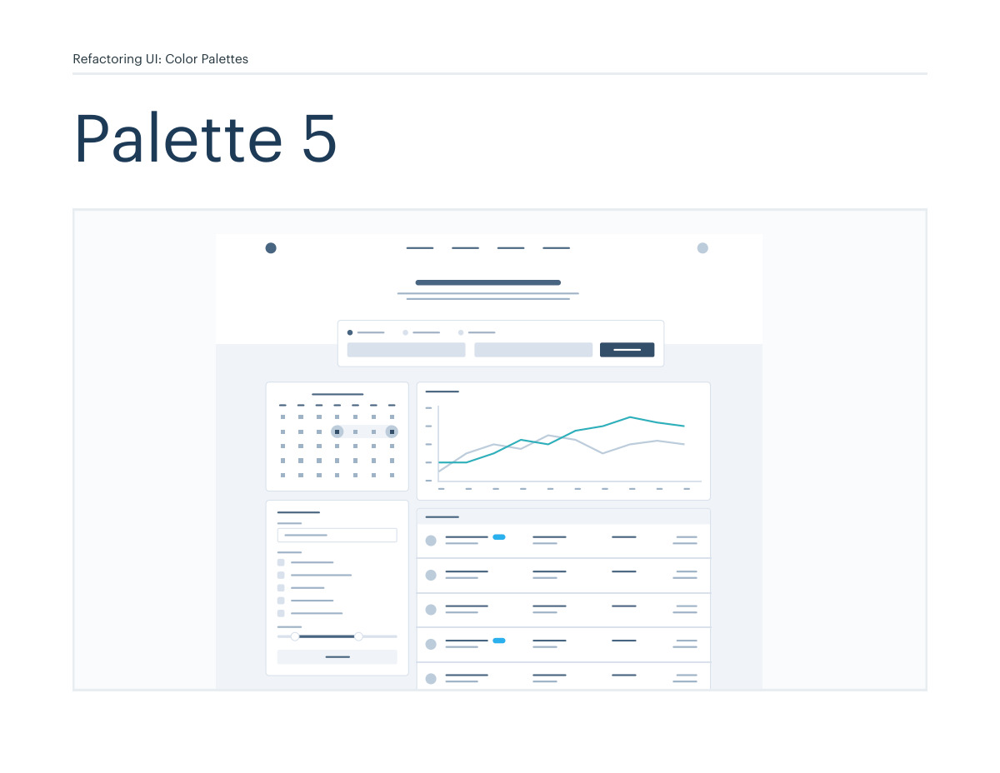
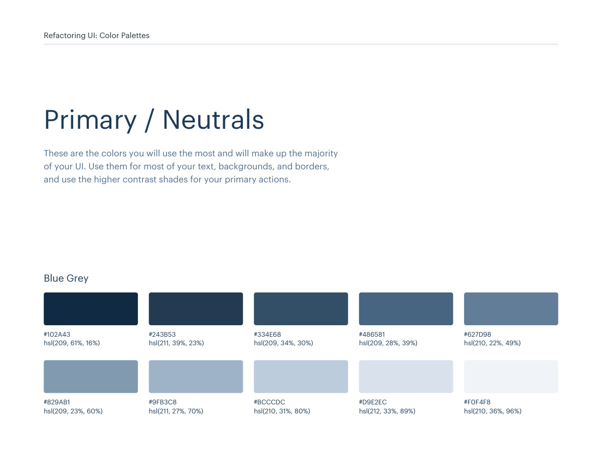
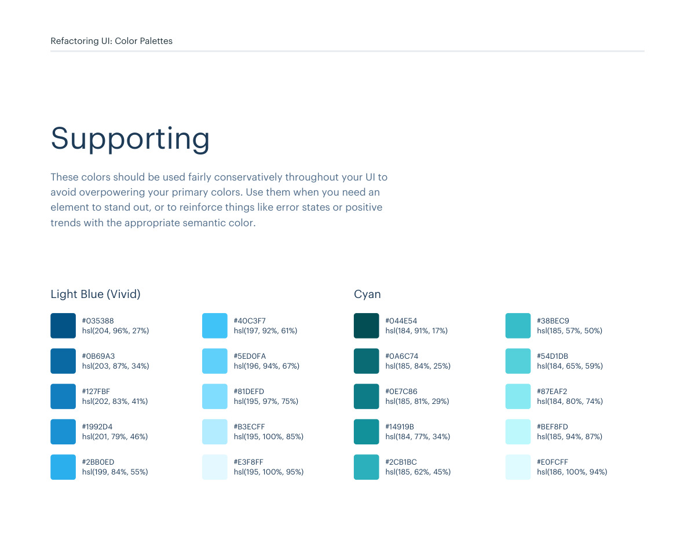
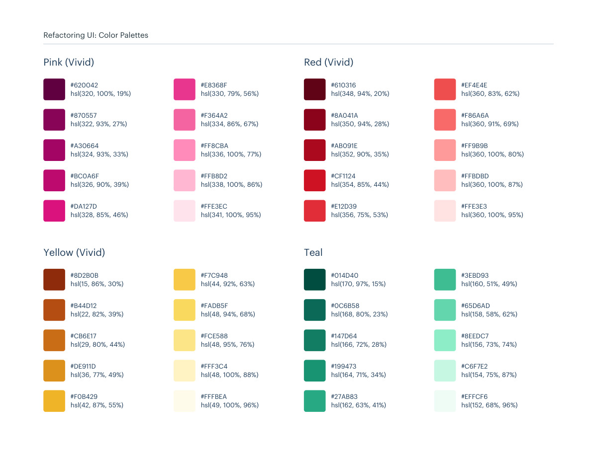

# Color palette 05: blue-grey

## Apply this

- If a coherent blue-grey color system fits the task, use palette 05 as a complete candidate.
- Map these source roles to existing semantic tokens, not new component literals: Primary / Neutrals: blue-grey; Supporting: light-blue-vivid, cyan, pink-vivid, red-vivid, yellow-vivid, teal.
- Keep palette-specific values intact; do not substitute matching names from swatches.json. Test text, surface, focus, hover, and status contrast, and pair status colors with another cue.

## Source

Source: `Color Palettes v1.1.0.pdf`, version 1.1.0, PDF pages 28–31.
Apply this is new guidance; the source blocks below preserve the supplied pypdf extraction verbatim.
Page images preserve the original visual content, including text absent from extraction.

Palette originals retain source comments and trailing commas (JSONC), despite their `.json` extension.
The `.strict.json` companion removes only that syntax; keys and values remain unchanged.
- [palette-05.json](../assets/palette-05.json)
- [palette-05.strict.json](../assets/palette-05.strict.json)

## Source pages

### Source page 28



```text
Refactoring UI: Color Palettes
Palette 5
```

### Source page 29



```text
Refactoring UI: Color Palettes
These are the colors you will use the most and will make up the majority 
of your UI. Use them for most of your text, backgrounds, and borders, 
and use the higher contrast shades for your primary actions.
Primary / Neutrals
hsl(209, 61%, 16%)
hsl(209, 23%, 60%)
hsl(211, 39%, 23%)
hsl(211, 27%, 70%)
hsl(209, 34%, 30%)
hsl(210, 31%, 80%)
hsl(209, 28%, 39%)
hsl(212, 33%, 89%)
hsl(210, 22%, 49%)
hsl(210, 36%, 96%)
#102A43
#829AB1
#243B53
#9FB3C8
#334E68
#BCCCDC
#486581
#D9E2EC
#627D98
#F0F4F8
Blue Grey
```

### Source page 30



```text
Refactoring UI: Color Palettes
These colors should be used fairly conservatively throughout your UI to 
avoid overpowering your primary colors. Use them when you need an 
element to stand out, or to reinforce things like error states or positive 
trends with the appropriate semantic color.
Supporting
hsl(204, 96%, 27%)
#035388
hsl(203, 87%, 34%)
#0B69A3
hsl(202, 83%, 41%)
#127FBF
hsl(201, 79%, 46%)
#1992D4
hsl(199, 84%, 55%)
#2BB0ED
hsl(197, 92%, 61%)
#40C3F7
hsl(196, 94%, 67%)
#5ED0FA
hsl(195, 97%, 75%)
#81DEFD
hsl(195, 100%, 85%)
#B3ECFF
hsl(195, 100%, 95%)
#E3F8FF
Light Blue (Vivid)
hsl(184, 91%, 17%)
#044E54
hsl(185, 84%, 25%)
#0A6C74
hsl(185, 81%, 29%)
#0E7C86
hsl(184, 77%, 34%)
#14919B
hsl(185, 62%, 45%)
#2CB1BC
hsl(185, 57%, 50%)
#38BEC9
hsl(184, 65%, 59%)
#54D1DB
hsl(184, 80%, 74%)
#87EAF2
hsl(185, 94%, 87%)
#BEF8FD
hsl(186, 100%, 94%)
#E0FCFF
Cyan
```

### Source page 31



```text
Refactoring UI: Color Palettes
hsl(170, 97%, 15%)
#014D40
hsl(168, 80%, 23%)
#0C6B58
hsl(166, 72%, 28%)
#147D64
hsl(164, 71%, 34%)
#199473
hsl(162, 63%, 41%)
#27AB83
hsl(160, 51%, 49%)
#3EBD93
hsl(158, 58%, 62%)
#65D6AD
hsl(156, 73%, 74%)
#8EEDC7
hsl(154, 75%, 87%)
#C6F7E2
hsl(152, 68%, 96%)
#EFFCF6
Teal
hsl(15, 86%, 30%)
#8D2B0B
hsl(22, 82%, 39%)
#B44D12
hsl(29, 80%, 44%)
#CB6E17
hsl(36, 77%, 49%)
#DE911D
hsl(42, 87%, 55%)
#F0B429
hsl(44, 92%, 63%)
#F7C948
hsl(48, 94%, 68%)
#FADB5F
hsl(48, 95%, 76%)
#FCE588
hsl(48, 100%, 88%)
#FFF3C4
hsl(49, 100%, 96%)
#FFFBEA
Yellow (Vivid)
hsl(320, 100%, 19%)
#620042
hsl(322, 93%, 27%)
#870557
hsl(324, 93%, 33%)
#A30664
hsl(326, 90%, 39%)
#BC0A6F
hsl(328, 85%, 46%)
#DA127D
hsl(330, 79%, 56%)
#E8368F
hsl(334, 86%, 67%)
#F364A2
hsl(336, 100%, 77%)
#FF8CBA
hsl(338, 100%, 86%)
#FFB8D2
hsl(341, 100%, 95%)
#FFE3EC
Pink (Vivid)
hsl(348, 94%, 20%)
#610316
hsl(350, 94%, 28%)
#8A041A
hsl(352, 90%, 35%)
#AB091E
hsl(354, 85%, 44%)
#CF1124
hsl(356, 75%, 53%)
#E12D39
hsl(360, 83%, 62%)
#EF4E4E
hsl(360, 91%, 69%)
#F86A6A
hsl(360, 100%, 80%)
#FF9B9B
hsl(360, 100%, 87%)
#FFBDBD
hsl(360, 100%, 95%)
#FFE3E3
Red (Vivid)
```
