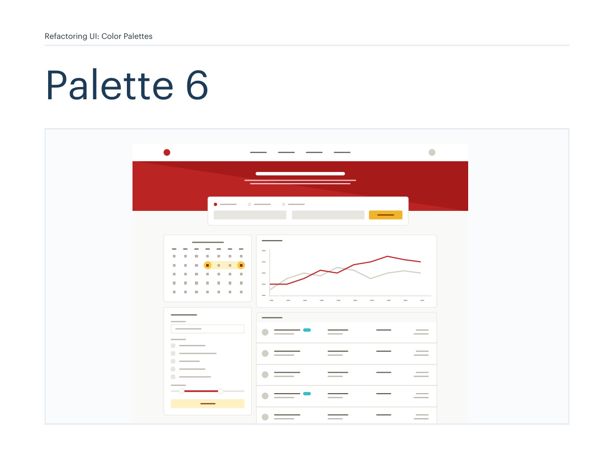
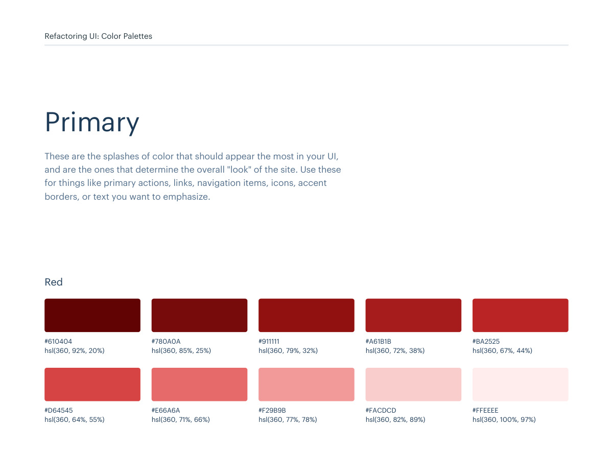
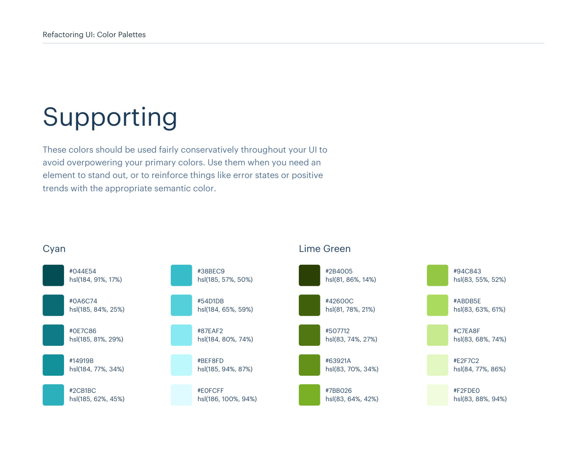

# Color palette 06: red, yellow-vivid

## Apply this

- If a coherent red, yellow-vivid color system fits the task, use palette 06 as a complete candidate.
- Map these source roles to existing semantic tokens, not new component literals: Primary: red, yellow-vivid; Neutrals: warm-grey; Supporting: cyan, lime-green.
- Keep palette-specific values intact; do not substitute matching names from swatches.json. Test text, surface, focus, hover, and status contrast, and pair status colors with another cue.

## Source

Source: `Color Palettes v1.1.0.pdf`, version 1.1.0, PDF pages 32–37.
Apply this is new guidance; the source blocks below preserve the supplied pypdf extraction verbatim.
Page images preserve the original visual content, including text absent from extraction.

Palette originals retain source comments and trailing commas (JSONC), despite their `.json` extension.
The `.strict.json` companion removes only that syntax; keys and values remain unchanged.
- [palette-06.json](../assets/palette-06.json)
- [palette-06.strict.json](../assets/palette-06.strict.json)

## Source pages

### Source page 32



```text
Refactoring UI: Color Palettes
Palette 6
```

### Source page 33



```text
Refactoring UI: Color Palettes
These are the splashes of color that should appear the most in your UI, 
and are the ones that determine the overall "look" of the site. Use these 
for things like primary actions, links, navigation items, icons, accent 
borders, or text you want to emphasize.
Primary
hsl(360, 92%, 20%)
hsl(360, 64%, 55%)
hsl(360, 85%, 25%)
hsl(360, 71%, 66%)
hsl(360, 79%, 32%)
hsl(360, 77%, 78%)
hsl(360, 72%, 38%)
hsl(360, 82%, 89%)
hsl(360, 67%, 44%)
hsl(360, 100%, 97%)
#610404
#D64545
#780A0A
#E66A6A
#911111
#F29B9B
#A61B1B
#FACDCD
#BA2525
#FFEEEE
Red
```

### Source page 34


```text
Refactoring UI: Color Palettes
hsl(15, 86%, 30%)
hsl(44, 92%, 63%)
hsl(22, 82%, 39%)
hsl(48, 94%, 68%)
hsl(29, 80%, 44%)
hsl(48, 95%, 76%)
hsl(36, 77%, 49%)
hsl(48, 100%, 88%)
hsl(42, 87%, 55%)
hsl(49, 100%, 96%)
#8D2B0B
#F7C948
#B44D12
#FADB5F
#CB6E17
#FCE588
#DE911D
#FFF3C4
#F0B429
#FFFBEA
Yellow (Vivid)
```

### Source page 35


```text
Refactoring UI: Color Palettes
These are the colors you will use the most and will make up the majority 
of your UI. Use them for most of your text, backgrounds, and borders, 
as well as for things like secondary buttons and links.
Neutrals
hsl(43, 13%, 90%)
#E8E6E1
hsl(42, 15%, 13%)
hsl(41, 8%, 61%)
hsl(40, 13%, 23%)
hsl(39, 11%, 69%)
hsl(37, 11%, 28%)
hsl(40, 15%, 80%)
hsl(41, 9%, 35%) hsl(41, 8%, 48%)
hsl(40, 23%, 97%)
#27241D
#A39E93
#423D33
#B8B2A7
#504A40
#D3CEC4
#625D52 #857F72
#FAF9F7
Warm Grey
```

### Source page 36



```text
Refactoring UI: Color Palettes
These colors should be used fairly conservatively throughout your UI to 
avoid overpowering your primary colors. Use them when you need an 
element to stand out, or to reinforce things like error states or positive 
trends with the appropriate semantic color.
Supporting
hsl(184, 91%, 17%)
#044E54
hsl(185, 84%, 25%)
#0A6C74
hsl(185, 81%, 29%)
#0E7C86
hsl(184, 77%, 34%)
#14919B
hsl(185, 62%, 45%)
#2CB1BC
hsl(185, 57%, 50%)
#38BEC9
hsl(184, 65%, 59%)
#54D1DB
hsl(184, 80%, 74%)
#87EAF2
hsl(185, 94%, 87%)
#BEF8FD
hsl(186, 100%, 94%)
#E0FCFF
Cyan
hsl(83, 55%, 52%)
#94C843
hsl(83, 63%, 61%)
#ABDB5E
hsl(83, 68%, 74%)
#C7EA8F
hsl(84, 77%, 86%)
#E2F7C2
hsl(83, 88%, 94%)
#F2FDE0
hsl(81, 86%, 14%)
#2B4005
hsl(81, 78%, 21%)
#42600C
hsl(83, 74%, 27%)
#507712
hsl(83, 70%, 34%)
#63921A
hsl(83, 64%, 42%)
#7BB026
Lime Green
```

### Source page 37


```text

```
