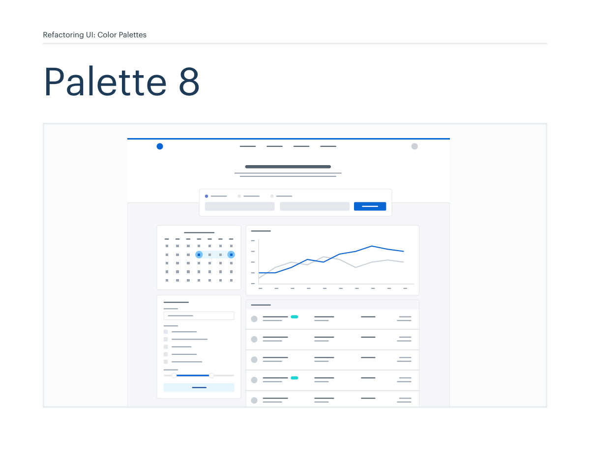
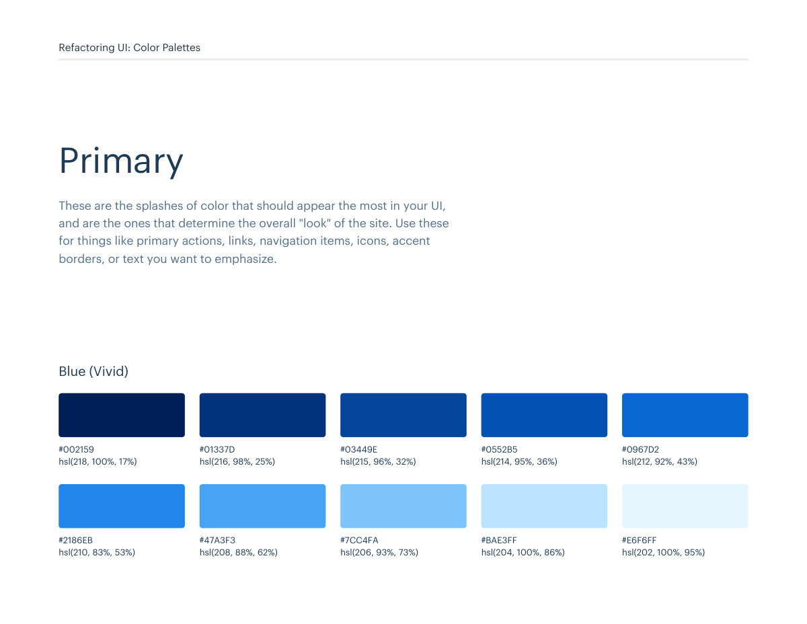
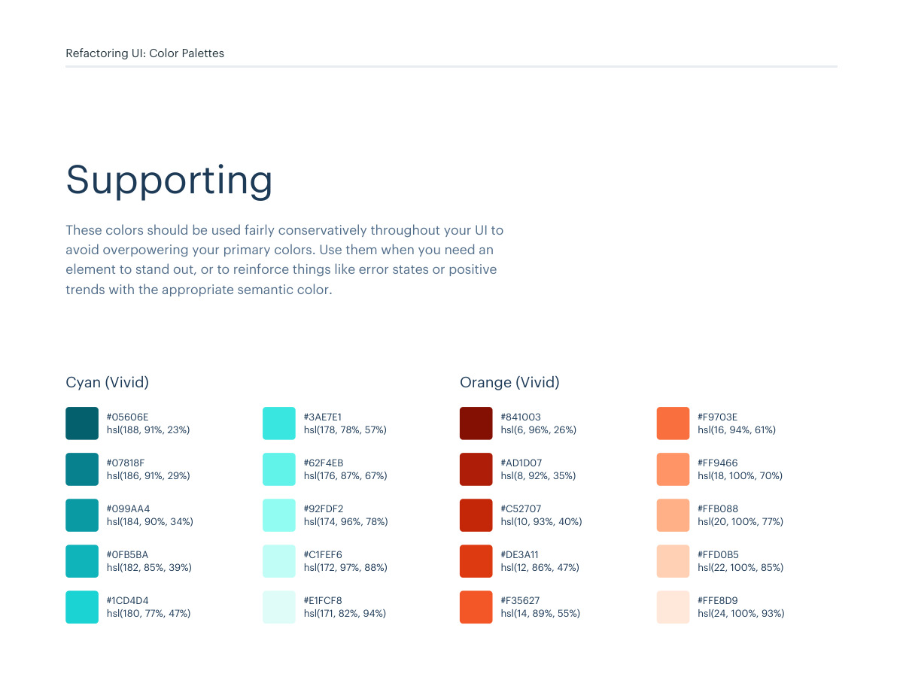
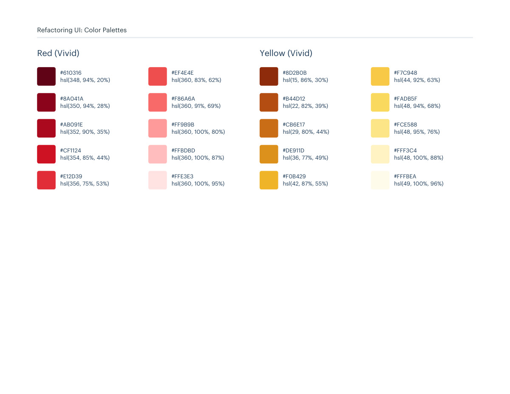

# Color palette 08: blue-vivid

## Apply this

- If a coherent blue-vivid color system fits the task, use palette 08 as a complete candidate.
- Map these source roles to existing semantic tokens, not new component literals: Primary: blue-vivid; Neutrals: cool-grey; Supporting: cyan-vivid, orange-vivid, red-vivid, yellow-vivid.
- Keep palette-specific values intact; do not substitute matching names from swatches.json. Test text, surface, focus, hover, and status contrast, and pair status colors with another cue.

## Source

Source: `Color Palettes v1.1.0.pdf`, version 1.1.0, PDF pages 44–49.
Apply this is new guidance; the source blocks below preserve the supplied pypdf extraction verbatim.
Page images preserve the original visual content, including text absent from extraction.

Palette originals retain source comments and trailing commas (JSONC), despite their `.json` extension.
The `.strict.json` companion removes only that syntax; keys and values remain unchanged.
- [palette-08.json](../assets/palette-08.json)
- [palette-08.strict.json](../assets/palette-08.strict.json)

## Source pages

### Source page 44



```text
Refactoring UI: Color Palettes
Palette 8
```

### Source page 45



```text
Refactoring UI: Color Palettes
These are the splashes of color that should appear the most in your UI, 
and are the ones that determine the overall "look" of the site. Use these 
for things like primary actions, links, navigation items, icons, accent 
borders, or text you want to emphasize.
Primary
hsl(218, 100%, 17%)
hsl(210, 83%, 53%)
hsl(216, 98%, 25%)
hsl(208, 88%, 62%)
hsl(215, 96%, 32%)
hsl(206, 93%, 73%)
hsl(214, 95%, 36%)
hsl(204, 100%, 86%)
hsl(212, 92%, 43%)
hsl(202, 100%, 95%)
#002159
#2186EB
#01337D
#47A3F3
#03449E
#7CC4FA
#0552B5
#BAE3FF
#0967D2
#E6F6FF
Blue (Vivid)
```

### Source page 46


```text
Refactoring UI: Color Palettes
These are the colors you will use the most and will make up the majority 
of your UI. Use them for most of your text, backgrounds, and borders, 
as well as for things like secondary buttons and links.
Neutrals
hsl(210, 24%, 16%)
hsl(211, 10%, 53%)
hsl(209, 20%, 25%)
hsl(211, 13%, 65%)
hsl(209, 18%, 30%)
hsl(210, 16%, 82%)
hsl(209, 14%, 37%)
hsl(214, 15%, 91%)
hsl(211, 12%, 43%)
hsl(216, 33%, 97%)
#1F2933
#7B8794
#323F4B
#9AA5B1
#3E4C59
#CBD2D9
#52606D
#E4E7EB
#616E7C
#F5F7FA
Cool Grey
```

### Source page 47



```text
Refactoring UI: Color Palettes
These colors should be used fairly conservatively throughout your UI to 
avoid overpowering your primary colors. Use them when you need an 
element to stand out, or to reinforce things like error states or positive 
trends with the appropriate semantic color.
Supporting
hsl(6, 96%, 26%)
#841003
hsl(8, 92%, 35%)
#AD1D07
hsl(10, 93%, 40%)
#C52707
hsl(12, 86%, 47%)
#DE3A11
hsl(14, 89%, 55%)
#F35627
hsl(16, 94%, 61%)
#F9703E
hsl(18, 100%, 70%)
#FF9466
hsl(20, 100%, 77%)
#FFB088
hsl(22, 100%, 85%)
#FFD0B5
hsl(24, 100%, 93%)
#FFE8D9
Orange (Vivid)
hsl(188, 91%, 23%)
#05606E
hsl(186, 91%, 29%)
#07818F
hsl(184, 90%, 34%)
#099AA4
hsl(182, 85%, 39%)
#0FB5BA
hsl(180, 77%, 47%)
#1CD4D4
hsl(178, 78%, 57%)
#3AE7E1
hsl(176, 87%, 67%)
#62F4EB
hsl(174, 96%, 78%)
#92FDF2
hsl(172, 97%, 88%)
#C1FEF6
hsl(171, 82%, 94%)
#E1FCF8
Cyan (Vivid)
```

### Source page 48



```text
hsl(15, 86%, 30%)
#8D2B0B
hsl(22, 82%, 39%)
#B44D12
hsl(29, 80%, 44%)
#CB6E17
hsl(36, 77%, 49%)
#DE911D
hsl(42, 87%, 55%)
#F0B429
hsl(44, 92%, 63%)
#F7C948
hsl(48, 94%, 68%)
#FADB5F
hsl(48, 95%, 76%)
#FCE588
hsl(48, 100%, 88%)
#FFF3C4
hsl(49, 100%, 96%)
#FFFBEA
Yellow (Vivid)
hsl(348, 94%, 20%)
#610316
hsl(350, 94%, 28%)
#8A041A
hsl(352, 90%, 35%)
#AB091E
hsl(354, 85%, 44%)
#CF1124
hsl(356, 75%, 53%)
#E12D39
hsl(360, 83%, 62%)
#EF4E4E
hsl(360, 91%, 69%)
#F86A6A
hsl(360, 100%, 80%)
#FF9B9B
hsl(360, 100%, 87%)
#FFBDBD
hsl(360, 100%, 95%)
#FFE3E3
Red (Vivid)
Refactoring UI: Color Palettes
```

### Source page 49


```text

```
