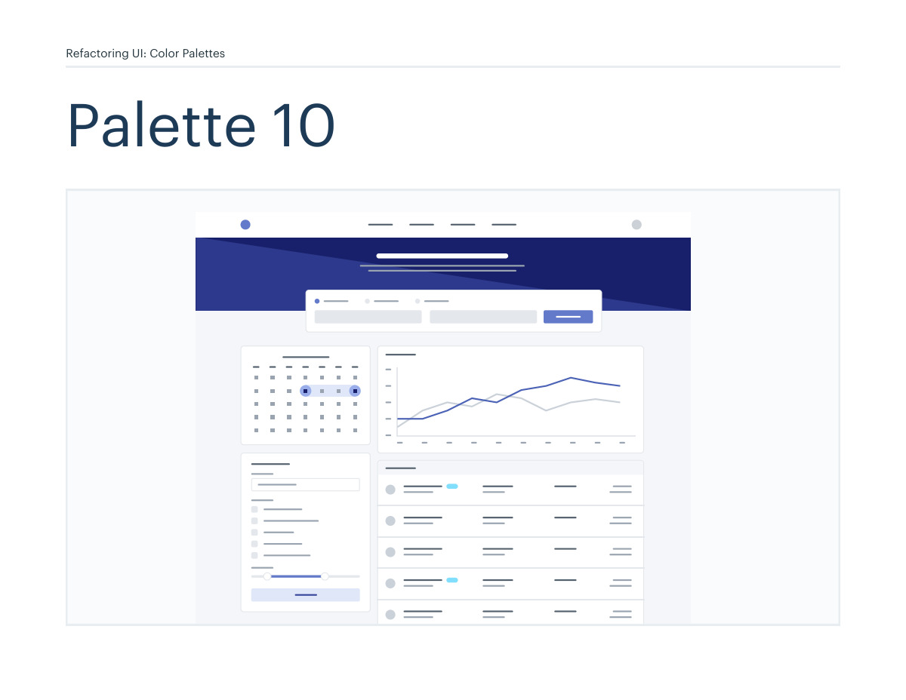
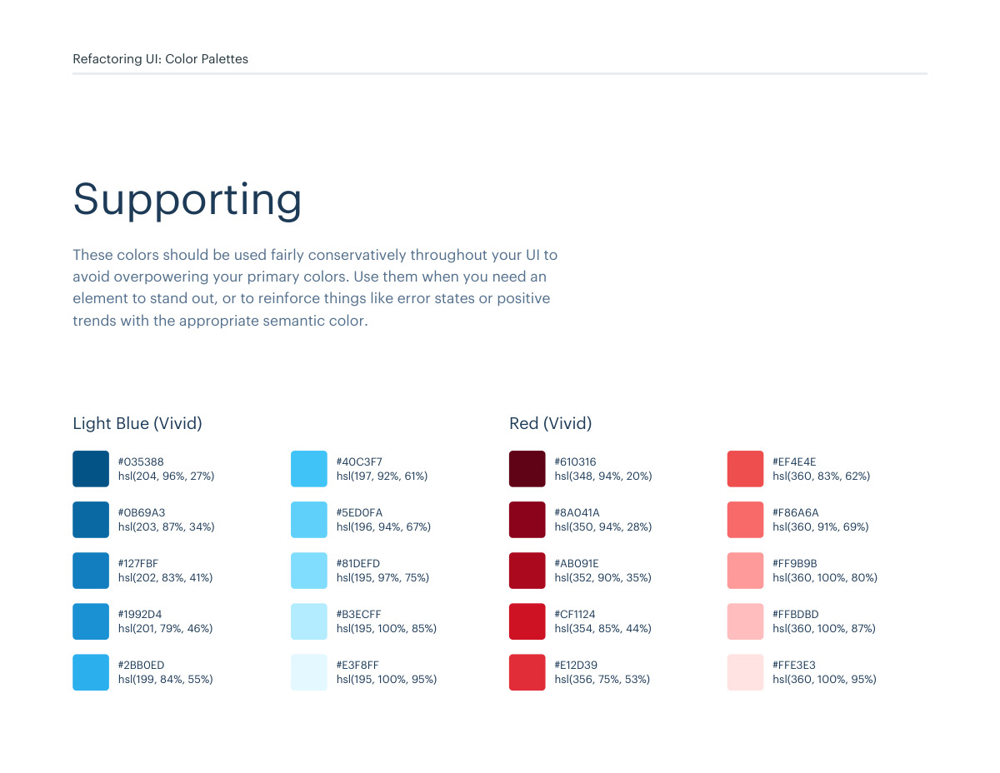
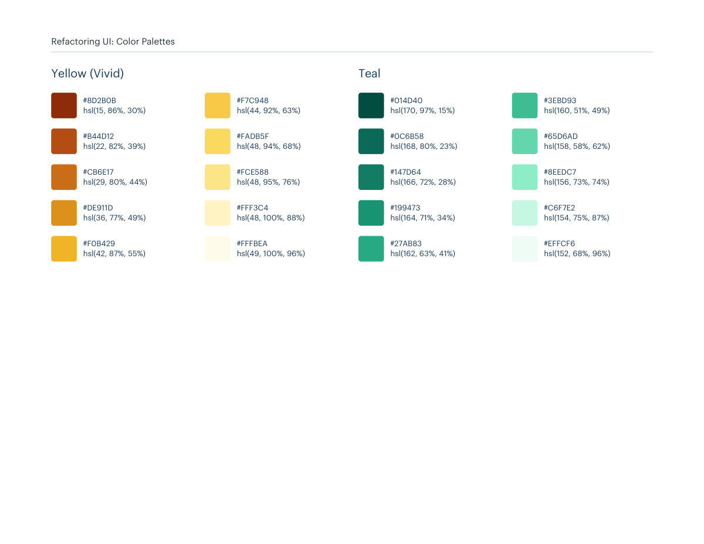

# Color palette 10: indigo

## Apply this

- If a coherent indigo color system fits the task, use palette 10 as a complete candidate.
- Map these source roles to existing semantic tokens, not new component literals: Primary: indigo; Neutrals: cool-grey; Supporting: light-blue-vivid, red-vivid, yellow-vivid, teal.
- Keep palette-specific values intact; do not substitute matching names from swatches.json. Test text, surface, focus, hover, and status contrast, and pair status colors with another cue.

## Source

Source: `Color Palettes v1.1.0.pdf`, version 1.1.0, PDF pages 56–61.
Apply this is new guidance; the source blocks below preserve the supplied pypdf extraction verbatim.
Page images preserve the original visual content, including text absent from extraction.

Palette originals retain source comments and trailing commas (JSONC), despite their `.json` extension.
The `.strict.json` companion removes only that syntax; keys and values remain unchanged.
- [palette-10.json](../assets/palette-10.json)
- [palette-10.strict.json](../assets/palette-10.strict.json)

## Source pages

### Source page 56



```text
Refactoring UI: Color Palettes
Palette 10
```

### Source page 57


```text
Refactoring UI: Color Palettes
These are the splashes of color that should appear the most in your UI, 
and are the ones that determine the overall "look" of the site. Use these 
for things like primary actions, links, navigation items, icons, accent 
borders, or text you want to emphasize.
Primary
hsl(234, 62%, 26%)
hsl(227, 50%, 59%)
hsl(232, 51%, 36%)
hsl(225, 57%, 67%)
hsl(230, 49%, 41%)
hsl(224, 67%, 76%)
hsl(228, 45%, 45%)
hsl(221, 78%, 86%)
hsl(227, 42%, 51%)
hsl(221, 68%, 93%)
#19216C
#647ACB
#2D3A8C
#7B93DB
#35469C
#98AEEB
#4055A8
#BED0F7
#4C63B6
#E0E8F9
Indigo
```

### Source page 58


```text
Refactoring UI: Color Palettes
These are the colors you will use the most and will make up the majority 
of your UI. Use them for most of your text, backgrounds, and borders, 
as well as for things like secondary buttons and links.
Neutrals
hsl(210, 24%, 16%)
hsl(211, 10%, 53%)
hsl(209, 20%, 25%)
hsl(211, 13%, 65%)
hsl(209, 18%, 30%)
hsl(210, 16%, 82%)
hsl(209, 14%, 37%)
hsl(214, 15%, 91%)
hsl(211, 12%, 43%)
hsl(216, 33%, 97%)
#1F2933
#7B8794
#323F4B
#9AA5B1
#3E4C59
#CBD2D9
#52606D
#E4E7EB
#616E7C
#F5F7FA
Cool Grey
```

### Source page 59



```text
Refactoring UI: Color Palettes
These colors should be used fairly conservatively throughout your UI to 
avoid overpowering your primary colors. Use them when you need an 
element to stand out, or to reinforce things like error states or positive 
trends with the appropriate semantic color.
Supporting
hsl(204, 96%, 27%)
#035388
hsl(203, 87%, 34%)
#0B69A3
hsl(202, 83%, 41%)
#127FBF
hsl(201, 79%, 46%)
#1992D4
hsl(199, 84%, 55%)
#2BB0ED
hsl(197, 92%, 61%)
#40C3F7
hsl(196, 94%, 67%)
#5ED0FA
hsl(195, 97%, 75%)
#81DEFD
hsl(195, 100%, 85%)
#B3ECFF
hsl(195, 100%, 95%)
#E3F8FF
Light Blue (Vivid)
hsl(348, 94%, 20%)
#610316
hsl(350, 94%, 28%)
#8A041A
hsl(352, 90%, 35%)
#AB091E
hsl(354, 85%, 44%)
#CF1124
hsl(356, 75%, 53%)
#E12D39
hsl(360, 83%, 62%)
#EF4E4E
hsl(360, 91%, 69%)
#F86A6A
hsl(360, 100%, 80%)
#FF9B9B
hsl(360, 100%, 87%)
#FFBDBD
hsl(360, 100%, 95%)
#FFE3E3
Red (Vivid)
```

### Source page 60



```text
hsl(170, 97%, 15%)
#014D40
hsl(168, 80%, 23%)
#0C6B58
hsl(166, 72%, 28%)
#147D64
hsl(164, 71%, 34%)
#199473
hsl(162, 63%, 41%)
#27AB83
hsl(160, 51%, 49%)
#3EBD93
hsl(158, 58%, 62%)
#65D6AD
hsl(156, 73%, 74%)
#8EEDC7
hsl(154, 75%, 87%)
#C6F7E2
hsl(152, 68%, 96%)
#EFFCF6
Teal
Refactoring UI: Color Palettes
hsl(15, 86%, 30%)
#8D2B0B
hsl(22, 82%, 39%)
#B44D12
hsl(29, 80%, 44%)
#CB6E17
hsl(36, 77%, 49%)
#DE911D
hsl(42, 87%, 55%)
#F0B429
hsl(44, 92%, 63%)
#F7C948
hsl(48, 94%, 68%)
#FADB5F
hsl(48, 95%, 76%)
#FCE588
hsl(48, 100%, 88%)
#FFF3C4
hsl(49, 100%, 96%)
#FFFBEA
Yellow (Vivid)
```

### Source page 61


```text

```
