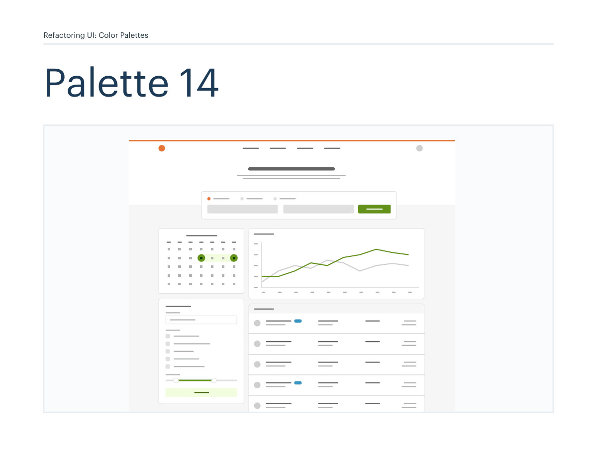
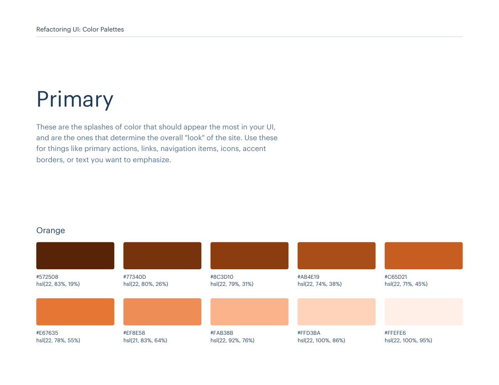
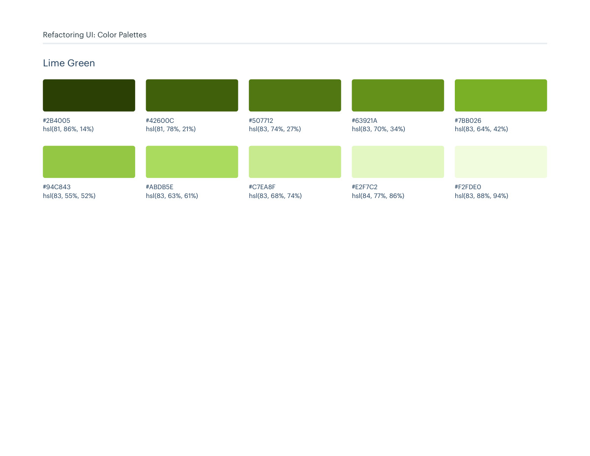
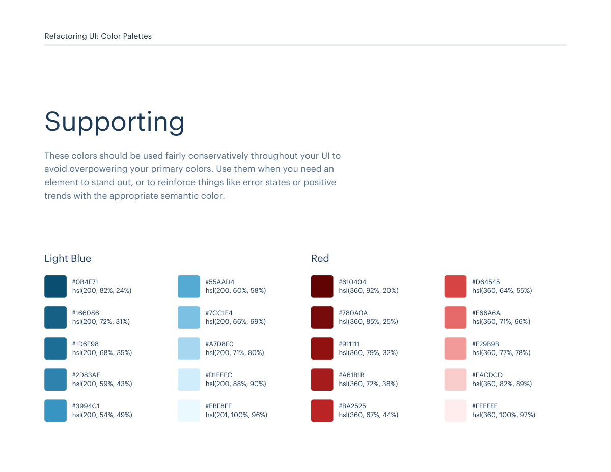

# Color palette 14: orange, lime-green

## Apply this

- If a coherent orange, lime-green color system fits the task, use palette 14 as a complete candidate.
- Map these source roles to existing semantic tokens, not new component literals: Primary: orange, lime-green; Neutrals: grey; Supporting: light-blue, red, yellow.
- Keep palette-specific values intact; do not substitute matching names from swatches.json. Test text, surface, focus, hover, and status contrast, and pair status colors with another cue.

## Source

Source: `Color Palettes v1.1.0.pdf`, version 1.1.0, PDF pages 80–85.
Apply this is new guidance; the source blocks below preserve the supplied pypdf extraction verbatim.
Page images preserve the original visual content, including text absent from extraction.

Palette originals retain source comments and trailing commas (JSONC), despite their `.json` extension.
The `.strict.json` companion removes only that syntax; keys and values remain unchanged.
- [palette-14.json](../assets/palette-14.json)
- [palette-14.strict.json](../assets/palette-14.strict.json)

## Source pages

### Source page 80



```text
Refactoring UI: Color Palettes
Palette 14
```

### Source page 81



```text
Refactoring UI: Color Palettes
These are the splashes of color that should appear the most in your UI, 
and are the ones that determine the overall "look" of the site. Use these 
for things like primary actions, links, navigation items, icons, accent 
borders, or text you want to emphasize.
Primary
hsl(22, 83%, 19%)
hsl(22, 78%, 55%)
hsl(22, 80%, 26%)
hsl(21, 83%, 64%)
hsl(22, 79%, 31%)
hsl(22, 92%, 76%)
hsl(22, 74%, 38%)
hsl(22, 100%, 86%)
hsl(22, 71%, 45%)
hsl(22, 100%, 95%)
#572508
#E67635
#77340D
#EF8E58
#8C3D10
#FAB38B
#AB4E19
#FFD3BA
#C65D21
#FFEFE6
Orange
```

### Source page 82



```text
Refactoring UI: Color Palettes
hsl(81, 86%, 14%)
hsl(83, 55%, 52%)
hsl(81, 78%, 21%)
hsl(83, 63%, 61%)
hsl(83, 74%, 27%)
hsl(83, 68%, 74%)
hsl(83, 70%, 34%)
hsl(84, 77%, 86%)
hsl(83, 64%, 42%)
hsl(83, 88%, 94%)
#2B4005
#94C843
#42600C
#ABDB5E
#507712
#C7EA8F
#63921A
#E2F7C2
#7BB026
#F2FDE0
Lime Green
```

### Source page 83


```text
Refactoring UI: Color Palettes
These are the colors you will use the most and will make up the majority 
of your UI. Use them for most of your text, backgrounds, and borders, 
as well as for things like secondary buttons and links.
Neutrals
hsl(0, 0%, 13%)
hsl(0, 0%, 62%)
hsl(0, 0%, 23%)
hsl(0, 0%, 69%)
hsl(0, 0%, 32%)
hsl(0, 0%, 81%)
hsl(0, 0%, 38%)
hsl(0, 0%, 88%)
hsl(0, 0%, 49%)
hsl(0, 0%, 97%)
#222222
#9E9E9E
#3B3B3B
#B1B1B1
#515151
#CFCFCF
#626262
#E1E1E1
#7E7E7E
#F7F7F7
Grey
```

### Source page 84



```text
Refactoring UI: Color Palettes
These colors should be used fairly conservatively throughout your UI to 
avoid overpowering your primary colors. Use them when you need an 
element to stand out, or to reinforce things like error states or positive 
trends with the appropriate semantic color.
Supporting
hsl(200, 82%, 24%)
#0B4F71
hsl(200, 72%, 31%)
#166086
hsl(200, 68%, 35%)
#1D6F98
hsl(200, 59%, 43%)
#2D83AE
hsl(200, 54%, 49%)
#3994C1
hsl(200, 60%, 58%)
#55AAD4
hsl(200, 66%, 69%)
#7CC1E4
hsl(200, 71%, 80%)
#A7D8F0
hsl(200, 88%, 90%)
#D1EEFC
hsl(201, 100%, 96%)
#EBF8FF
Light Blue
hsl(360, 92%, 20%)
#610404
hsl(360, 85%, 25%)
#780A0A
hsl(360, 79%, 32%)
#911111
hsl(360, 72%, 38%)
#A61B1B
hsl(360, 67%, 44%)
#BA2525
hsl(360, 64%, 55%)
#D64545
hsl(360, 71%, 66%)
#E66A6A
hsl(360, 77%, 78%)
#F29B9B
hsl(360, 82%, 89%)
#FACDCD
hsl(360, 100%, 97%)
#FFEEEE
Red
```

### Source page 85


```text
Refactoring UI: Color Palettes
hsl(43, 86%, 17%)
#513C06
hsl(43, 77%, 27%)
#7C5E10
hsl(43, 72%, 37%)
#A27C1A
hsl(42, 63%, 48%)
#C99A2E
hsl(42, 78%, 60%)
#E9B949
hsl(43, 89%, 70%)
#F7D070
hsl(43, 90%, 76%)
#F9DA8B
hsl(45, 86%, 81%)
#F8E3A3
hsl(45, 90%, 88%)
#FCEFC7
hsl(45, 100%, 96%)
#FFFAEB
Yellow
```
