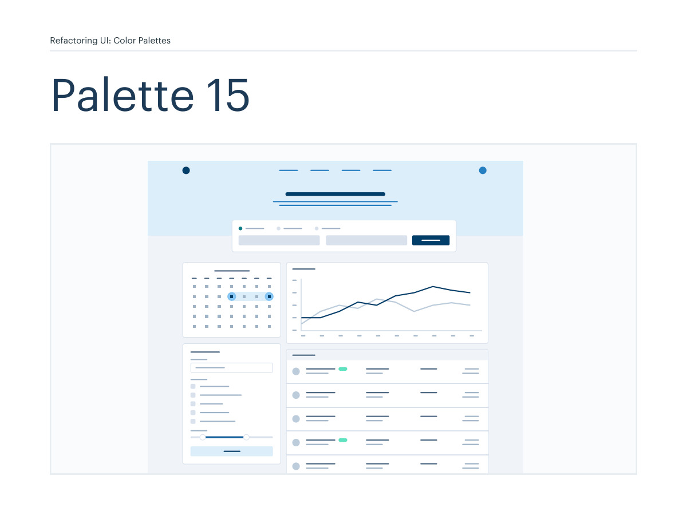
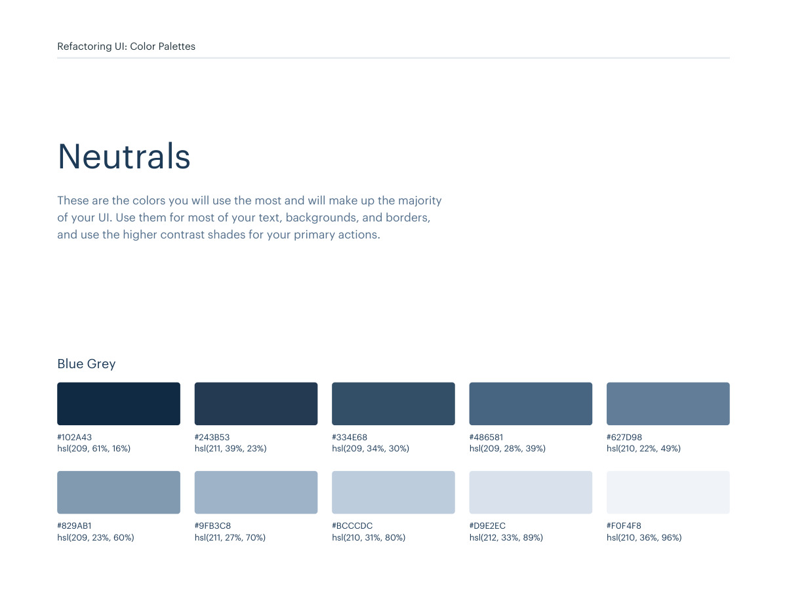
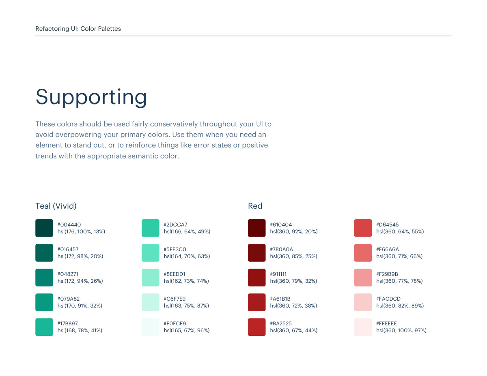
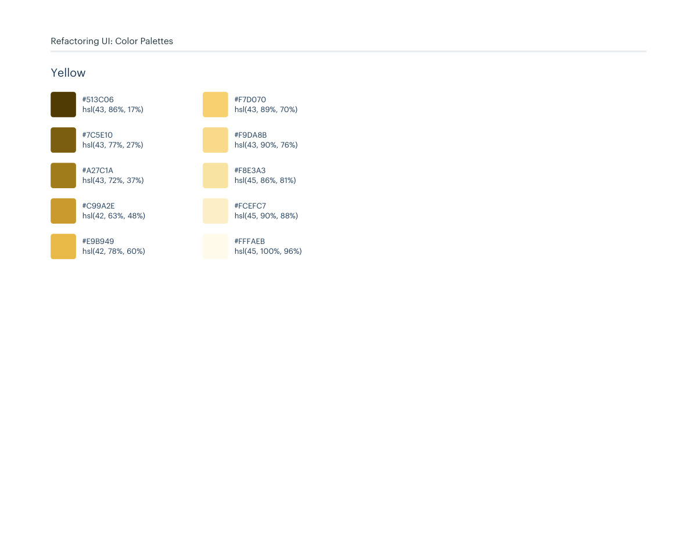

# Color palette 15: blue

## Apply this

- If a coherent blue color system fits the task, use palette 15 as a complete candidate.
- Map these source roles to existing semantic tokens, not new component literals: Primary: blue; Neutrals: blue-grey; Supporting: teal-vivid, red, yellow.
- Keep palette-specific values intact; do not substitute matching names from swatches.json. Test text, surface, focus, hover, and status contrast, and pair status colors with another cue.

## Source

Source: `Color Palettes v1.1.0.pdf`, version 1.1.0, PDF pages 86–91.
Apply this is new guidance; the source blocks below preserve the supplied pypdf extraction verbatim.
Page images preserve the original visual content, including text absent from extraction.

Palette originals retain source comments and trailing commas (JSONC), despite their `.json` extension.
The `.strict.json` companion removes only that syntax; keys and values remain unchanged.
- [palette-15.json](../assets/palette-15.json)
- [palette-15.strict.json](../assets/palette-15.strict.json)

## Source pages

### Source page 86



```text
Refactoring UI: Color Palettes
Palette 15
```

### Source page 87


```text
Refactoring UI: Color Palettes
These are the splashes of color that should appear the most in your UI, 
and are the ones that determine the overall "look" of the site. Use these 
for things like primary actions, links, navigation items, icons, accent 
borders, or text you want to emphasize.
Primary
hsl(205, 100%, 21%)
hsl(205, 65%, 55%)
hsl(205, 87%, 29%)
hsl(205, 74%, 65%)
hsl(205, 82%, 33%)
hsl(205, 84%, 74%)
hsl(205, 76%, 39%)
hsl(205, 97%, 85%)
hsl(205, 67%, 45%)
hsl(205, 79%, 92%)
#003E6B
#4098D7
#0A558C
#62B0E8
#0F609B
#84C5F4
#186FAF
#B6E0FE
#2680C2
#DCEEFB
Blue
```

### Source page 88



```text
Refactoring UI: Color Palettes
These are the colors you will use the most and will make up the majority 
of your UI. Use them for most of your text, backgrounds, and borders, 
and use the higher contrast shades for your primary actions.
Neutrals
hsl(209, 61%, 16%)
hsl(209, 23%, 60%)
hsl(211, 39%, 23%)
hsl(211, 27%, 70%)
hsl(209, 34%, 30%)
hsl(210, 31%, 80%)
hsl(209, 28%, 39%)
hsl(212, 33%, 89%)
hsl(210, 22%, 49%)
hsl(210, 36%, 96%)
#102A43
#829AB1
#243B53
#9FB3C8
#334E68
#BCCCDC
#486581
#D9E2EC
#627D98
#F0F4F8
Blue Grey
```

### Source page 89



```text
Refactoring UI: Color Palettes
These colors should be used fairly conservatively throughout your UI to 
avoid overpowering your primary colors. Use them when you need an 
element to stand out, or to reinforce things like error states or positive 
trends with the appropriate semantic color.
Supporting
hsl(176, 100%, 13%)
#004440
hsl(172, 98%, 20%)
#016457
hsl(172, 94%, 26%)
#048271
hsl(170, 91%, 32%)
#079A82
hsl(168, 78%, 41%)
#17B897
hsl(166, 64%, 49%)
#2DCCA7
hsl(164, 70%, 63%)
#5FE3C0
hsl(162, 73%, 74%)
#8EEDD1
hsl(163, 75%, 87%)
#C6F7E9
hsl(165, 67%, 96%)
#F0FCF9
Teal (Vivid)
hsl(360, 92%, 20%)
#610404
hsl(360, 85%, 25%)
#780A0A
hsl(360, 79%, 32%)
#911111
hsl(360, 72%, 38%)
#A61B1B
hsl(360, 67%, 44%)
#BA2525
hsl(360, 64%, 55%)
#D64545
hsl(360, 71%, 66%)
#E66A6A
hsl(360, 77%, 78%)
#F29B9B
hsl(360, 82%, 89%)
#FACDCD
hsl(360, 100%, 97%)
#FFEEEE
Red
```

### Source page 90



```text
hsl(43, 86%, 17%)
#513C06
hsl(43, 77%, 27%)
#7C5E10
hsl(43, 72%, 37%)
#A27C1A
hsl(42, 63%, 48%)
#C99A2E
hsl(42, 78%, 60%)
#E9B949
hsl(43, 89%, 70%)
#F7D070
hsl(43, 90%, 76%)
#F9DA8B
hsl(45, 86%, 81%)
#F8E3A3
hsl(45, 90%, 88%)
#FCEFC7
hsl(45, 100%, 96%)
#FFFAEB
Yellow
Refactoring UI: Color Palettes
```

### Source page 91


```text

```
