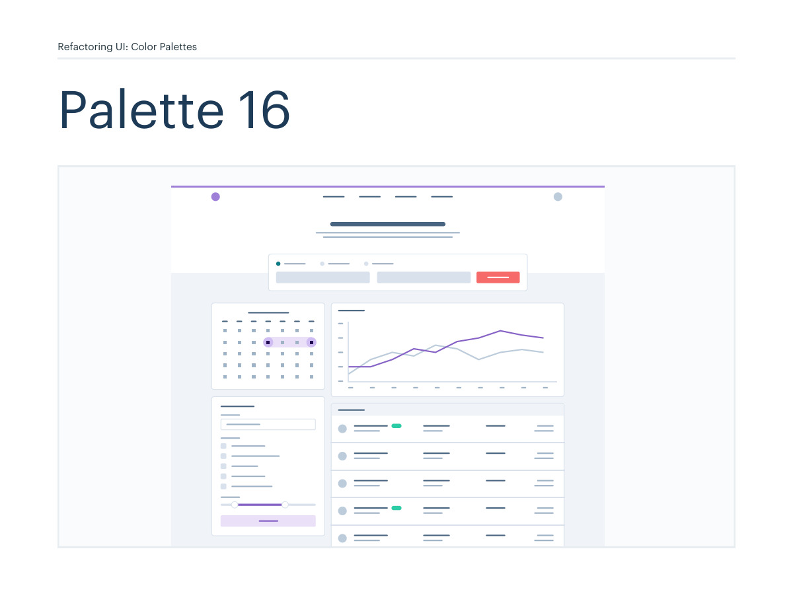
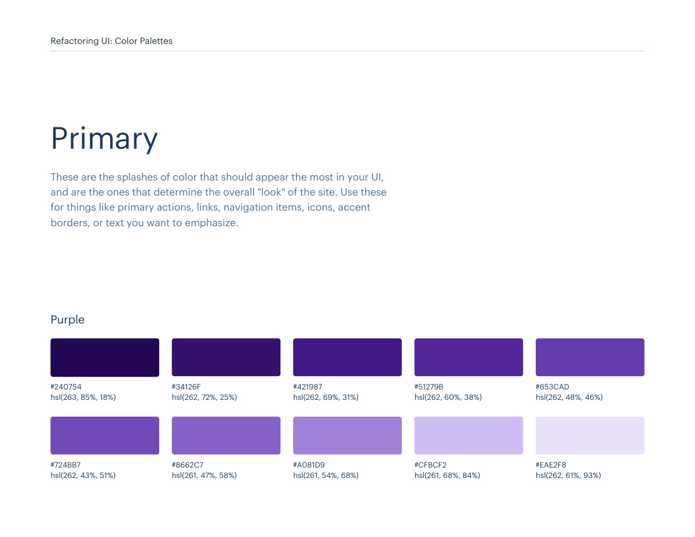
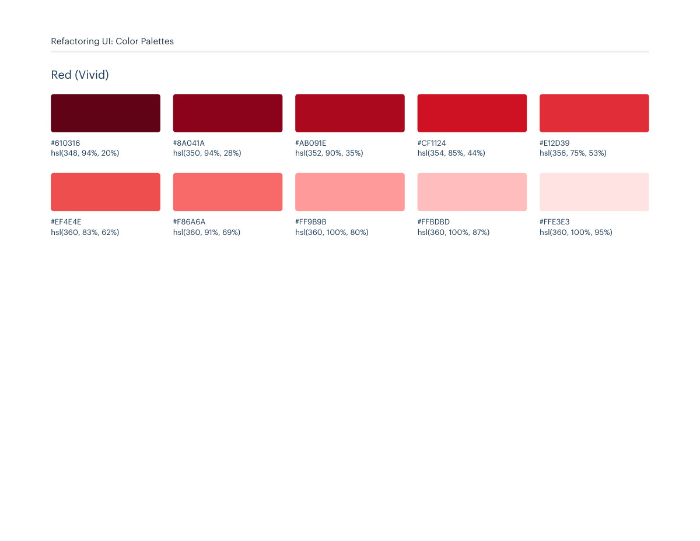
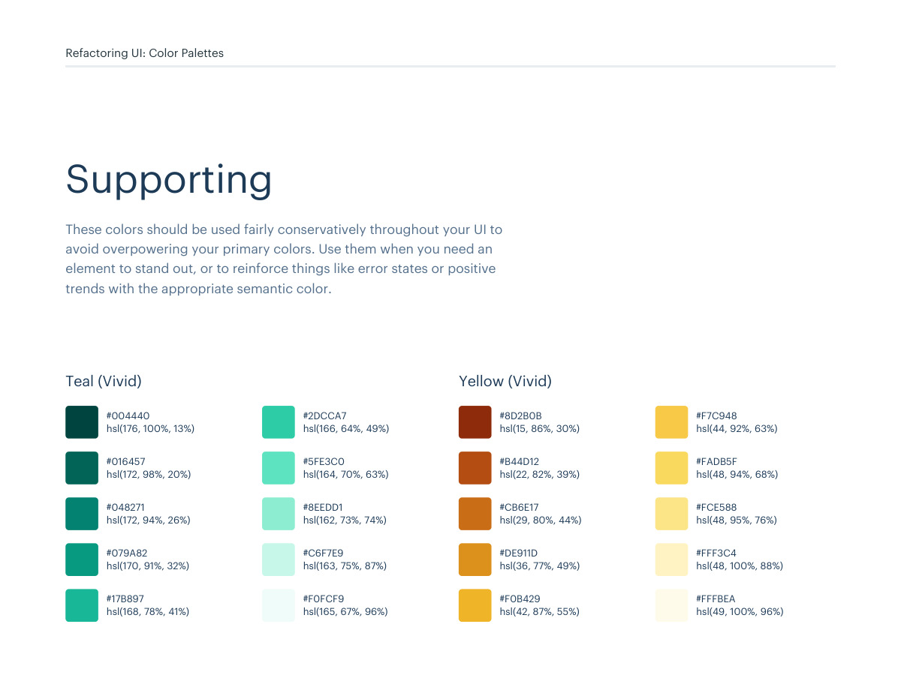

# Color palette 16: purple, red-vivid

## Apply this

- If a coherent purple, red-vivid color system fits the task, use palette 16 as a complete candidate.
- Map these source roles to existing semantic tokens, not new component literals: Primary: purple, red-vivid; Neutrals: blue-grey; Supporting: teal-vivid, yellow-vivid.
- Keep palette-specific values intact; do not substitute matching names from swatches.json. Test text, surface, focus, hover, and status contrast, and pair status colors with another cue.

## Source

Source: `Color Palettes v1.1.0.pdf`, version 1.1.0, PDF pages 92–97.
Apply this is new guidance; the source blocks below preserve the supplied pypdf extraction verbatim.
Page images preserve the original visual content, including text absent from extraction.

Palette originals retain source comments and trailing commas (JSONC), despite their `.json` extension.
The `.strict.json` companion removes only that syntax; keys and values remain unchanged.
- [palette-16.json](../assets/palette-16.json)
- [palette-16.strict.json](../assets/palette-16.strict.json)

## Source pages

### Source page 92



```text
Refactoring UI: Color Palettes
Palette 16
```

### Source page 93



```text
Refactoring UI: Color Palettes
These are the splashes of color that should appear the most in your UI, 
and are the ones that determine the overall "look" of the site. Use these 
for things like primary actions, links, navigation items, icons, accent 
borders, or text you want to emphasize.
Primary
Purple
hsl(263, 85%, 18%)
#240754
hsl(262, 72%, 25%)
#34126F
hsl(262, 69%, 31%)
#421987
hsl(262, 60%, 38%)
#51279B
hsl(262, 48%, 46%)
#653CAD
hsl(262, 43%, 51%)
#724BB7
hsl(261, 47%, 58%)
#8662C7
hsl(261, 54%, 68%)
#A081D9
hsl(261, 68%, 84%)
#CFBCF2
hsl(262, 61%, 93%)
#EAE2F8
```

### Source page 94



```text
Refactoring UI: Color Palettes
hsl(348, 94%, 20%)
#610316
hsl(350, 94%, 28%)
#8A041A
hsl(352, 90%, 35%)
#AB091E
hsl(354, 85%, 44%)
#CF1124
hsl(356, 75%, 53%)
#E12D39
hsl(360, 83%, 62%)
#EF4E4E
hsl(360, 91%, 69%)
#F86A6A
hsl(360, 100%, 80%)
#FF9B9B
hsl(360, 100%, 87%)
#FFBDBD
hsl(360, 100%, 95%)
#FFE3E3
Red (Vivid)
```

### Source page 95


```text
Refactoring UI: Color Palettes
These are the colors you will use the most and will make up the majority 
of your UI. Use them for most of your text, backgrounds, and borders, 
and use the higher contrast shades for your primary actions.
Neutrals
hsl(209, 61%, 16%)
hsl(209, 23%, 60%)
hsl(211, 39%, 23%)
hsl(211, 27%, 70%)
hsl(209, 34%, 30%)
hsl(210, 31%, 80%)
hsl(209, 28%, 39%)
hsl(212, 33%, 89%)
hsl(210, 22%, 49%)
hsl(210, 36%, 96%)
#102A43
#829AB1
#243B53
#9FB3C8
#334E68
#BCCCDC
#486581
#D9E2EC
#627D98
#F0F4F8
Blue Grey
```

### Source page 96



```text
Refactoring UI: Color Palettes
These colors should be used fairly conservatively throughout your UI to 
avoid overpowering your primary colors. Use them when you need an 
element to stand out, or to reinforce things like error states or positive 
trends with the appropriate semantic color.
Supporting
hsl(176, 100%, 13%)
#004440
hsl(172, 98%, 20%)
#016457
hsl(172, 94%, 26%)
#048271
hsl(170, 91%, 32%)
#079A82
hsl(168, 78%, 41%)
#17B897
hsl(166, 64%, 49%)
#2DCCA7
hsl(164, 70%, 63%)
#5FE3C0
hsl(162, 73%, 74%)
#8EEDD1
hsl(163, 75%, 87%)
#C6F7E9
hsl(165, 67%, 96%)
#F0FCF9
Teal (Vivid)
hsl(15, 86%, 30%)
#8D2B0B
hsl(22, 82%, 39%)
#B44D12
hsl(29, 80%, 44%)
#CB6E17
hsl(36, 77%, 49%)
#DE911D
hsl(42, 87%, 55%)
#F0B429
hsl(44, 92%, 63%)
#F7C948
hsl(48, 94%, 68%)
#FADB5F
hsl(48, 95%, 76%)
#FCE588
hsl(48, 100%, 88%)
#FFF3C4
hsl(49, 100%, 96%)
#FFFBEA
Yellow (Vivid)
```

### Source page 97


```text

```
