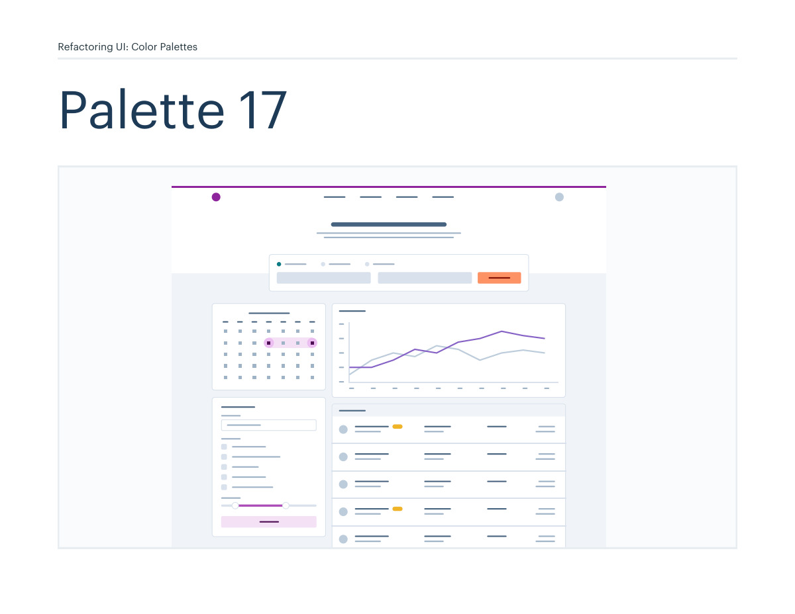
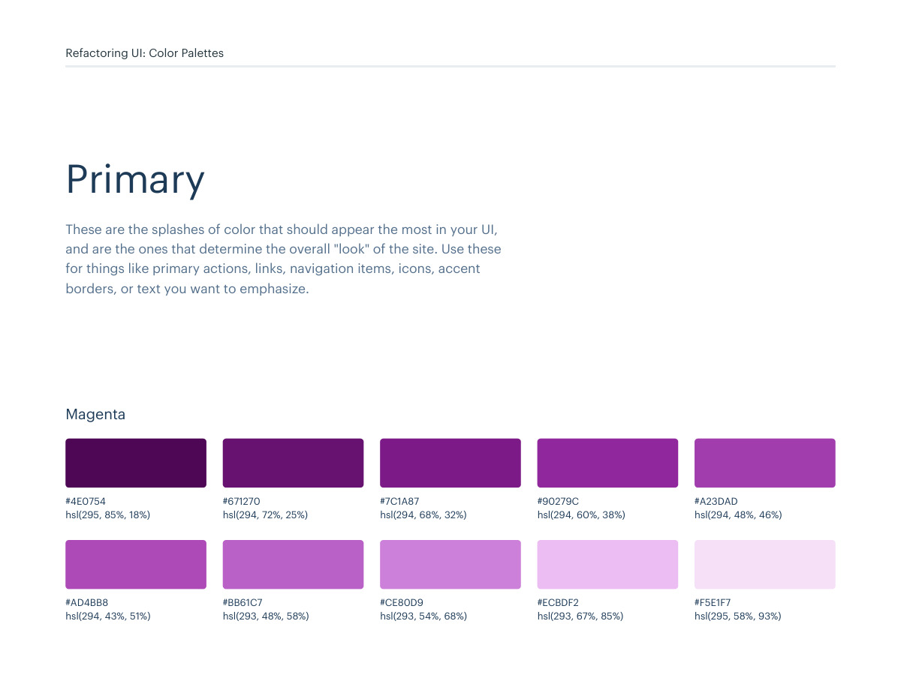
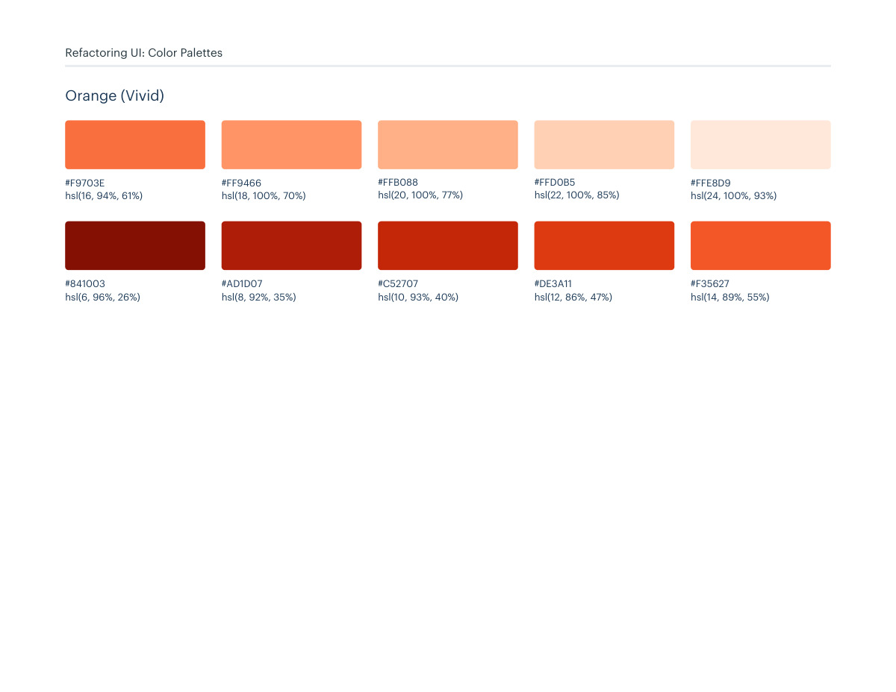
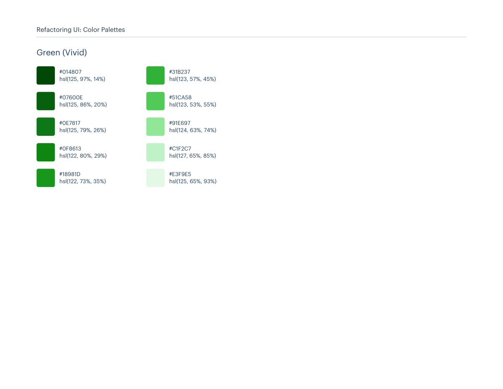

# Color palette 17: magenta, orange-vivid

## Apply this

- If a coherent magenta, orange-vivid color system fits the task, use palette 17 as a complete candidate.
- Map these source roles to existing semantic tokens, not new component literals: Primary: magenta, orange-vivid; Neutrals: blue-grey; Supporting: yellow-vivid, red-vivid, green-vivid.
- Keep palette-specific values intact; do not substitute matching names from swatches.json. Test text, surface, focus, hover, and status contrast, and pair status colors with another cue.

## Source

Source: `Color Palettes v1.1.0.pdf`, version 1.1.0, PDF pages 98–103.
Apply this is new guidance; the source blocks below preserve the supplied pypdf extraction verbatim.
Page images preserve the original visual content, including text absent from extraction.

Palette originals retain source comments and trailing commas (JSONC), despite their `.json` extension.
The `.strict.json` companion removes only that syntax; keys and values remain unchanged.
- [palette-17.json](../assets/palette-17.json)
- [palette-17.strict.json](../assets/palette-17.strict.json)

## Source pages

### Source page 98



```text
Refactoring UI: Color Palettes
Palette 17
```

### Source page 99



```text
Refactoring UI: Color Palettes
These are the splashes of color that should appear the most in your UI, 
and are the ones that determine the overall "look" of the site. Use these 
for things like primary actions, links, navigation items, icons, accent 
borders, or text you want to emphasize.
Primary
hsl(295, 85%, 18%)
#4E0754
hsl(294, 72%, 25%)
#671270
hsl(294, 68%, 32%)
#7C1A87
hsl(294, 60%, 38%)
#90279C
hsl(294, 48%, 46%)
#A23DAD
hsl(294, 43%, 51%)
#AD4BB8
hsl(293, 48%, 58%)
#BB61C7
hsl(293, 54%, 68%)
#CE80D9
hsl(293, 67%, 85%)
#ECBDF2
hsl(295, 58%, 93%)
#F5E1F7
Magenta
```

### Source page 100



```text
Refactoring UI: Color Palettes
hsl(6, 96%, 26%)
#841003
hsl(8, 92%, 35%)
#AD1D07
hsl(10, 93%, 40%)
#C52707
hsl(12, 86%, 47%)
#DE3A11
hsl(14, 89%, 55%)
#F35627
hsl(16, 94%, 61%)
#F9703E
hsl(18, 100%, 70%)
#FF9466
hsl(20, 100%, 77%)
#FFB088
hsl(22, 100%, 85%)
#FFD0B5
hsl(24, 100%, 93%)
#FFE8D9
Orange (Vivid)
```

### Source page 101


```text
Refactoring UI: Color Palettes
These are the colors you will use the most and will make up the majority 
of your UI. Use them for most of your text, backgrounds, and borders, 
and use the higher contrast shades for your primary actions.
Neutrals
hsl(209, 61%, 16%)
hsl(209, 23%, 60%)
hsl(211, 39%, 23%)
hsl(211, 27%, 70%)
hsl(209, 34%, 30%)
hsl(210, 31%, 80%)
hsl(209, 28%, 39%)
hsl(212, 33%, 89%)
hsl(210, 22%, 49%)
hsl(210, 36%, 96%)
#102A43
#829AB1
#243B53
#9FB3C8
#334E68
#BCCCDC
#486581
#D9E2EC
#627D98
#F0F4F8
Blue Grey
```

### Source page 102


```text
Refactoring UI: Color Palettes
These colors should be used fairly conservatively throughout your UI to 
avoid overpowering your primary colors. Use them when you need an 
element to stand out, or to reinforce things like error states or positive 
trends with the appropriate semantic color.
Supporting
hsl(15, 86%, 30%)
#8D2B0B
hsl(22, 82%, 39%)
#B44D12
hsl(29, 80%, 44%)
#CB6E17
hsl(36, 77%, 49%)
#DE911D
hsl(42, 87%, 55%)
#F0B429
hsl(44, 92%, 63%)
#F7C948
hsl(48, 94%, 68%)
#FADB5F
hsl(48, 95%, 76%)
#FCE588
hsl(48, 100%, 88%)
#FFF3C4
hsl(49, 100%, 96%)
#FFFBEA
Yellow (Vivid)
hsl(348, 94%, 20%)
#610316
hsl(350, 94%, 28%)
#8A041A
hsl(352, 90%, 35%)
#AB091E
hsl(354, 85%, 44%)
#CF1124
hsl(356, 75%, 53%)
#E12D39
hsl(360, 83%, 62%)
#EF4E4E
hsl(360, 91%, 69%)
#F86A6A
hsl(360, 100%, 80%)
#FF9B9B
hsl(360, 100%, 87%)
#FFBDBD
hsl(360, 100%, 95%)
#FFE3E3
Red (Vivid)
```

### Source page 103



```text
hsl(125, 97%, 14%)
#014807
hsl(125, 86%, 20%)
#07600E
hsl(125, 79%, 26%)
#0E7817
hsl(122, 80%, 29%)
#0F8613
hsl(122, 73%, 35%)
#18981D
hsl(123, 57%, 45%)
#31B237
hsl(123, 53%, 55%)
#51CA58
hsl(124, 63%, 74%)
#91E697
hsl(127, 65%, 85%)
#C1F2C7
hsl(125, 65%, 93%)
#E3F9E5
Green (Vivid)
Refactoring UI: Color Palettes
```
