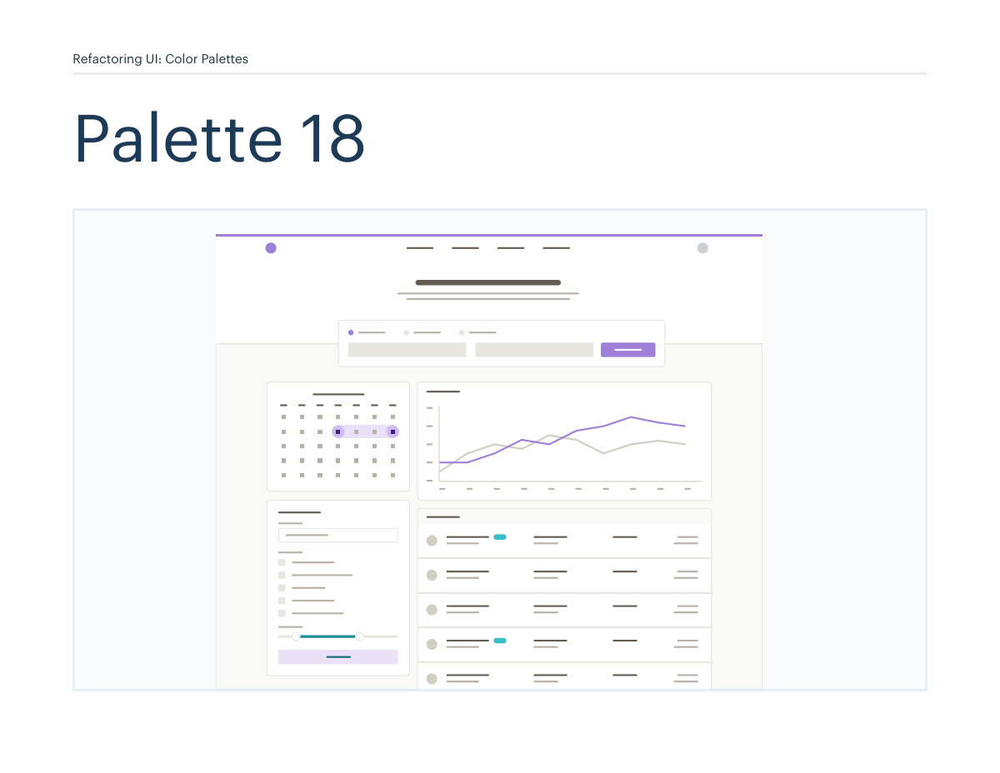
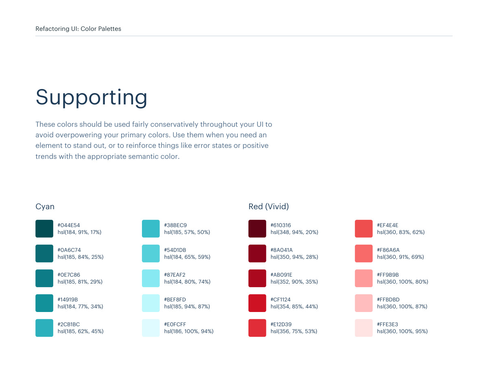
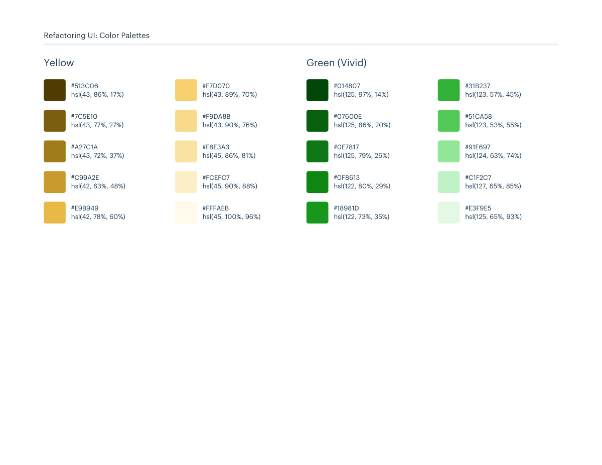

# Color palette 18: purple

## Apply this

- If a coherent purple color system fits the task, use palette 18 as a complete candidate.
- Map these source roles to existing semantic tokens, not new component literals: Primary: purple; Neutrals: warm-grey; Supporting: cyan, red-vivid, yellow, green-vivid.
- Keep palette-specific values intact; do not substitute matching names from swatches.json. Test text, surface, focus, hover, and status contrast, and pair status colors with another cue.

## Source

Source: `Color Palettes v1.1.0.pdf`, version 1.1.0, PDF pages 104–109.
Apply this is new guidance; the source blocks below preserve the supplied pypdf extraction verbatim.
Page images preserve the original visual content, including text absent from extraction.

Palette originals retain source comments and trailing commas (JSONC), despite their `.json` extension.
The `.strict.json` companion removes only that syntax; keys and values remain unchanged.
- [palette-18.json](../assets/palette-18.json)
- [palette-18.strict.json](../assets/palette-18.strict.json)

## Source pages

### Source page 104



```text
Refactoring UI: Color Palettes
Palette 18
```

### Source page 105


```text
Refactoring UI: Color Palettes
These are the splashes of color that should appear the most in your UI, 
and are the ones that determine the overall "look" of the site. Use these 
for things like primary actions, links, navigation items, icons, accent 
borders, or text you want to emphasize.
Primary
Purple
hsl(263, 85%, 18%)
#240754
hsl(262, 72%, 25%)
#34126F
hsl(262, 69%, 31%)
#421987
hsl(262, 60%, 38%)
#51279B
hsl(262, 48%, 46%)
#653CAD
hsl(262, 43%, 51%)
#724BB7
hsl(261, 47%, 58%)
#8662C7
hsl(261, 54%, 68%)
#A081D9
hsl(261, 68%, 84%)
#CFBCF2
hsl(262, 61%, 93%)
#EAE2F8
```

### Source page 106


```text
Refactoring UI: Color Palettes
These are the colors you will use the most and will make up the majority 
of your UI. Use them for most of your text, backgrounds, and borders, 
as well as for things like secondary buttons and links.
Neutrals
hsl(43, 13%, 90%)
#E8E6E1
hsl(42, 15%, 13%)
hsl(41, 8%, 61%)
hsl(40, 13%, 23%)
hsl(39, 11%, 69%)
hsl(37, 11%, 28%)
hsl(40, 15%, 80%)
hsl(41, 9%, 35%) hsl(41, 8%, 48%)
hsl(40, 23%, 97%)
#27241D
#A39E93
#423D33
#B8B2A7
#504A40
#D3CEC4
#625D52 #857F72
#FAF9F7
Warm Grey
```

### Source page 107



```text
Refactoring UI: Color Palettes
These colors should be used fairly conservatively throughout your UI to 
avoid overpowering your primary colors. Use them when you need an 
element to stand out, or to reinforce things like error states or positive 
trends with the appropriate semantic color.
Supporting
hsl(184, 91%, 17%)
#044E54
hsl(185, 84%, 25%)
#0A6C74
hsl(185, 81%, 29%)
#0E7C86
hsl(184, 77%, 34%)
#14919B
hsl(185, 62%, 45%)
#2CB1BC
hsl(185, 57%, 50%)
#38BEC9
hsl(184, 65%, 59%)
#54D1DB
hsl(184, 80%, 74%)
#87EAF2
hsl(185, 94%, 87%)
#BEF8FD
hsl(186, 100%, 94%)
#E0FCFF
Cyan
hsl(348, 94%, 20%)
#610316
hsl(350, 94%, 28%)
#8A041A
hsl(352, 90%, 35%)
#AB091E
hsl(354, 85%, 44%)
#CF1124
hsl(356, 75%, 53%)
#E12D39
hsl(360, 83%, 62%)
#EF4E4E
hsl(360, 91%, 69%)
#F86A6A
hsl(360, 100%, 80%)
#FF9B9B
hsl(360, 100%, 87%)
#FFBDBD
hsl(360, 100%, 95%)
#FFE3E3
Red (Vivid)
```

### Source page 108



```text
hsl(43, 86%, 17%)
#513C06
hsl(43, 77%, 27%)
#7C5E10
hsl(43, 72%, 37%)
#A27C1A
hsl(42, 63%, 48%)
#C99A2E
hsl(42, 78%, 60%)
#E9B949
hsl(43, 89%, 70%)
#F7D070
hsl(43, 90%, 76%)
#F9DA8B
hsl(45, 86%, 81%)
#F8E3A3
hsl(45, 90%, 88%)
#FCEFC7
hsl(45, 100%, 96%)
#FFFAEB
Yellow
Refactoring UI: Color Palettes
hsl(125, 97%, 14%)
#014807
hsl(125, 86%, 20%)
#07600E
hsl(125, 79%, 26%)
#0E7817
hsl(122, 80%, 29%)
#0F8613
hsl(122, 73%, 35%)
#18981D
hsl(123, 57%, 45%)
#31B237
hsl(123, 53%, 55%)
#51CA58
hsl(124, 63%, 74%)
#91E697
hsl(127, 65%, 85%)
#C1F2C7
hsl(125, 65%, 93%)
#E3F9E5
Green (Vivid)
```

### Source page 109


```text

```
