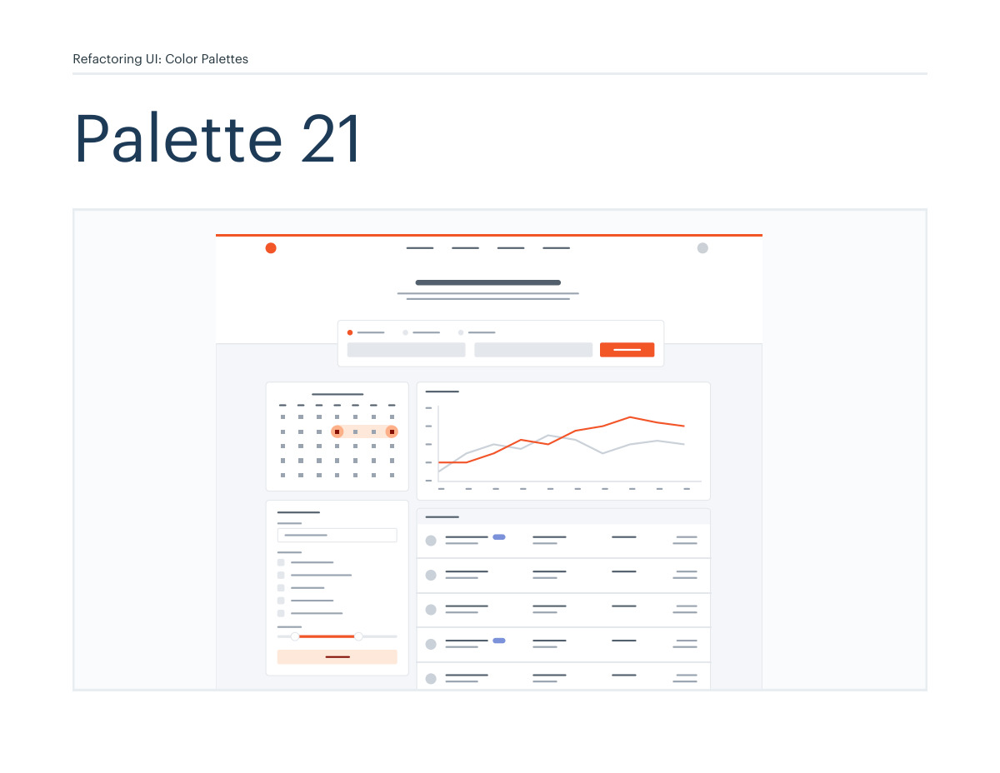
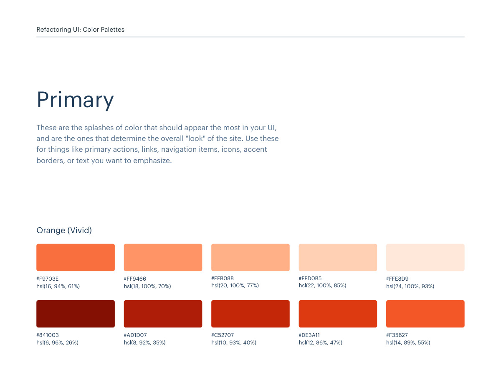
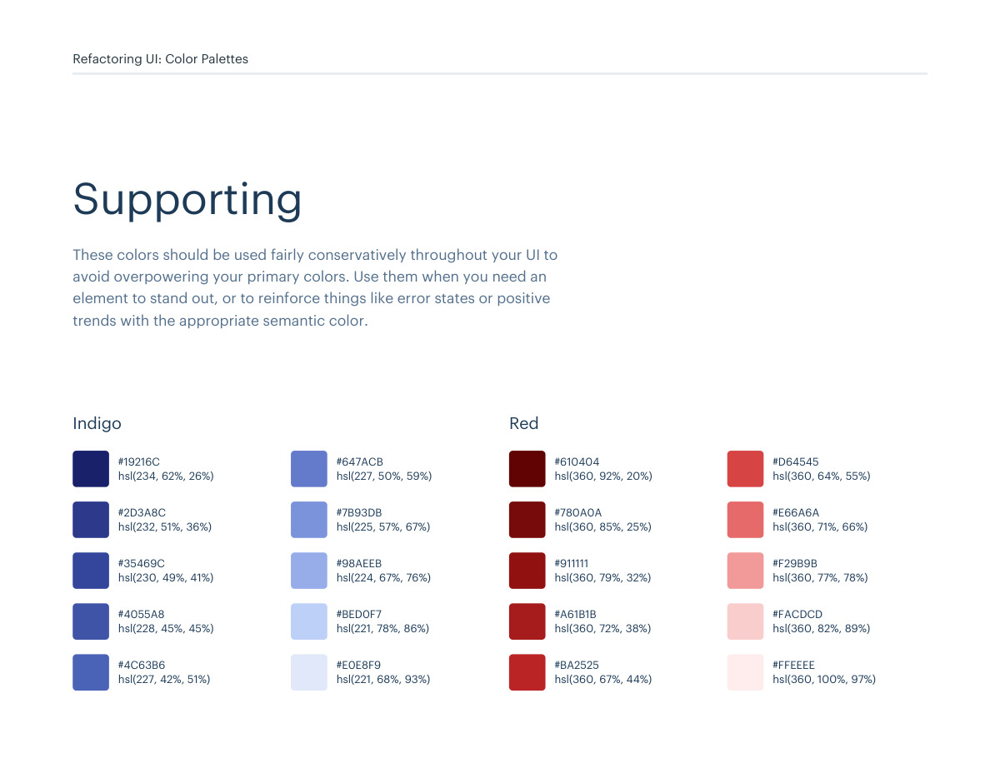
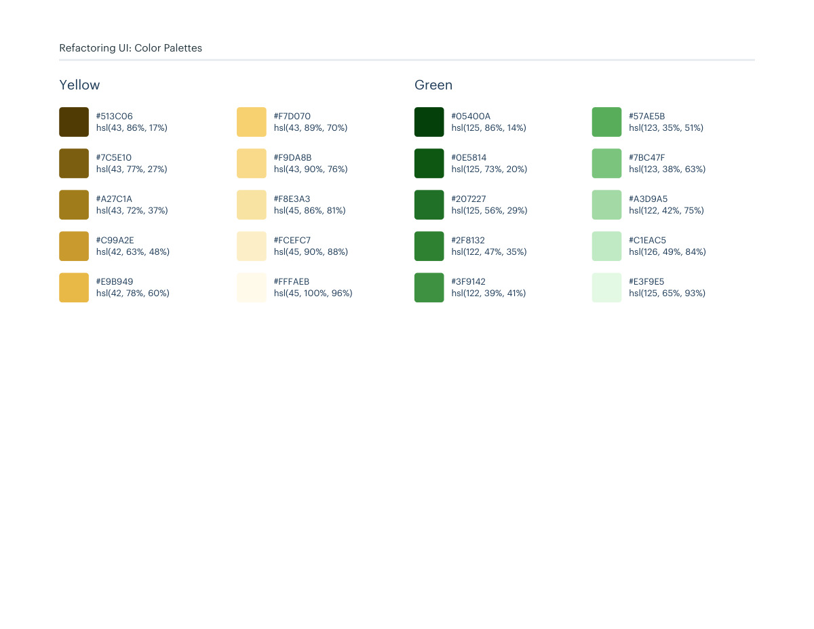

# Color palette 21: orange-vivid

## Apply this

- If a coherent orange-vivid color system fits the task, use palette 21 as a complete candidate.
- Map these source roles to existing semantic tokens, not new component literals: Primary: orange-vivid; Neutrals: cool-grey; Supporting: indigo, red, yellow, green.
- Keep palette-specific values intact; do not substitute matching names from swatches.json. Test text, surface, focus, hover, and status contrast, and pair status colors with another cue.

## Source

Source: `Color Palettes v1.1.0.pdf`, version 1.1.0, PDF pages 122–127.
Apply this is new guidance; the source blocks below preserve the supplied pypdf extraction verbatim.
Page images preserve the original visual content, including text absent from extraction.

Palette originals retain source comments and trailing commas (JSONC), despite their `.json` extension.
The `.strict.json` companion removes only that syntax; keys and values remain unchanged.
- [palette-21.json](../assets/palette-21.json)
- [palette-21.strict.json](../assets/palette-21.strict.json)

## Source pages

### Source page 122



```text
Refactoring UI: Color Palettes
Palette 21
```

### Source page 123



```text
Refactoring UI: Color Palettes
These are the splashes of color that should appear the most in your UI, 
and are the ones that determine the overall "look" of the site. Use these 
for things like primary actions, links, navigation items, icons, accent 
borders, or text you want to emphasize.
Primary
hsl(6, 96%, 26%)
#841003
hsl(8, 92%, 35%)
#AD1D07
hsl(10, 93%, 40%)
#C52707
hsl(12, 86%, 47%)
#DE3A11
hsl(14, 89%, 55%)
#F35627
hsl(16, 94%, 61%)
#F9703E
hsl(18, 100%, 70%)
#FF9466
hsl(20, 100%, 77%)
#FFB088
hsl(22, 100%, 85%)
#FFD0B5
hsl(24, 100%, 93%)
#FFE8D9
Orange (Vivid)
```

### Source page 124


```text
Refactoring UI: Color Palettes
These are the colors you will use the most and will make up the majority 
of your UI. Use them for most of your text, backgrounds, and borders, 
as well as for things like secondary buttons and links.
Neutrals
hsl(210, 24%, 16%)
hsl(211, 10%, 53%)
hsl(209, 20%, 25%)
hsl(211, 13%, 65%)
hsl(209, 18%, 30%)
hsl(210, 16%, 82%)
hsl(209, 14%, 37%)
hsl(214, 15%, 91%)
hsl(211, 12%, 43%)
hsl(216, 33%, 97%)
#1F2933
#7B8794
#323F4B
#9AA5B1
#3E4C59
#CBD2D9
#52606D
#E4E7EB
#616E7C
#F5F7FA
Cool Grey
```

### Source page 125



```text
Refactoring UI: Color Palettes
These colors should be used fairly conservatively throughout your UI to 
avoid overpowering your primary colors. Use them when you need an 
element to stand out, or to reinforce things like error states or positive 
trends with the appropriate semantic color.
Supporting
hsl(234, 62%, 26%)
#19216C
hsl(232, 51%, 36%)
#2D3A8C
hsl(230, 49%, 41%)
#35469C
hsl(228, 45%, 45%)
#4055A8
hsl(227, 42%, 51%)
#4C63B6
hsl(227, 50%, 59%)
#647ACB
hsl(225, 57%, 67%)
#7B93DB
hsl(224, 67%, 76%)
#98AEEB
hsl(221, 78%, 86%)
#BED0F7
hsl(221, 68%, 93%)
#E0E8F9
Indigo
hsl(360, 92%, 20%)
#610404
hsl(360, 85%, 25%)
#780A0A
hsl(360, 79%, 32%)
#911111
hsl(360, 72%, 38%)
#A61B1B
hsl(360, 67%, 44%)
#BA2525
hsl(360, 64%, 55%)
#D64545
hsl(360, 71%, 66%)
#E66A6A
hsl(360, 77%, 78%)
#F29B9B
hsl(360, 82%, 89%)
#FACDCD
hsl(360, 100%, 97%)
#FFEEEE
Red
```

### Source page 126



```text
hsl(43, 86%, 17%)
#513C06
hsl(43, 77%, 27%)
#7C5E10
hsl(43, 72%, 37%)
#A27C1A
hsl(42, 63%, 48%)
#C99A2E
hsl(42, 78%, 60%)
#E9B949
hsl(43, 89%, 70%)
#F7D070
hsl(43, 90%, 76%)
#F9DA8B
hsl(45, 86%, 81%)
#F8E3A3
hsl(45, 90%, 88%)
#FCEFC7
hsl(45, 100%, 96%)
#FFFAEB
Yellow
hsl(125, 86%, 14%)
#05400A
hsl(125, 73%, 20%)
#0E5814
hsl(125, 56%, 29%)
#207227
hsl(122, 47%, 35%)
#2F8132
hsl(122, 39%, 41%)
#3F9142
hsl(123, 35%, 51%)
#57AE5B
hsl(123, 38%, 63%)
#7BC47F
hsl(122, 42%, 75%)
#A3D9A5
hsl(126, 49%, 84%)
#C1EAC5
hsl(125, 65%, 93%)
#E3F9E5
Green
Refactoring UI: Color Palettes
```

### Source page 127


```text

```
