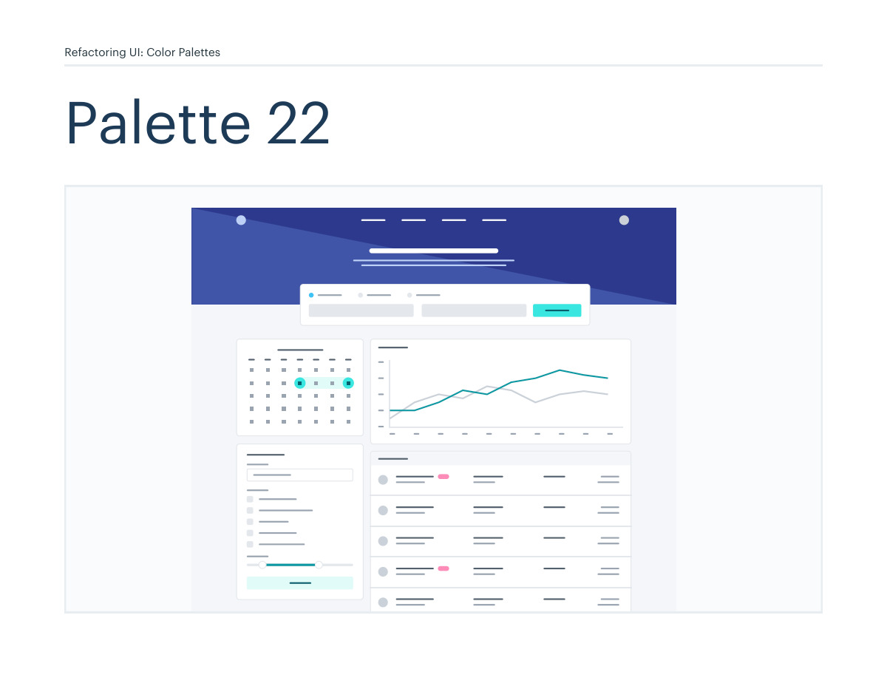
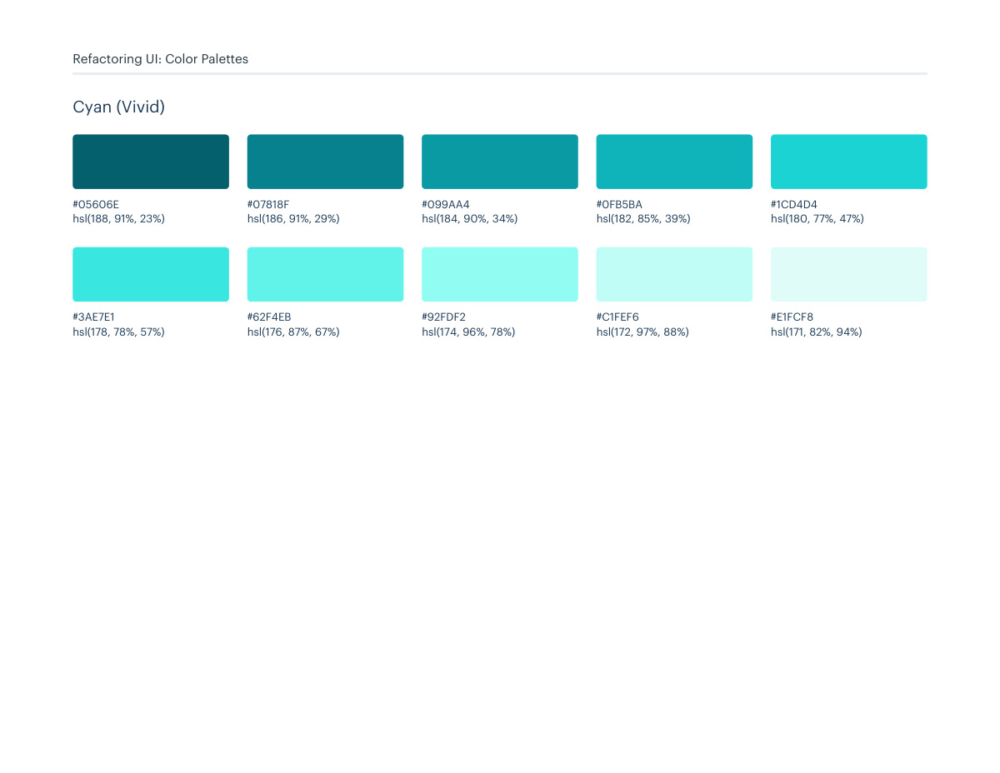

# Color palette 22: indigo, cyan-vivid

## Apply this

- If a coherent indigo, cyan-vivid color system fits the task, use palette 22 as a complete candidate.
- Map these source roles to existing semantic tokens, not new component literals: Primary: indigo, cyan-vivid; Neutrals: cool-grey; Supporting: pink-vivid, red-vivid, yellow-vivid, green-vivid.
- Keep palette-specific values intact; do not substitute matching names from swatches.json. Test text, surface, focus, hover, and status contrast, and pair status colors with another cue.

## Source

Source: `Color Palettes v1.1.0.pdf`, version 1.1.0, PDF pages 128–133.
Apply this is new guidance; the source blocks below preserve the supplied pypdf extraction verbatim.
Page images preserve the original visual content, including text absent from extraction.

Palette originals retain source comments and trailing commas (JSONC), despite their `.json` extension.
The `.strict.json` companion removes only that syntax; keys and values remain unchanged.
- [palette-22.json](../assets/palette-22.json)
- [palette-22.strict.json](../assets/palette-22.strict.json)

## Source pages

### Source page 128



```text
Refactoring UI: Color Palettes
Palette 22
```

### Source page 129


```text
Refactoring UI: Color Palettes
These are the splashes of color that should appear the most in your UI, 
and are the ones that determine the overall "look" of the site. Use these 
for things like primary actions, links, navigation items, icons, accent 
borders, or text you want to emphasize.
Primary
hsl(234, 62%, 26%)
hsl(227, 50%, 59%)
hsl(232, 51%, 36%)
hsl(225, 57%, 67%)
hsl(230, 49%, 41%)
hsl(224, 67%, 76%)
hsl(228, 45%, 45%)
hsl(221, 78%, 86%)
hsl(227, 42%, 51%)
hsl(221, 68%, 93%)
#19216C
#647ACB
#2D3A8C
#7B93DB
#35469C
#98AEEB
#4055A8
#BED0F7
#4C63B6
#E0E8F9
Indigo
```

### Source page 130



```text
Refactoring UI: Color Palettes
hsl(188, 91%, 23%)
#05606E
hsl(186, 91%, 29%)
#07818F
hsl(184, 90%, 34%)
#099AA4
hsl(182, 85%, 39%)
#0FB5BA
hsl(180, 77%, 47%)
#1CD4D4
hsl(178, 78%, 57%)
#3AE7E1
hsl(176, 87%, 67%)
#62F4EB
hsl(174, 96%, 78%)
#92FDF2
hsl(172, 97%, 88%)
#C1FEF6
hsl(171, 82%, 94%)
#E1FCF8
Cyan (Vivid)
```

### Source page 131


```text
Refactoring UI: Color Palettes
These are the colors you will use the most and will make up the majority 
of your UI. Use them for most of your text, backgrounds, and borders, 
as well as for things like secondary buttons and links.
Neutrals
hsl(210, 24%, 16%)
hsl(211, 10%, 53%)
hsl(209, 20%, 25%)
hsl(211, 13%, 65%)
hsl(209, 18%, 30%)
hsl(210, 16%, 82%)
hsl(209, 14%, 37%)
hsl(214, 15%, 91%)
hsl(211, 12%, 43%)
hsl(216, 33%, 97%)
#1F2933
#7B8794
#323F4B
#9AA5B1
#3E4C59
#CBD2D9
#52606D
#E4E7EB
#616E7C
#F5F7FA
Cool Grey
```

### Source page 132


```text
Refactoring UI: Color Palettes
These colors should be used fairly conservatively throughout your UI to 
avoid overpowering your primary colors. Use them when you need an 
element to stand out, or to reinforce things like error states or positive 
trends with the appropriate semantic color.
Supporting
hsl(320, 100%, 19%)
#620042
hsl(322, 93%, 27%)
#870557
hsl(324, 93%, 33%)
#A30664
hsl(326, 90%, 39%)
#BC0A6F
hsl(328, 85%, 46%)
#DA127D
hsl(330, 79%, 56%)
#E8368F
hsl(334, 86%, 67%)
#F364A2
hsl(336, 100%, 77%)
#FF8CBA
hsl(338, 100%, 86%)
#FFB8D2
hsl(341, 100%, 95%)
#FFE3EC
Pink (Vivid)
hsl(348, 94%, 20%)
#610316
hsl(350, 94%, 28%)
#8A041A
hsl(352, 90%, 35%)
#AB091E
hsl(354, 85%, 44%)
#CF1124
hsl(356, 75%, 53%)
#E12D39
hsl(360, 83%, 62%)
#EF4E4E
hsl(360, 91%, 69%)
#F86A6A
hsl(360, 100%, 80%)
#FF9B9B
hsl(360, 100%, 87%)
#FFBDBD
hsl(360, 100%, 95%)
#FFE3E3
Red (Vivid)
```

### Source page 133


```text
Refactoring UI: Color Palettes
hsl(15, 86%, 30%)
#8D2B0B
hsl(22, 82%, 39%)
#B44D12
hsl(29, 80%, 44%)
#CB6E17
hsl(36, 77%, 49%)
#DE911D
hsl(42, 87%, 55%)
#F0B429
hsl(44, 92%, 63%)
#F7C948
hsl(48, 94%, 68%)
#FADB5F
hsl(48, 95%, 76%)
#FCE588
hsl(48, 100%, 88%)
#FFF3C4
hsl(49, 100%, 96%)
#FFFBEA
Yellow (Vivid)
hsl(125, 97%, 14%)
#014807
hsl(125, 86%, 20%)
#07600E
hsl(125, 79%, 26%)
#0E7817
hsl(122, 80%, 29%)
#0F8613
hsl(122, 73%, 35%)
#18981D
hsl(123, 57%, 45%)
#31B237
hsl(123, 53%, 55%)
#51CA58
hsl(124, 63%, 74%)
#91E697
hsl(127, 65%, 85%)
#C1F2C7
hsl(125, 65%, 93%)
#E3F9E5
Green (Vivid)
```
