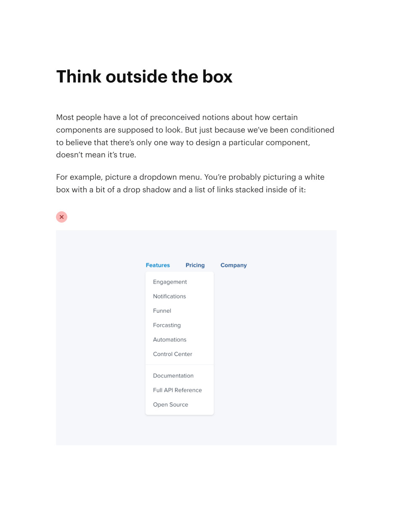
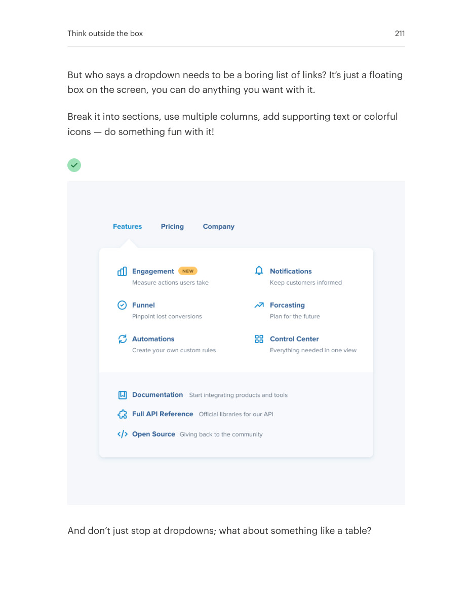
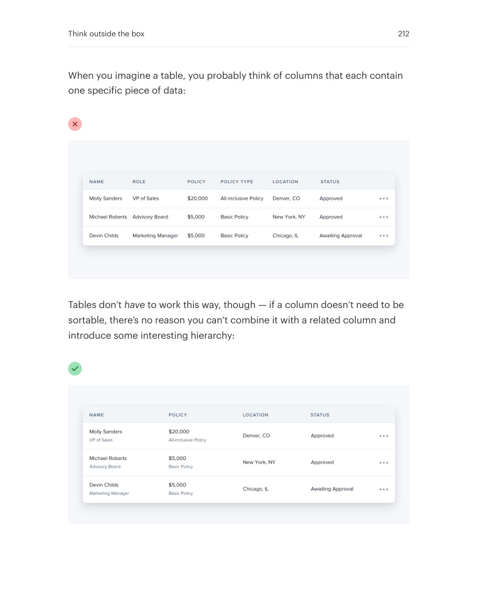
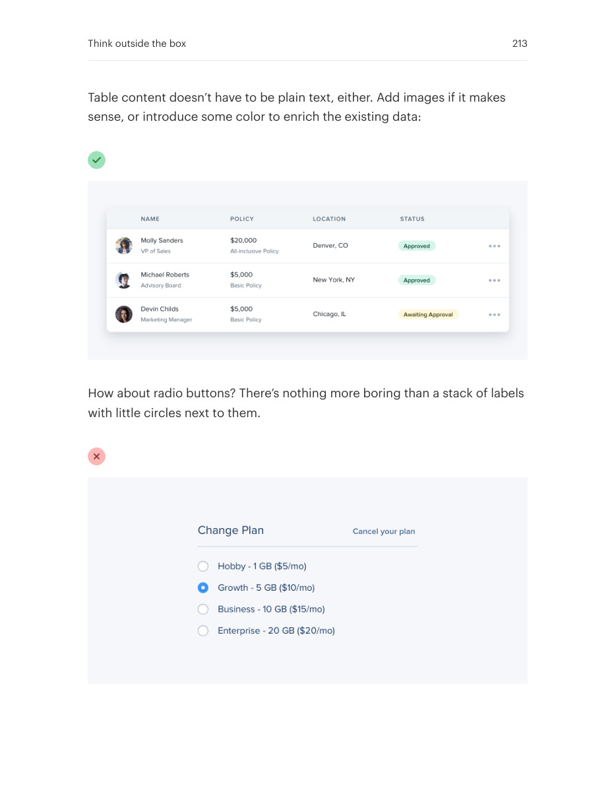
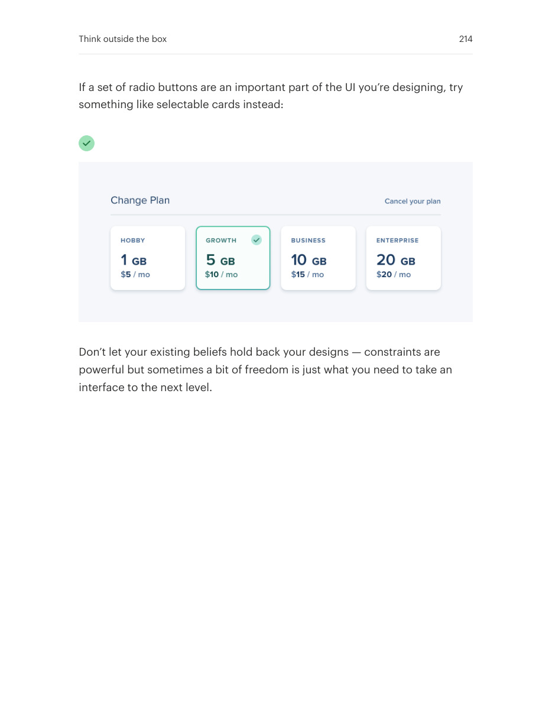

# Rethink familiar component compositions

## Apply this

- If a stock pattern limits the result, revisit the information hierarchy rather than adding decoration.
- Try a richer menu, expanded table content, or a different selection composition for the actual task.
- Keep predictable keyboard behavior and semantics; visual novelty must not break established interaction.

## Source

Source: `Refactoring UI v1.0.2.pdf`, version 1.0.2, PDF pages 210–214.
Apply this is new guidance; the source blocks below preserve the supplied pypdf extraction verbatim.
Page images preserve the original visual content, including text absent from extraction.

### Source outline

- Think outside the box (source page 210)

## Source pages

### Source page 210



```text
Think outside the box
Most people have a lot of preconceived notions about how certain
components are supposed to look. But just because we’ve been conditioned
to believe that there’s only one way to design a particular component,
doesn’t mean it’s true.
For example, picture a dropdown menu. You’re probably picturing a white
box with a bit of a drop shadow and a list of links stacked inside of it:

```

### Source page 211



```text
But who says a dropdown needs to be a boring list of links? It’s just a floating
box on the screen, you can do anything you want with it.
Break it into sections, use multiple columns, add supporting text or colorful
icons — do something fun with it!
And don’t just stop at dropdowns; what about something like a table?
Think outside the box 211
```

### Source page 212



```text
When you imagine a table, you probably think of columns that each contain
one specific piece of data:
Tables don’thave to work this way, though — if a column doesn’t need to be
sortable, there’s no reason you can’t combine it with a related column and
introduce some interesting hierarchy:
Think outside the box 212
```

### Source page 213



```text
Table content doesn’t have to be plain text, either. Add images if it makes
sense, or introduce some color to enrich the existing data:
How about radio buttons? There’s nothing more boring than a stack of labels
with little circles next to them.
Think outside the box 213
```

### Source page 214



```text
If a set of radio buttons are an important part of the UI you’re designing, try
something like selectable cards instead:
Don’t let your existing beliefs hold back your designs — constraints are
powerful but sometimes a bit of freedom is just what you need to take an
interface to the next level.
Think outside the box 214
```
