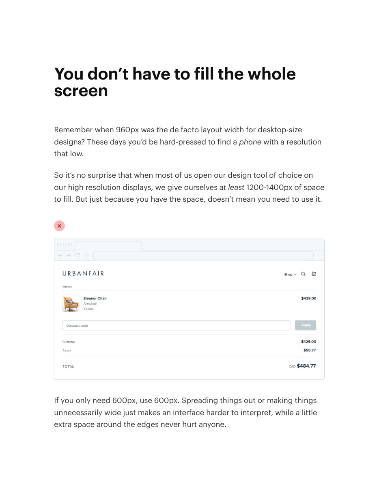
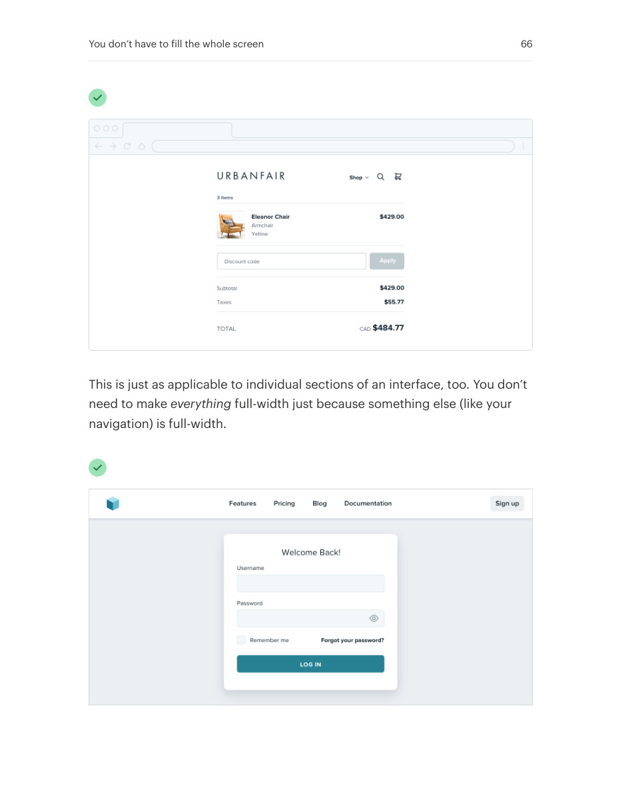
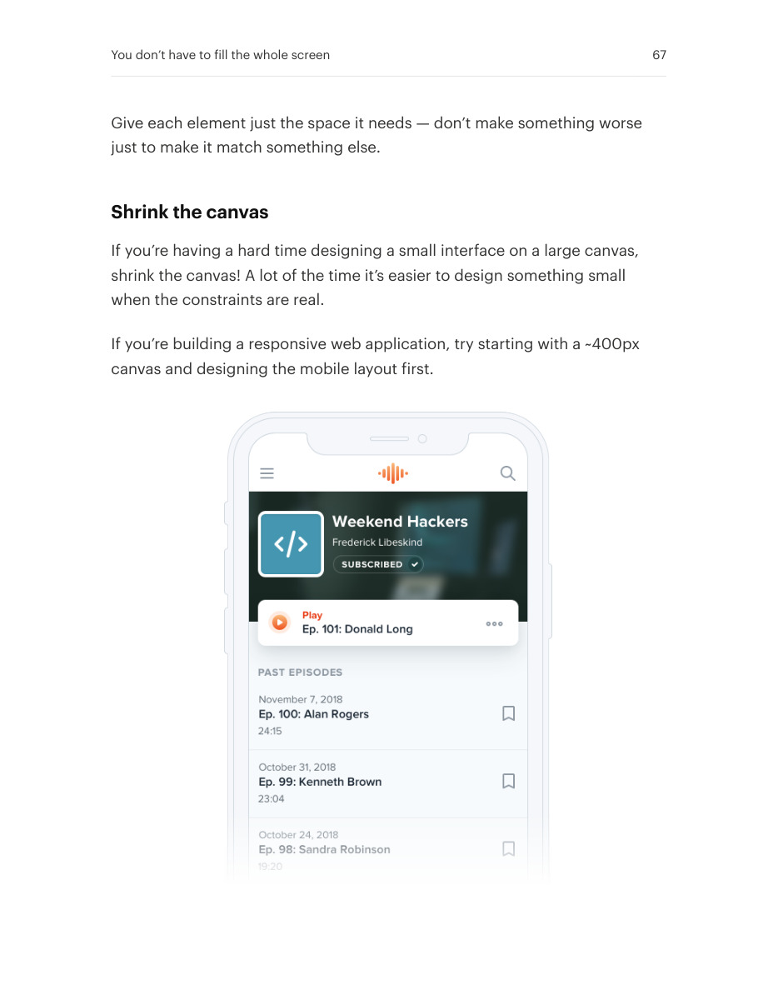
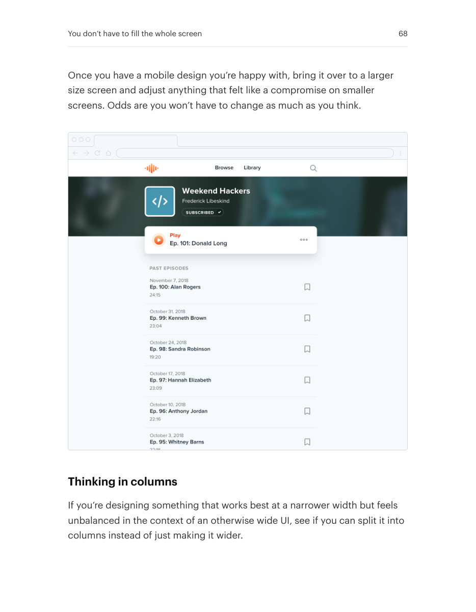
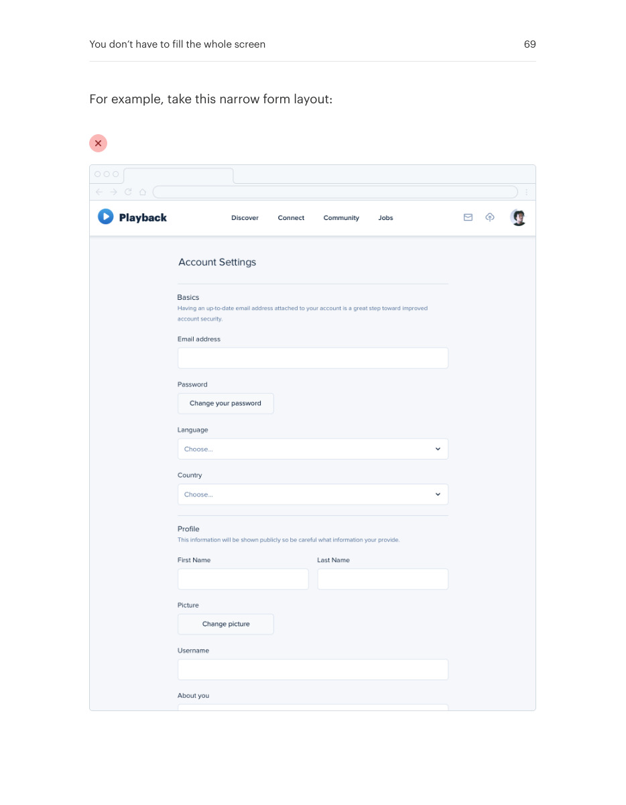
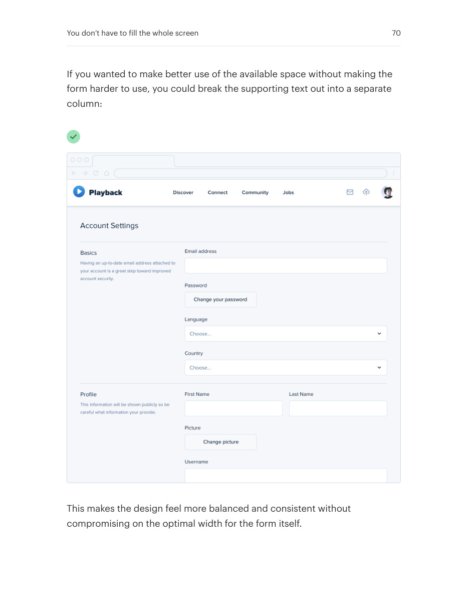
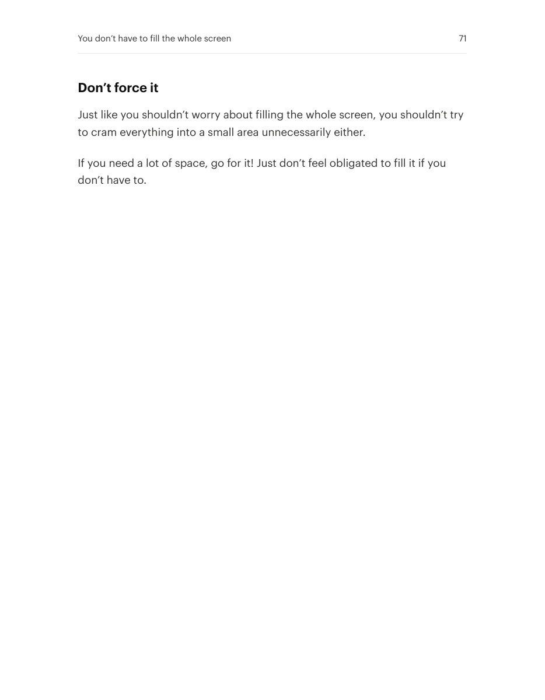

# Fit the canvas to the content

## Apply this

- If a simple form stretches across a wide screen, constrain its useful width.
- Shrink the content canvas or use supporting columns rather than stretching every control.
- Check narrow screens and long content; leave unused space when it improves comprehension.

## Source

Source: `Refactoring UI v1.0.2.pdf`, version 1.0.2, PDF pages 65–71.
Apply this is new guidance; the source blocks below preserve the supplied pypdf extraction verbatim.
Page images preserve the original visual content, including text absent from extraction.

### Source outline

- You don’t have to fill the whole screen (source page 65)
  - Shrink the canvas (source page 67)
  - Thinking in columns (source page 68)
  - Don’t force it (source page 71)

## Source pages

### Source page 65



```text
You don’t have to fill the whole
screen
Remember when 960px was the de facto layout width for desktop-size
designs? These days you’d be hard-pressed to find aphone with a resolution
that low.
So it’s no surprise that when most of us open our design tool of choice on
our high resolution displays, we give ourselvesat least 1200-1400px of space
to fill. But just because you have the space, doesn’t mean you need to use it.
If you only need 600px, use 600px. Spreading things out or making things
unnecessarily wide just makes an interface harder to interpret, while a little
extra space around the edges never hurt anyone.
```

### Source page 66



```text
This is just as applicable to individual sections of an interface, too. You don’t
need to makeeverything full-width just because something else (like your
navigation) is full-width.
You don’t have to fill the whole screen 66
```

### Source page 67



```text
Give each element just the space it needs — don’t make something worse
just to make it match something else.
Shrink the canvas
If you’re having a hard time designing a small interface on a large canvas,
shrink the canvas! A lot of the time it’s easier to design something small
when the constraints are real.
If you’re building a responsive web application, try starting with a ~400px
canvas and designing the mobile layout first.
You don’t have to fill the whole screen 67
```

### Source page 68



```text
Once you have a mobile design you’re happy with, bring it over to a larger
size screen and adjust anything that felt like a compromise on smaller
screens. Odds are you won’t have to change as much as you think.
Thinking in columns
If you’re designing something that works best at a narrower width but feels
unbalanced in the context of an otherwise wide UI, see if you can split it into
columns instead of just making it wider.
You don’t have to fill the whole screen 68
```

### Source page 69



```text
For example, take this narrow form layout:
You don’t have to fill the whole screen 69
```

### Source page 70



```text
If you wanted to make better use of the available space without making the
form harder to use, you could break the supporting text out into a separate
column:
This makes the design feel more balanced and consistent without
compromising on the optimal width for the form itself.
You don’t have to fill the whole screen 70
```

### Source page 71



```text
Don’t force it
Just like you shouldn’t worry about filling the whole screen, you shouldn’t try
to cram everything into a small area unnecessarily either.
If you need a lot of space, go for it! Just don’t feel obligated to fill it if you
don’t have to.
You don’t have to fill the whole screen 71
```
