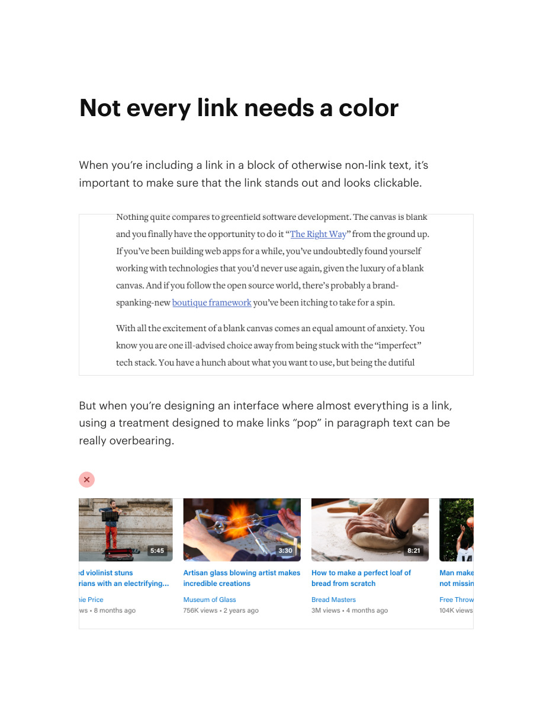
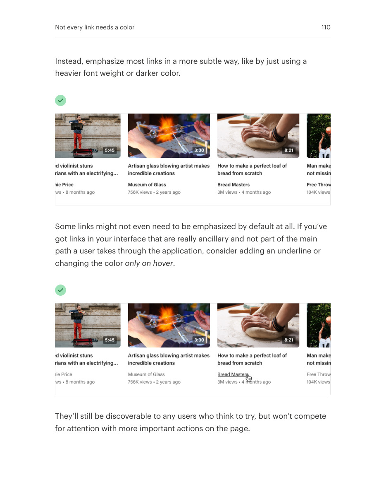

# Style links according to context

## Apply this

- If every link creates visual noise, distinguish navigation from links inside prose.
- Use clear contextual styling and reinforce important affordances with hover and focus states.
- Keep prose links distinguishable without relying on color alone; test keyboard visibility.

## Source

Source: `Refactoring UI v1.0.2.pdf`, version 1.0.2, PDF pages 109–110.
Apply this is new guidance; the source blocks below preserve the supplied pypdf extraction verbatim.
Page images preserve the original visual content, including text absent from extraction.

### Source outline

- Not every link needs a color (source page 109)

## Source pages

### Source page 109



```text
Not every link needs a color
When you’re including a link in a block of otherwise non-link text, it’s
important to make sure that the link stands out and looks clickable.
But when you’re designing an interface where almost everything is a link,
using a treatment designed to make links “pop” in paragraph text can be
really overbearing.

```

### Source page 110



```text
Instead, emphasize most links in a more subtle way, like by just using a
heavier font weight or darker color.
Some links might not even need to be emphasized by default at all. If you’ve
got links in your interface that are really ancillary and not part of the main
path a user takes through the application, consider adding an underline or
changing the coloronly on hover.
They’ll still be discoverable to any users who think to try, but won’t compete
for attention with more important actions on the page.
Not every link needs a color 110
```
