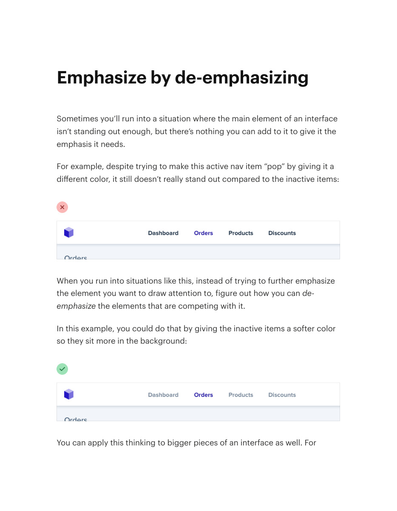
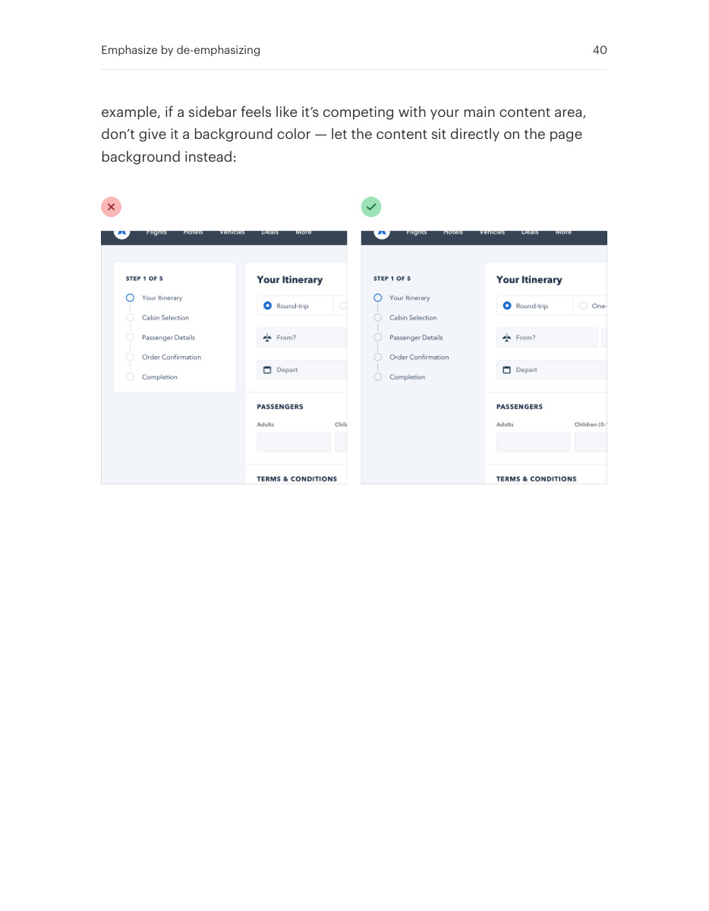

# Emphasize by quieting competitors

## Apply this

- If a primary item still feels weak, inspect the elements competing with it.
- Lower the contrast or visual weight of secondary navigation, containers, or content.
- Retain readable secondary content and verify the primary item becomes easier to find.

## Source

Source: `Refactoring UI v1.0.2.pdf`, version 1.0.2, PDF pages 39–40.
Apply this is new guidance; the source blocks below preserve the supplied pypdf extraction verbatim.
Page images preserve the original visual content, including text absent from extraction.

### Source outline

- Emphasize by de-emphasizing (source page 39)

## Source pages

### Source page 39



```text
Emphasize by de-emphasizing
Sometimes you’ll run into a situation where the main element of an interface
isn’t standing out enough, but there’s nothing you can add to it to give it the
emphasis it needs.
For example, despite trying to make this active nav item “pop” by giving it a
different color, it still doesn’t really stand out compared to the inactive items:
When you run into situations like this, instead of trying to further emphasize
the element you want to draw attention to, figure out how you cande-
emphasize the elements that are competing with it.
In this example, you could do that by giving the inactive items a softer color
so they sit more in the background:
You can apply this thinking to bigger pieces of an interface as well. For
```

### Source page 40



```text
example, if a sidebar feels like it’s competing with your main content area,
don’t give it a background color — let the content sit directly on the page
background instead:
Emphasize by de-emphasizing 40
```
