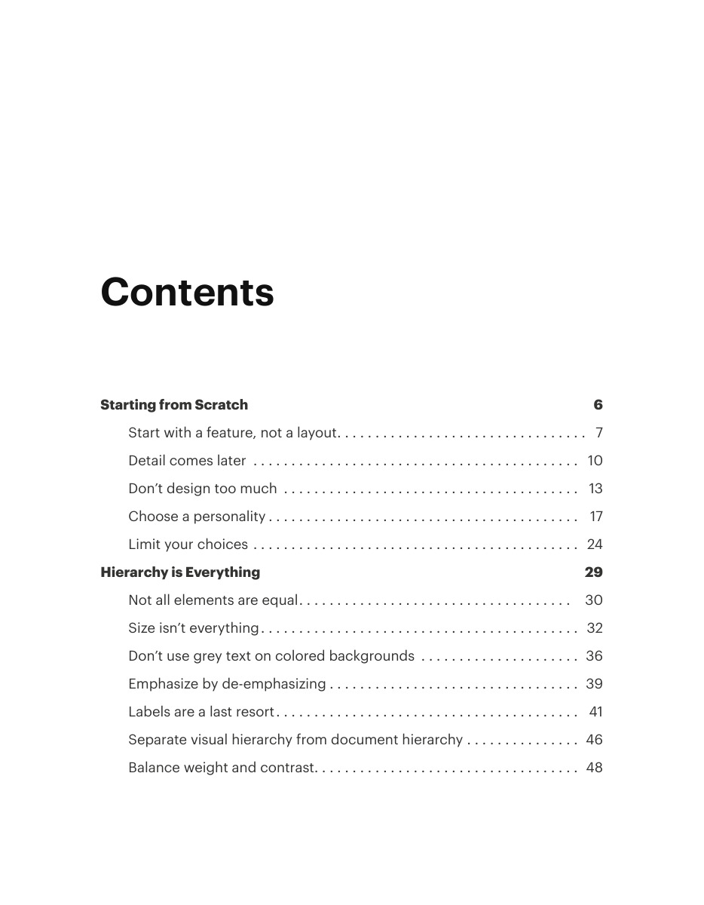
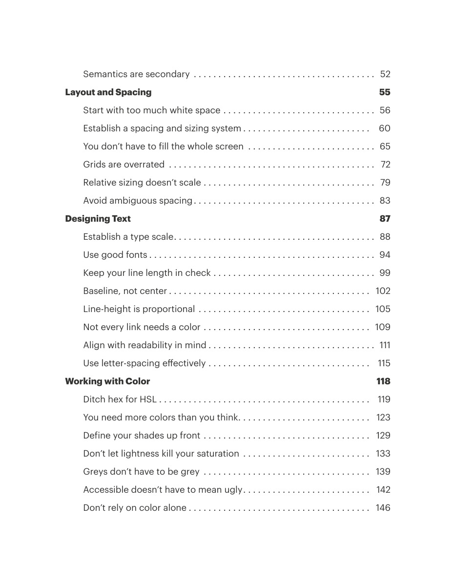
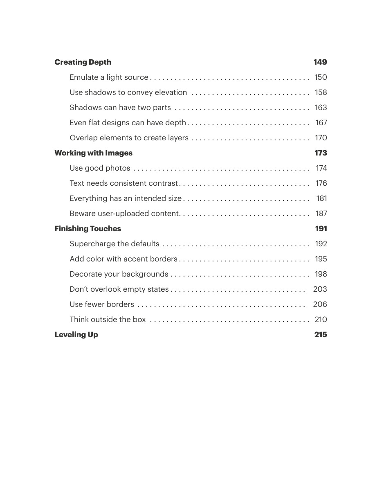

# Design reference provenance and contents

## Apply this

- If locating an original passage, use the printed contents and source page markers.
- Read the task-relevant topic and open its page images when examples matter.
- Refactoring UI is by Adam Wathan and Steve Schoger. This conversion preserves their original source; it does not claim authorship of its text or visuals.

## Source

Source: `Refactoring UI v1.0.2.pdf`, version 1.0.2, PDF pages 1–5.
Apply this is new guidance; the source blocks below preserve the supplied pypdf extraction verbatim.
Page images preserve the original visual content, including text absent from extraction.

## Source pages

### Source page 1


```text

```

### Source page 2


```text

```

### Source page 3



```text
Contents
Starting from Scratch                                                                                                                             6
Start with a feature, not a layout. . . . . . . . . . . . . . . . . . . . . . . . . . . . . . . . . 7
Detail comes later . . . . . . . . . . . . . . . . . . . . . . . . . . . . . . . . . . . . . . . . . . . 10
Don’t design too much . . . . . . . . . . . . . . . . . . . . . . . . . . . . . . . . . . . . . . . 13
Choose a personality. . . . . . . . . . . . . . . . . . . . . . . . . . . . . . . . . . . . . . . . . 17
Limit your choices. . . . . . . . . . . . . . . . . . . . . . . . . . . . . . . . . . . . . . . . . . . 24
Hierarchy is Everything                                                                                                                      29
Not all elements are equal. . . . . . . . . . . . . . . . . . . . . . . . . . . . . . . . . . . . 30
Size isn’t everything. . . . . . . . . . . . . . . . . . . . . . . . . . . . . . . . . . . . . . . . . . 32
Don’t use grey text on colored backgrounds . . . . . . . . . . . . . . . . . . . . . 36
Emphasize by de-emphasizing. . . . . . . . . . . . . . . . . . . . . . . . . . . . . . . . . 39
Labels are a last resort. . . . . . . . . . . . . . . . . . . . . . . . . . . . . . . . . . . . . . . . 41
Separate visual hierarchy from document hierarchy. . . . . . . . . . . . . . . 46
Balance weight and contrast. . . . . . . . . . . . . . . . . . . . . . . . . . . . . . . . . . . 48
```

### Source page 4



```text
Semantics are secondary . . . . . . . . . . . . . . . . . . . . . . . . . . . . . . . . . . . . . 52
Layout and Spacing                                                                                                                               55
Start with too much white space. . . . . . . . . . . . . . . . . . . . . . . . . . . . . . . 56
Establish a spacing and sizing system. . . . . . . . . . . . . . . . . . . . . . . . . . 60
You don’t have to fill the whole screen . . . . . . . . . . . . . . . . . . . . . . . . . . 65
Grids are overrated . . . . . . . . . . . . . . . . . . . . . . . . . . . . . . . . . . . . . . . . . . 72
Relative sizing doesn’t scale. . . . . . . . . . . . . . . . . . . . . . . . . . . . . . . . . . . 79
Avoid ambiguous spacing. . . . . . . . . . . . . . . . . . . . . . . . . . . . . . . . . . . . . 83
Designing Text                                                                                                                                           87
Establish a type scale. . . . . . . . . . . . . . . . . . . . . . . . . . . . . . . . . . . . . . . . . 88
Use good fonts. . . . . . . . . . . . . . . . . . . . . . . . . . . . . . . . . . . . . . . . . . . . . . 94
Keep your line length in check. . . . . . . . . . . . . . . . . . . . . . . . . . . . . . . . . 99
Baseline, not center. . . . . . . . . . . . . . . . . . . . . . . . . . . . . . . . . . . . . . . . . 102
Line-height is proportional . . . . . . . . . . . . . . . . . . . . . . . . . . . . . . . . . . . 105
Not every link needs a color. . . . . . . . . . . . . . . . . . . . . . . . . . . . . . . . . . 109
Align with readability in mind. . . . . . . . . . . . . . . . . . . . . . . . . . . . . . . . . . 111
Use letter-spacing effectively. . . . . . . . . . . . . . . . . . . . . . . . . . . . . . . . . 115
Working with Color                                                                                                                              118
Ditch hex for HSL. . . . . . . . . . . . . . . . . . . . . . . . . . . . . . . . . . . . . . . . . . . 119
You need more colors than you think. . . . . . . . . . . . . . . . . . . . . . . . . . . 123
Define your shades up front. . . . . . . . . . . . . . . . . . . . . . . . . . . . . . . . . . 129
Don’t let lightness kill your saturation . . . . . . . . . . . . . . . . . . . . . . . . . . 133
Greys don’t have to be grey . . . . . . . . . . . . . . . . . . . . . . . . . . . . . . . . . . 139
Accessible doesn’t have to mean ugly. . . . . . . . . . . . . . . . . . . . . . . . . . 142
Don’t rely on color alone. . . . . . . . . . . . . . . . . . . . . . . . . . . . . . . . . . . . . 146
```

### Source page 5



```text
Creating Depth                                                                                                                                       149
Emulate a light source. . . . . . . . . . . . . . . . . . . . . . . . . . . . . . . . . . . . . . . 150
Use shadows to convey elevation . . . . . . . . . . . . . . . . . . . . . . . . . . . . . 158
Shadows can have two parts . . . . . . . . . . . . . . . . . . . . . . . . . . . . . . . . . 163
Even flat designs can have depth. . . . . . . . . . . . . . . . . . . . . . . . . . . . . . 167
Overlap elements to create layers. . . . . . . . . . . . . . . . . . . . . . . . . . . . . 170
Working with Images                                                                                                                          173
Use good photos . . . . . . . . . . . . . . . . . . . . . . . . . . . . . . . . . . . . . . . . . . . 174
Text needs consistent contrast. . . . . . . . . . . . . . . . . . . . . . . . . . . . . . . . 176
Everything has an intended size. . . . . . . . . . . . . . . . . . . . . . . . . . . . . . . 181
Beware user-uploaded content. . . . . . . . . . . . . . . . . . . . . . . . . . . . . . . . 187
Finishing Touches                                                                                                                                 191
Supercharge the defaults . . . . . . . . . . . . . . . . . . . . . . . . . . . . . . . . . . . . 192
Add color with accent borders. . . . . . . . . . . . . . . . . . . . . . . . . . . . . . . . 195
Decorate your backgrounds. . . . . . . . . . . . . . . . . . . . . . . . . . . . . . . . . . 198
Don’t overlook empty states. . . . . . . . . . . . . . . . . . . . . . . . . . . . . . . . . 203
Use fewer borders . . . . . . . . . . . . . . . . . . . . . . . . . . . . . . . . . . . . . . . . . 206
Think outside the box . . . . . . . . . . . . . . . . . . . . . . . . . . . . . . . . . . . . . . . 210
Leveling Up                                                                                                                                                 215
```
