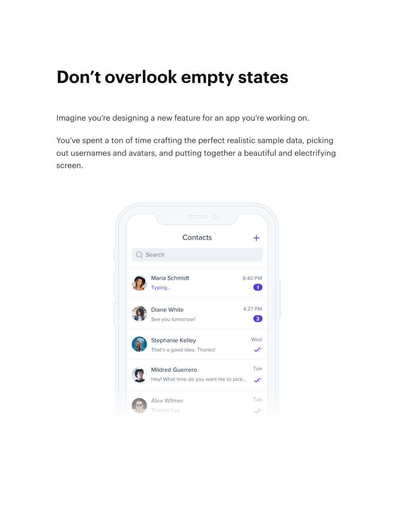
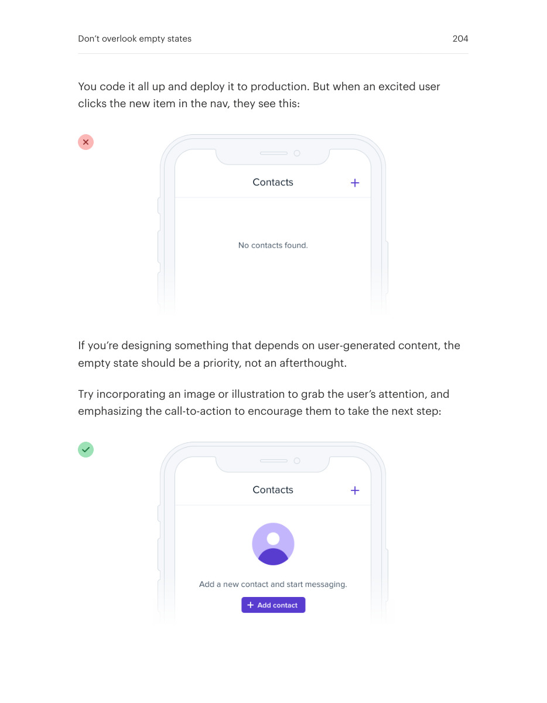
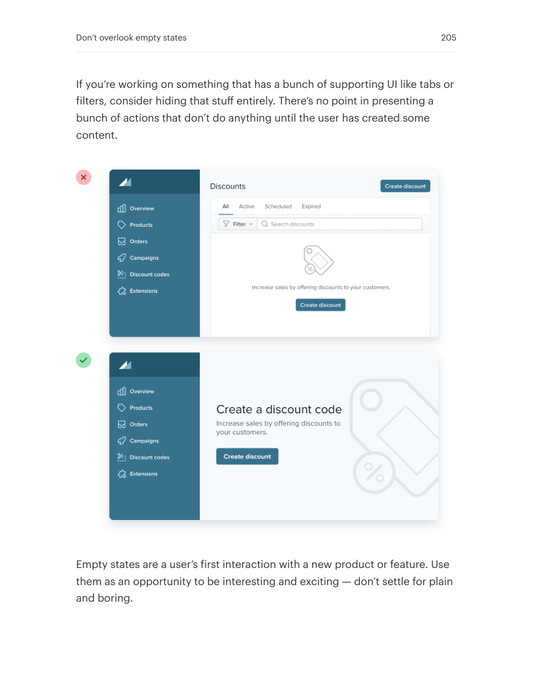

# Make empty states useful

## Apply this

- If a first-run screen is blank, explain what belongs there and how to create it.
- Offer one relevant next action and a restrained illustration or preview when helpful.
- Hide irrelevant controls until they are usable; distinguish an empty collection from an error or filtered result.

## Source

Source: `Refactoring UI v1.0.2.pdf`, version 1.0.2, PDF pages 203–205.
Apply this is new guidance; the source blocks below preserve the supplied pypdf extraction verbatim.
Page images preserve the original visual content, including text absent from extraction.

### Source outline

- Don’t overlook empty states (source page 203)

## Source pages

### Source page 203



```text
Don’t overlook empty states
Imagine you’re designing a new feature for an app you’re working on.
You’ve spent a ton of time crafting the perfect realistic sample data, picking
out usernames and avatars, and putting together a beautiful and electrifying
screen.

```

### Source page 204



```text
You code it all up and deploy it to production. But when an excited user
clicks the new item in the nav, they see this:
If you’re designing something that depends on user-generated content, the
empty state should be a priority, not an afterthought.
Try incorporating an image or illustration to grab the user’s attention, and
emphasizing the call-to-action to encourage them to take the next step:
Don’t overlook empty states 204
```

### Source page 205



```text
If you’re working on something that has a bunch of supporting UI like tabs or
filters, consider hiding that stuff entirely. There’s no point in presenting a
bunch of actions that don’t do anything until the user has created some
content.
Empty states are a user’s first interaction with a new product or feature. Use
them as an opportunity to be interesting and exciting — don’t settle for plain
and boring.
Don’t overlook empty states 205
```
