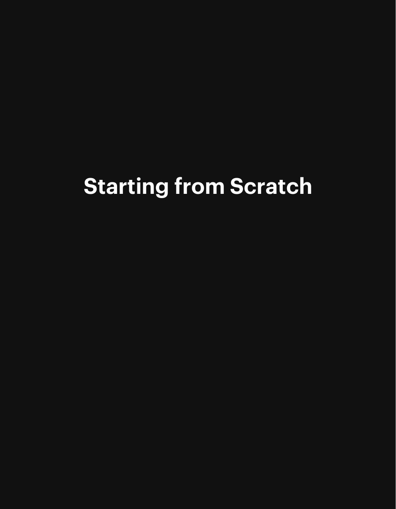
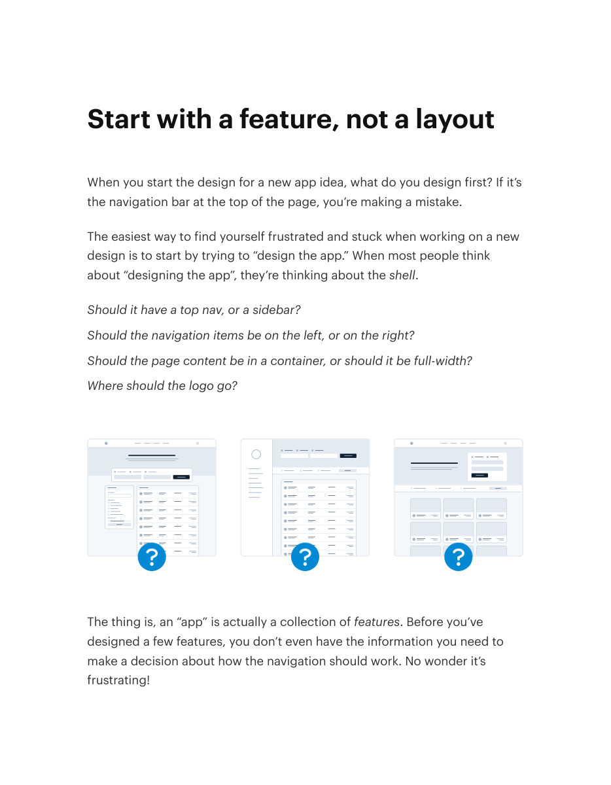
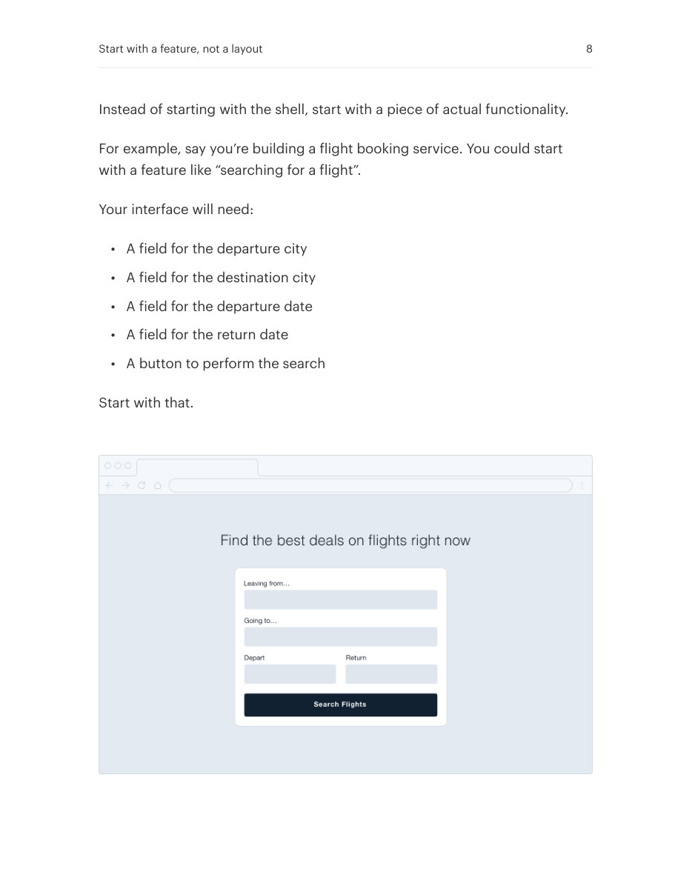
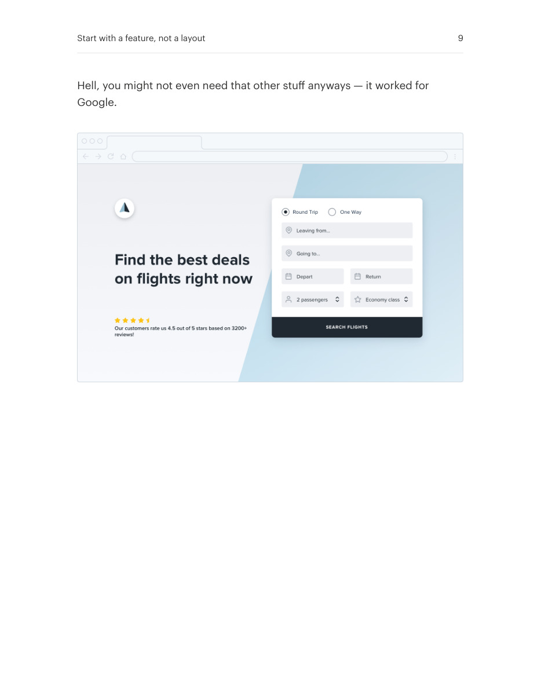

# Feature-first interface design

## Apply this

- If a blank canvas stalls you, choose one user task instead of a page layout.
- Sketch the controls and data needed to complete that task before navigation or chrome.
- Check that the task works end to end; postpone unrelated sections until they are needed.

## Source

Source: `Refactoring UI v1.0.2.pdf`, version 1.0.2, PDF pages 6–9.
Apply this is new guidance; the source blocks below preserve the supplied pypdf extraction verbatim.
Page images preserve the original visual content, including text absent from extraction.

### Source outline

- Starting from Scratch (source page 6)
- Start with a feature, not a layout (source page 7)

## Source pages

### Source page 6



```text
Starting from Scratch
```

### Source page 7



```text
Start with a feature, not a layout
When you start the design for a new app idea, what do you design first? If it’s
the navigation bar at the top of the page, you’re making a mistake.
The easiest way to find yourself frustrated and stuck when working on a new
design is to start by trying to “design the app.” When most people think
about “designing the app”, they’re thinking about theshell.
Should it have a top nav, or a sidebar?
Should the navigation items be on the left, or on the right?
Should the page content be in a container, or should it be full-width?
Where should the logo go?
The thing is, an “app” is actually a collection offeatures. Before you’ve
designed a few features, you don’t even have the information you need to
make a decision about how the navigation should work. No wonder it’s
frustrating!
```

### Source page 8



```text
Instead of starting with the shell, start with a piece of actual functionality.
For example, say you’re building a flight booking service. You could start
with a feature like “searching for a flight”.
Your interface will need:
• A field for the departure city
• A field for the destination city
• A field for the departure date
• A field for the return date
• A button to perform the search
Start with that.
Start with a feature, not a layout 8
```

### Source page 9



```text
Hell, you might not even need that other stuff anyways — it worked for
Google.
Start with a feature, not a layout 9
```
