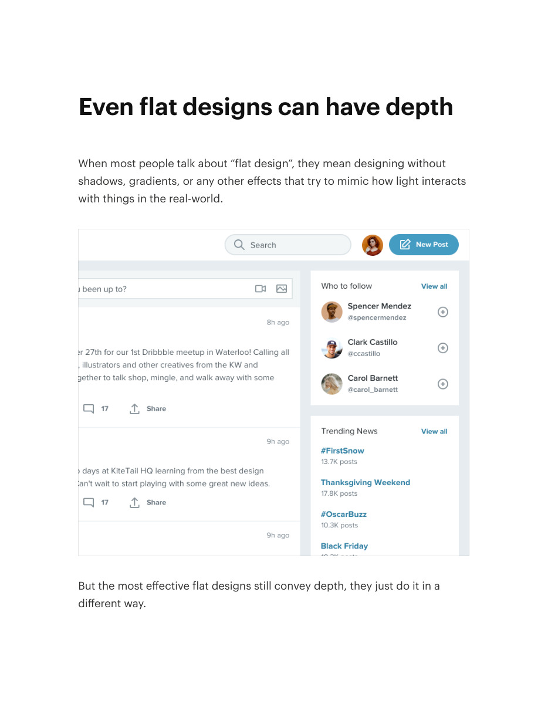
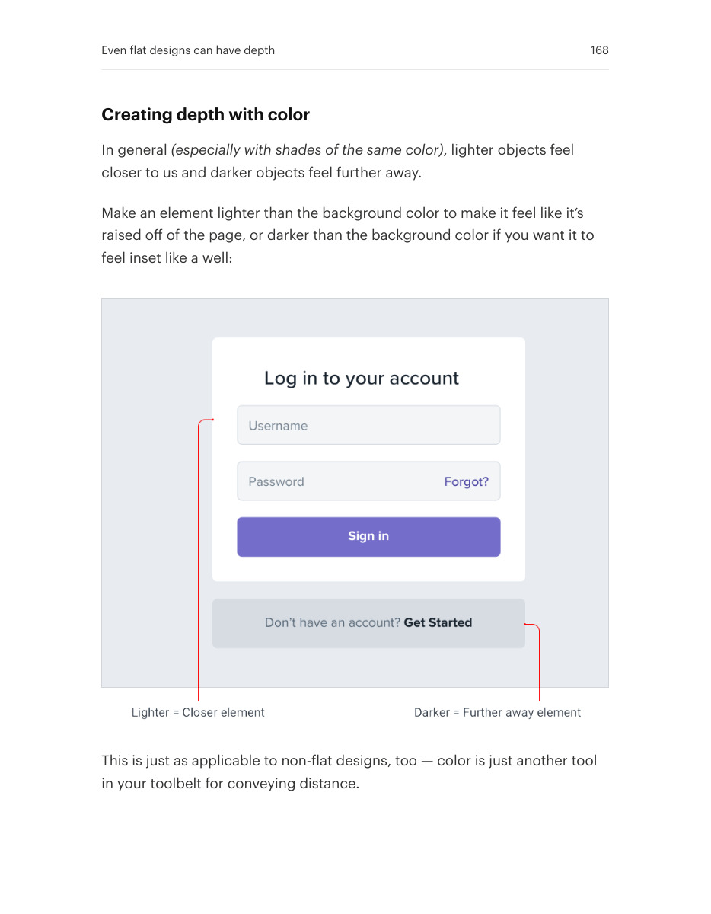
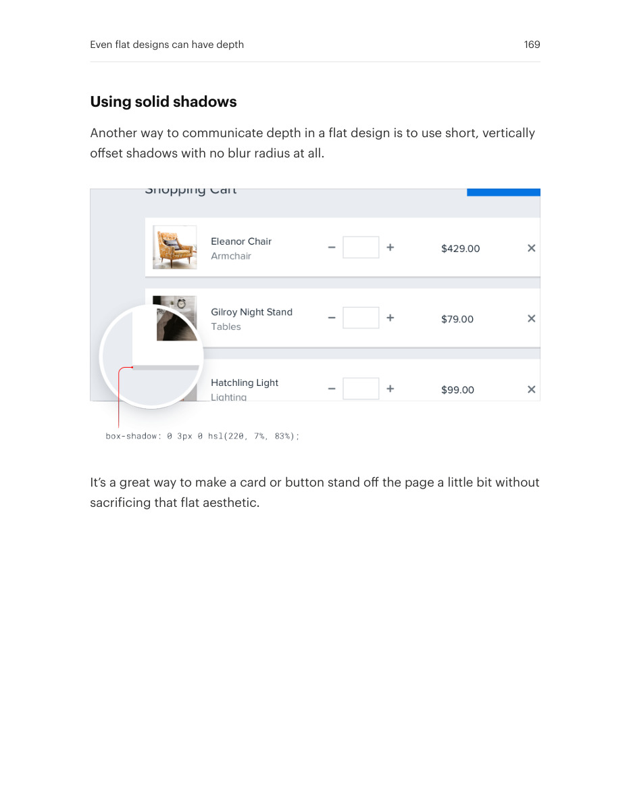

# Create depth without blurred shadows

## Apply this

- If a flat design loses layering, use value differences and simple offsets.
- Make nearer surfaces lighter or use a small solid shadow where it fits the style.
- Check the hierarchy remains readable without assuming every style needs simulated realism.

## Source

Source: `Refactoring UI v1.0.2.pdf`, version 1.0.2, PDF pages 167–169.
Apply this is new guidance; the source blocks below preserve the supplied pypdf extraction verbatim.
Page images preserve the original visual content, including text absent from extraction.

### Source outline

- Even flat designs can have depth (source page 167)
  - Creating depth with color (source page 168)
  - Using solid shadows (source page 169)

## Source pages

### Source page 167



```text
Even flat designs can have depth
When most people talk about “flat design”, they mean designing without
shadows, gradients, or any other effects that try to mimic how light interacts
with things in the real-world.
But the most effective flat designs still convey depth, they just do it in a
different way.
```

### Source page 168



```text
Creating depth with color
In general(especially with shades of the same color), lighter objects feel
closer to us and darker objects feel further away.
Make an element lighter than the background color to make it feel like it’s
raised off of the page, or darker than the background color if you want it to
feel inset like a well:
This is just as applicable to non-flat designs, too — color is just another tool
in your toolbelt for conveying distance.
Even flat designs can have depth 168
```

### Source page 169



```text
Using solid shadows
Another way to communicate depth in a flat design is to use short, vertically
offset shadows with no blur radius at all.
It’s a great way to make a card or button stand off the page a little bit without
sacrificing that flat aesthetic.
Even flat designs can have depth 169
```
