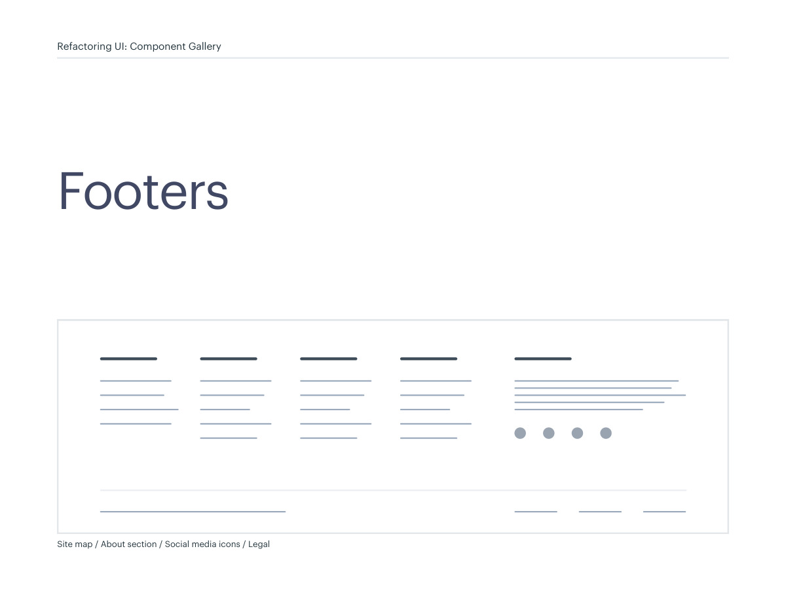
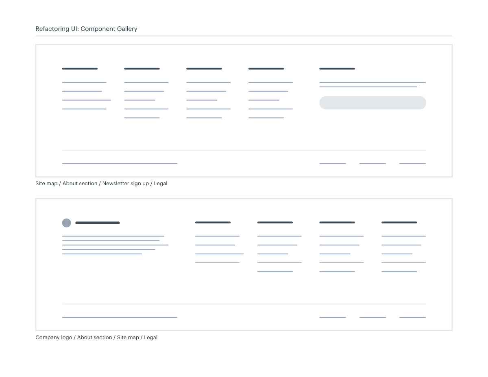
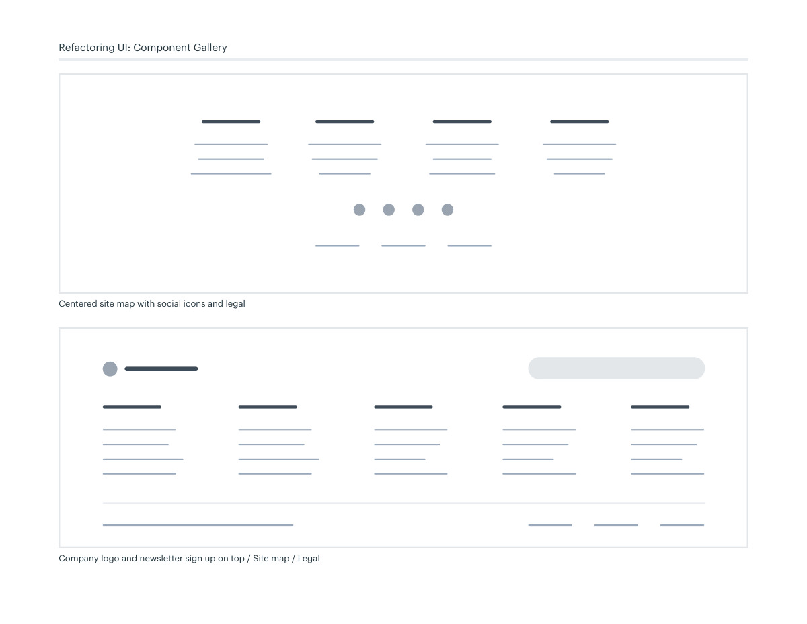
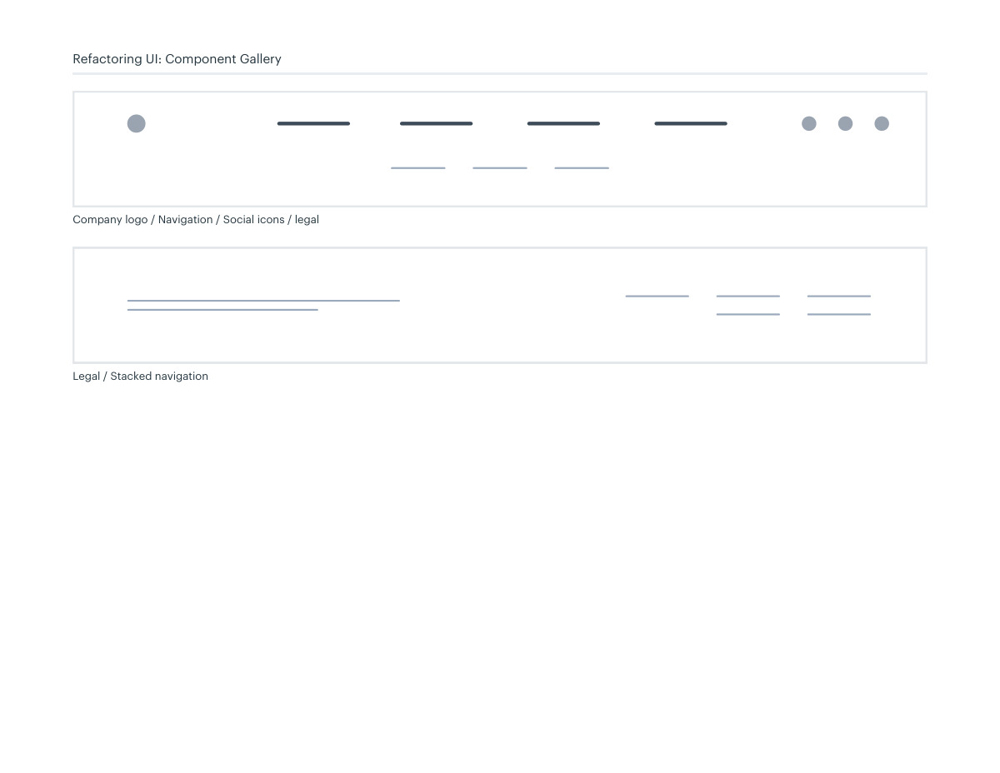

# Footer information layouts

## Apply this

- If a footer becomes a dumping ground, group destinations, company context, and legal information.
- Choose a compact row or grouped sitemap with newsletter and social actions secondary.
- Check small-screen order and readable links; do not duplicate the entire header without a reason.

## Source

Source: `Component Gallery v1.1.0.pdf`, version 1.1.0, PDF pages 76–79.
Apply this is new guidance; the source blocks below preserve the supplied pypdf extraction verbatim.
Page images preserve the original visual content, including text absent from extraction.

## Source pages

### Source page 76



```text
Site map / About section / Social media icons / Legal 
Footers
Refactoring UI: Component Gallery
```

### Source page 77



```text
Company logo / About section / Site map / Legal 
Site map / About section / Newsletter sign up / Legal 
Refactoring UI: Component Gallery
```

### Source page 78



```text
Company logo and newsletter sign up on top / Site map / Legal 
Centered site map with social icons and legal
Refactoring UI: Component Gallery
```

### Source page 79



```text
Refactoring UI: Component Gallery
Company logo / Navigation / Social icons / legal
Legal / Stacked navigation
```
