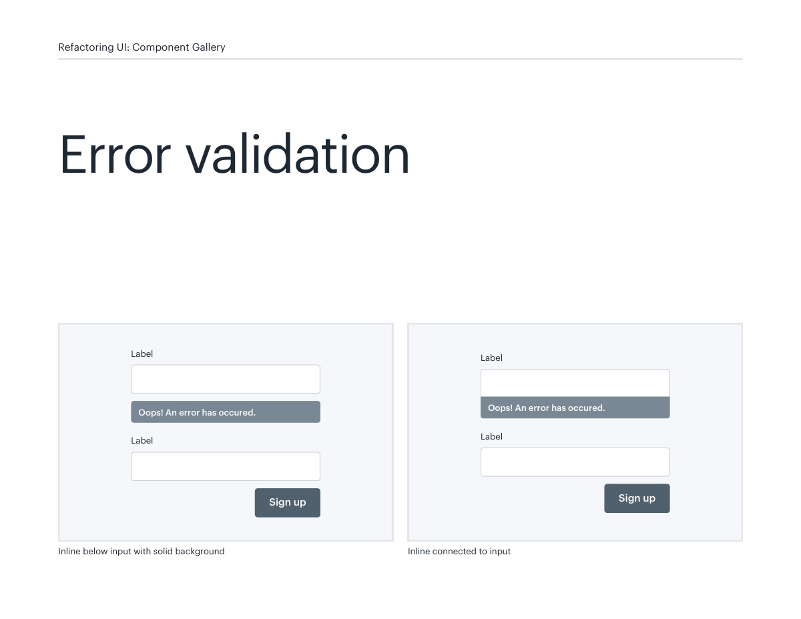
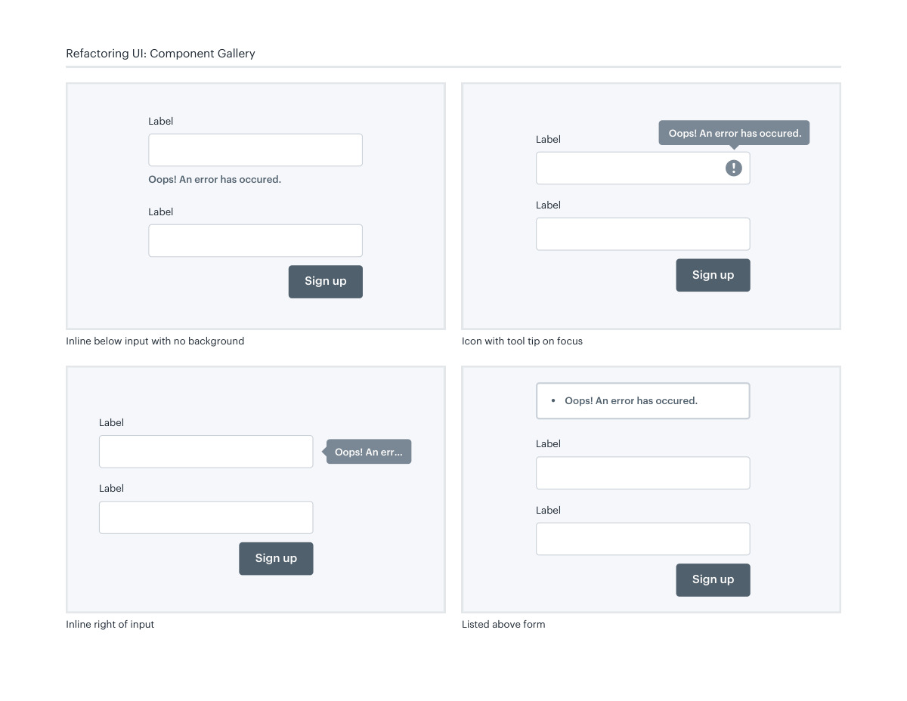
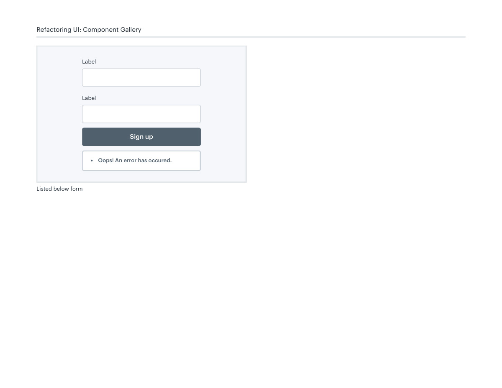

# Form validation feedback

## Apply this

- If users cannot locate a failed field, place a specific correction near the input.
- Compare inline, grouped, and summary feedback patterns without obscuring values.
- Associate errors with fields and expose them to assistive technology; do not rely only on a red outline.

## Source

Source: `Component Gallery v1.1.0.pdf`, version 1.1.0, PDF pages 12–15.
Apply this is new guidance; the source blocks below preserve the supplied pypdf extraction verbatim.
Page images preserve the original visual content, including text absent from extraction.

## Source pages

### Source page 12



```text
Error validation
Sign up
Label
Label
Oops! An error has occured.
Inline below input with solid background
Sign up
Label
Label
Oops! An error has occured.
Inline connected to input
Refactoring UI: Component Gallery
```

### Source page 13



```text
Refactoring UI: Component Gallery
Oops! An error has occured.
Sign up
Label
Label
Icon with tool tip on focus
Oops! An err…
Sign up
Label
Label
Inline right of input
Oops! An error has occured.
Listed above form
Sign up
Label
Label
Sign up
Label
Label
Oops! An error has occured.
Inline below input with no background
```

### Source page 14



```text
Refactoring UI: Component Gallery
Listed below form
Oops! An error has occured.
Sign up
Label
Label
```

### Source page 15


```text

```
