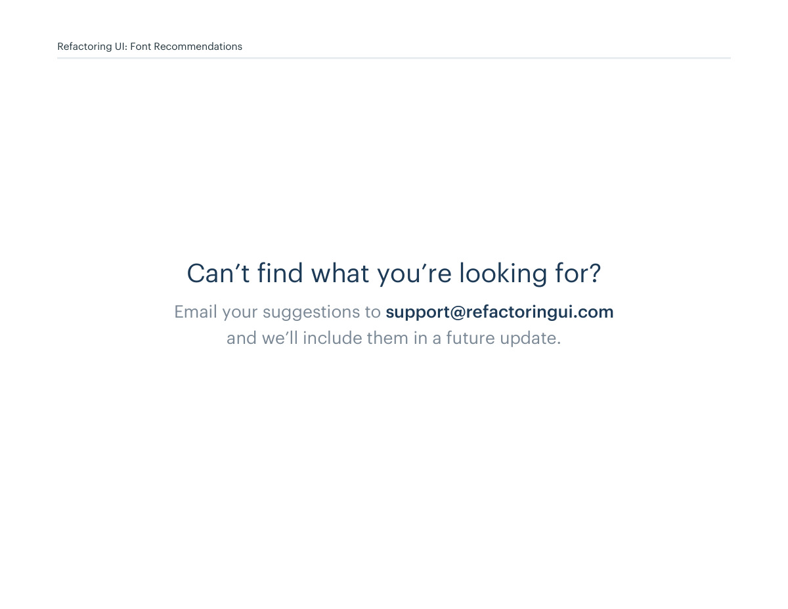

# Gallery source closing and requests

## Apply this

- If the gallery lacks a matching pattern, start with the nearest task-relevant example.
- Treat these examples as visual references rather than complete interaction specifications.
- The closing contact and its printed footer are historical source text; verify contact details before relying on them.

## Source

Source: `Component Gallery v1.1.0.pdf`, version 1.1.0, PDF pages 86–86.
Apply this is new guidance; the source blocks below preserve the supplied pypdf extraction verbatim.
Page images preserve the original visual content, including text absent from extraction.

## Source pages

### Source page 86



```text
Can’t find what you’re looking for?
Email your suggestions to support@refactoringui.com 
and we’ll include them in a future update.
Refactoring UI: Font Recommendations
```
