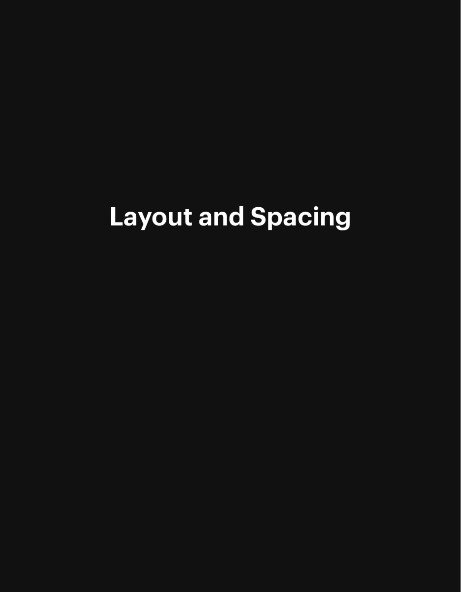
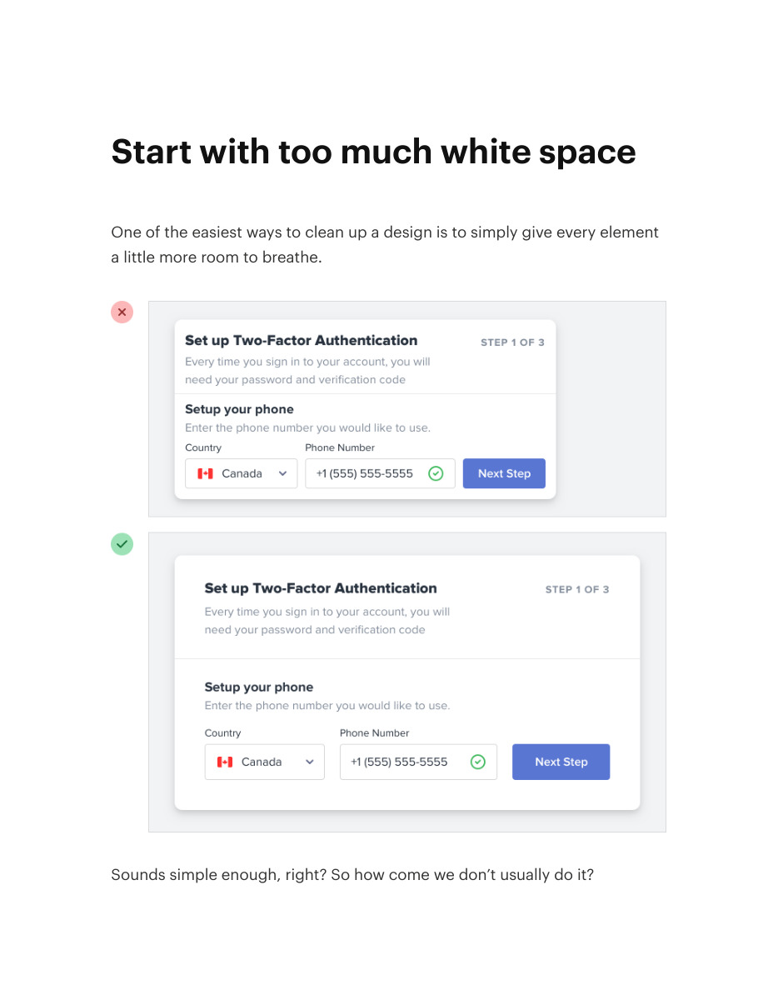
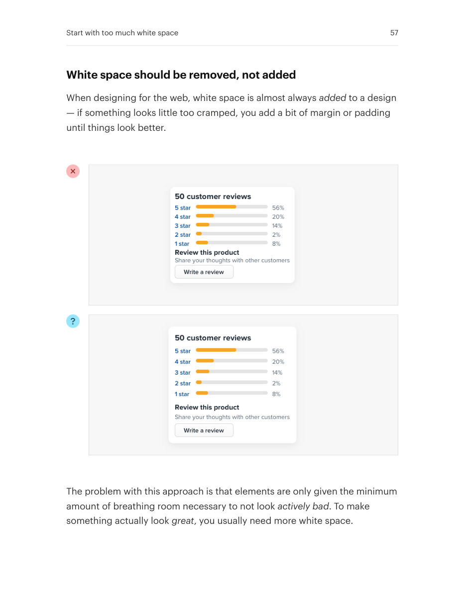
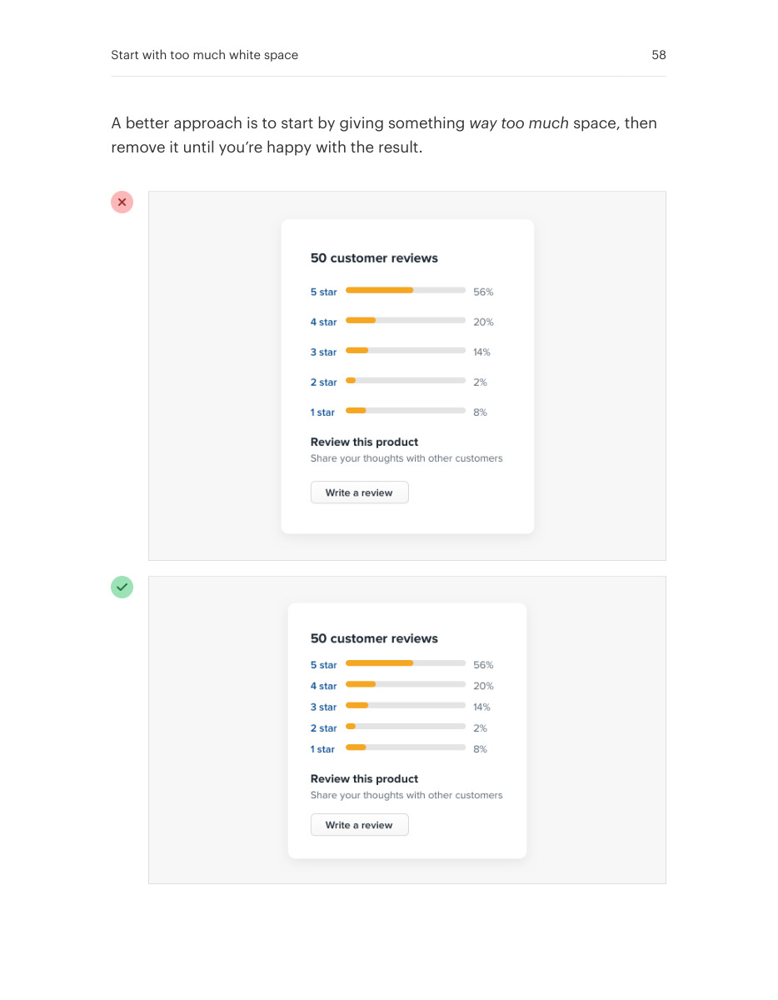
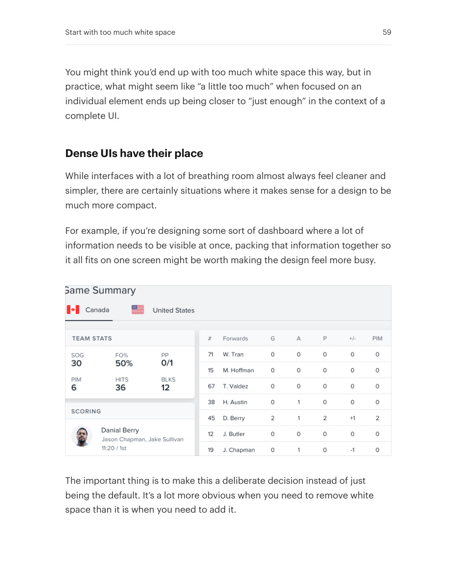

# Start with generous whitespace

## Apply this

- If a layout feels cramped, begin with more separation than you think it needs.
- Remove space gradually until related groups feel connected without becoming crowded.
- Dense tools can justify tighter spacing; test with actual task density rather than filling empty space by default.

## Source

Source: `Refactoring UI v1.0.2.pdf`, version 1.0.2, PDF pages 55–59.
Apply this is new guidance; the source blocks below preserve the supplied pypdf extraction verbatim.
Page images preserve the original visual content, including text absent from extraction.

### Source outline

- Layout and Spacing (source page 55)
- Start with too much white space (source page 56)
  - White space should be removed, not added (source page 57)
  - Dense UIs have their place (source page 59)

## Source pages

### Source page 55



```text
Layout and Spacing
```

### Source page 56



```text
Start with too much white space
One of the easiest ways to clean up a design is to simply give every element
a little more room to breathe.
Sounds simple enough, right? So how come we don’t usually do it?
```

### Source page 57



```text
White space should be removed, not added
When designing for the web, white space is almost alwaysadded to a design
— if something looks little too cramped, you add a bit of margin or padding
until things look better.
The problem with this approach is that elements are only given the minimum
amount of breathing room necessary to not lookactively bad. To make
something actually lookgreat, you usually need more white space.
Start with too much white space 57
```

### Source page 58



```text
A better approach is to start by giving somethingway too much space, then
remove it until you’re happy with the result.
Start with too much white space 58
```

### Source page 59



```text
You might think you’d end up with too much white space this way, but in
practice, what might seem like “a little too much” when focused on an
individual element ends up being closer to “just enough” in the context of a
complete UI.
Dense UIs have their place
While interfaces with a lot of breathing room almost always feel cleaner and
simpler, there are certainly situations where it makes sense for a design to be
much more compact.
For example, if you’re designing some sort of dashboard where a lot of
information needs to be visible at once, packing that information together so
it all fits on one screen might be worth making the design feel more busy.
The important thing is to make this a deliberate decision instead of just
being the default. It’s a lot more obvious when you need to remove white
space than it is when you need to add it.
Start with too much white space 59
```
