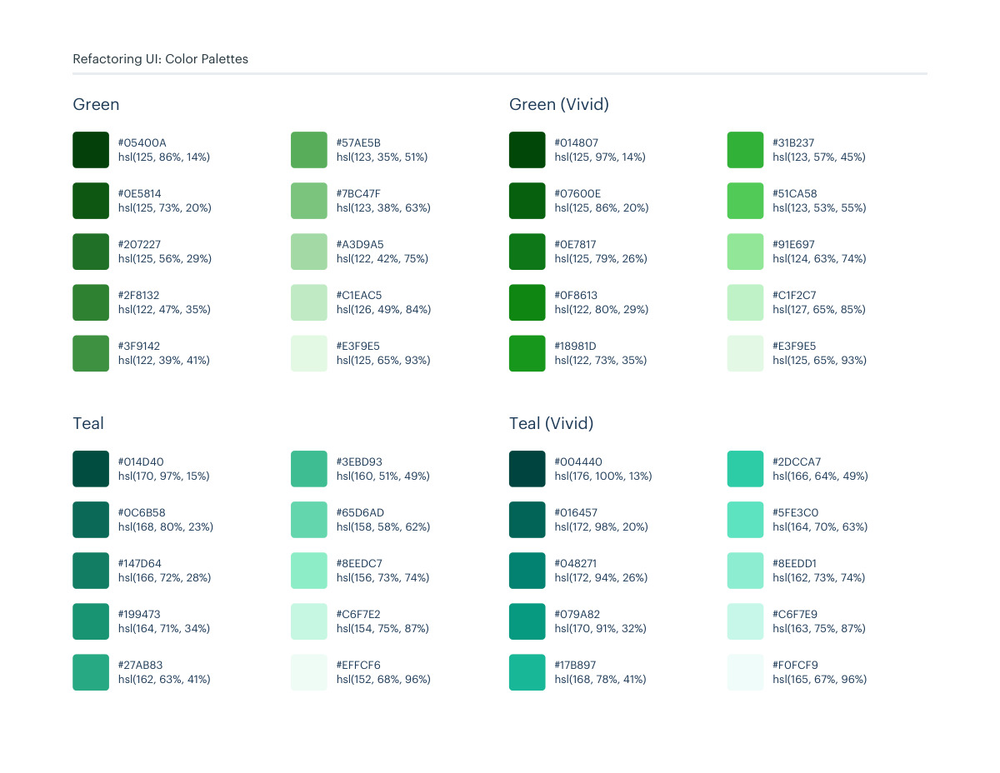
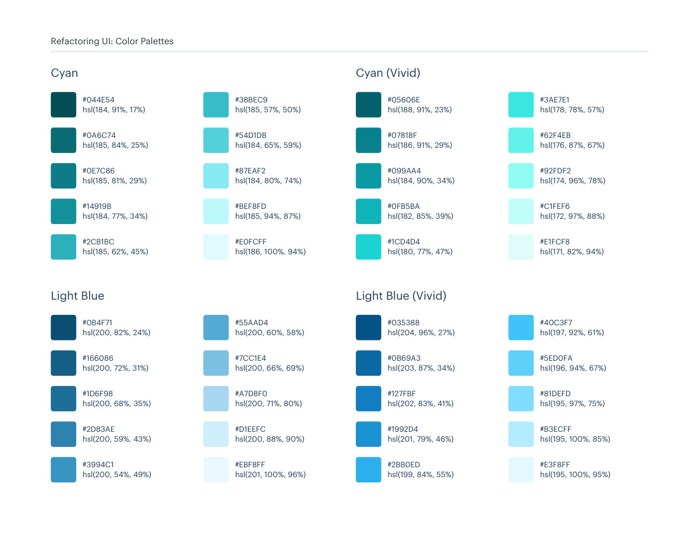

# Green, teal, cyan, and light-blue swatches

## Apply this

- If you need to extend an existing color system, compare the green, teal, cyan, and light-blue swatches in these pages.
- Select a coherent shade family and map it to existing semantic token roles; preserve palette-specific variants separately.
- Verify foreground/background contrast and temperature across components; same-named shades in a palette may differ from this swatch catalog.

## Source

Source: `Color Palettes v1.1.0.pdf`, version 1.1.0, PDF pages 147–148.
Apply this is new guidance; the source blocks below preserve the supplied pypdf extraction verbatim.
Page images preserve the original visual content, including text absent from extraction.

Palette originals retain source comments and trailing commas (JSONC), despite their `.json` extension.
The `.strict.json` companion removes only that syntax; keys and values remain unchanged.
- [swatches.json](../assets/swatches.json)
- [swatches.strict.json](../assets/swatches.strict.json)

## Source pages

### Source page 147



```text
Refactoring UI: Color Palettes
hsl(125, 86%, 14%)
#05400A
hsl(125, 73%, 20%)
#0E5814
hsl(125, 56%, 29%)
#207227
hsl(122, 47%, 35%)
#2F8132
hsl(122, 39%, 41%)
#3F9142
hsl(123, 35%, 51%)
#57AE5B
hsl(123, 38%, 63%)
#7BC47F
hsl(122, 42%, 75%)
#A3D9A5
hsl(126, 49%, 84%)
#C1EAC5
hsl(125, 65%, 93%)
#E3F9E5
Green
hsl(125, 97%, 14%)
#014807
hsl(125, 86%, 20%)
#07600E
hsl(125, 79%, 26%)
#0E7817
hsl(122, 80%, 29%)
#0F8613
hsl(122, 73%, 35%)
#18981D
hsl(123, 57%, 45%)
#31B237
hsl(123, 53%, 55%)
#51CA58
hsl(124, 63%, 74%)
#91E697
hsl(127, 65%, 85%)
#C1F2C7
hsl(125, 65%, 93%)
#E3F9E5
Green (Vivid)
hsl(170, 97%, 15%)
#014D40
hsl(168, 80%, 23%)
#0C6B58
hsl(166, 72%, 28%)
#147D64
hsl(164, 71%, 34%)
#199473
hsl(162, 63%, 41%)
#27AB83
hsl(160, 51%, 49%)
#3EBD93
hsl(158, 58%, 62%)
#65D6AD
hsl(156, 73%, 74%)
#8EEDC7
hsl(154, 75%, 87%)
#C6F7E2
hsl(152, 68%, 96%)
#EFFCF6
Teal
hsl(176, 100%, 13%)
#004440
hsl(172, 98%, 20%)
#016457
hsl(172, 94%, 26%)
#048271
hsl(170, 91%, 32%)
#079A82
hsl(168, 78%, 41%)
#17B897
hsl(166, 64%, 49%)
#2DCCA7
hsl(164, 70%, 63%)
#5FE3C0
hsl(162, 73%, 74%)
#8EEDD1
hsl(163, 75%, 87%)
#C6F7E9
hsl(165, 67%, 96%)
#F0FCF9
Teal (Vivid)
```

### Source page 148



```text
Refactoring UI: Color Palettes
hsl(200, 82%, 24%)
#0B4F71
hsl(200, 72%, 31%)
#166086
hsl(200, 68%, 35%)
#1D6F98
hsl(200, 59%, 43%)
#2D83AE
hsl(200, 54%, 49%)
#3994C1
hsl(200, 60%, 58%)
#55AAD4
hsl(200, 66%, 69%)
#7CC1E4
hsl(200, 71%, 80%)
#A7D8F0
hsl(200, 88%, 90%)
#D1EEFC
hsl(201, 100%, 96%)
#EBF8FF
Light Blue
hsl(204, 96%, 27%)
#035388
hsl(203, 87%, 34%)
#0B69A3
hsl(202, 83%, 41%)
#127FBF
hsl(201, 79%, 46%)
#1992D4
hsl(199, 84%, 55%)
#2BB0ED
hsl(197, 92%, 61%)
#40C3F7
hsl(196, 94%, 67%)
#5ED0FA
hsl(195, 97%, 75%)
#81DEFD
hsl(195, 100%, 85%)
#B3ECFF
hsl(195, 100%, 95%)
#E3F8FF
Light Blue (Vivid)
hsl(184, 91%, 17%)
#044E54
hsl(185, 84%, 25%)
#0A6C74
hsl(185, 81%, 29%)
#0E7C86
hsl(184, 77%, 34%)
#14919B
hsl(185, 62%, 45%)
#2CB1BC
hsl(185, 57%, 50%)
#38BEC9
hsl(184, 65%, 59%)
#54D1DB
hsl(184, 80%, 74%)
#87EAF2
hsl(185, 94%, 87%)
#BEF8FD
hsl(186, 100%, 94%)
#E0FCFF
Cyan
hsl(188, 91%, 23%)
#05606E
hsl(186, 91%, 29%)
#07818F
hsl(184, 90%, 34%)
#099AA4
hsl(182, 85%, 39%)
#0FB5BA
hsl(180, 77%, 47%)
#1CD4D4
hsl(178, 78%, 57%)
#3AE7E1
hsl(176, 87%, 67%)
#62F4EB
hsl(174, 96%, 78%)
#92FDF2
hsl(172, 97%, 88%)
#C1FEF6
hsl(171, 82%, 94%)
#E1FCF8
Cyan (Vivid)
```
