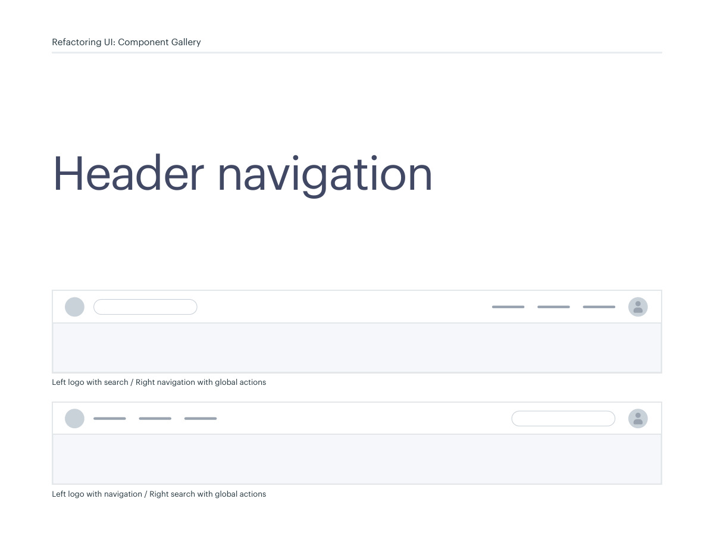
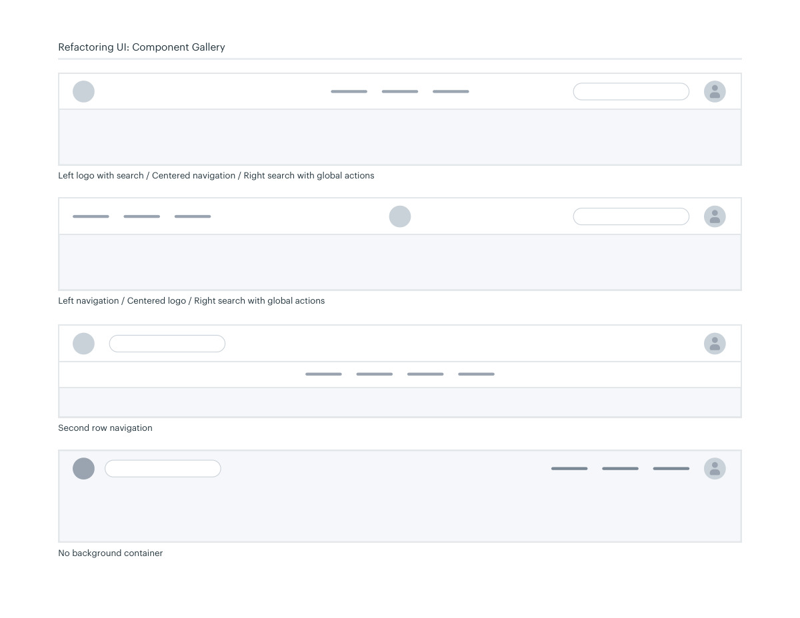

# Header navigation composition

## Apply this

- If global navigation is crowded, separate identity, destinations, search, and account actions.
- Choose a one- or two-row header with deliberate alignment and hierarchy.
- Test narrow screens and long labels; verify that collapsing navigation does not hide essential tasks.

## Source

Source: `Component Gallery v1.1.0.pdf`, version 1.1.0, PDF pages 62–63.
Apply this is new guidance; the source blocks below preserve the supplied pypdf extraction verbatim.
Page images preserve the original visual content, including text absent from extraction.

## Source pages

### Source page 62



```text
Left logo with search / Right navigation with global actions
Left logo with navigation / Right search with global actions
Header navigation
Refactoring UI: Component Gallery
```

### Source page 63



```text
Left logo with search / Centered navigation / Right search with global actions
Left navigation / Centered logo / Right search with global actions
Second row navigation
Refactoring UI: Component Gallery
No background container
```
