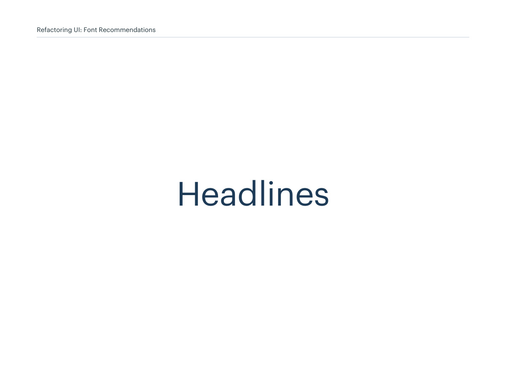
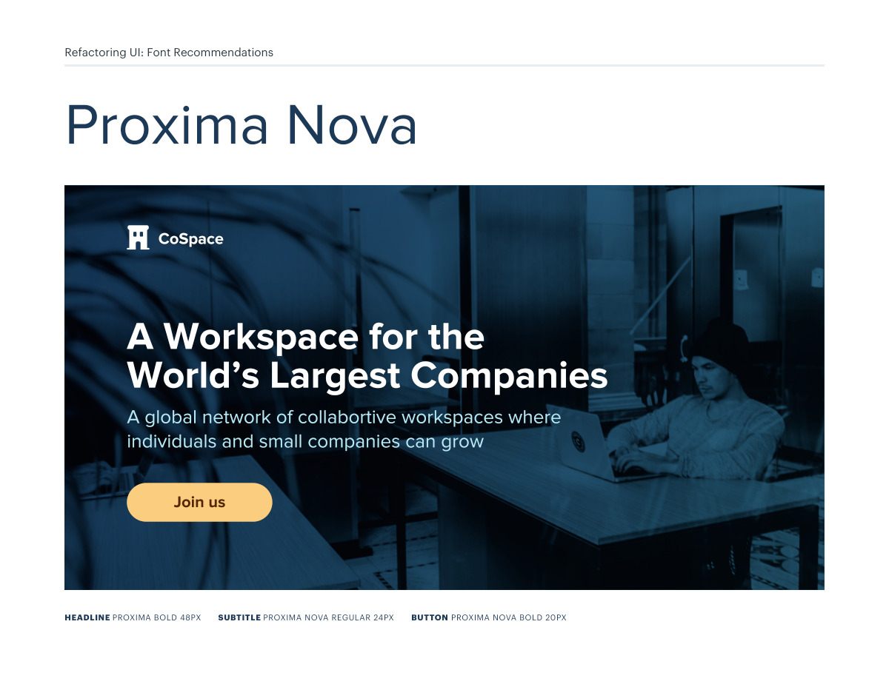
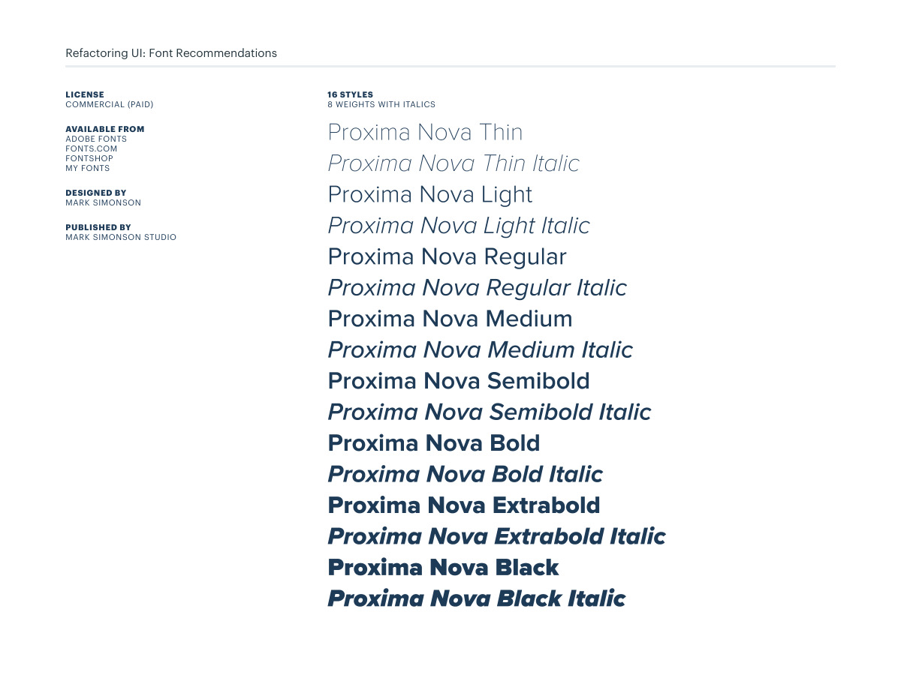
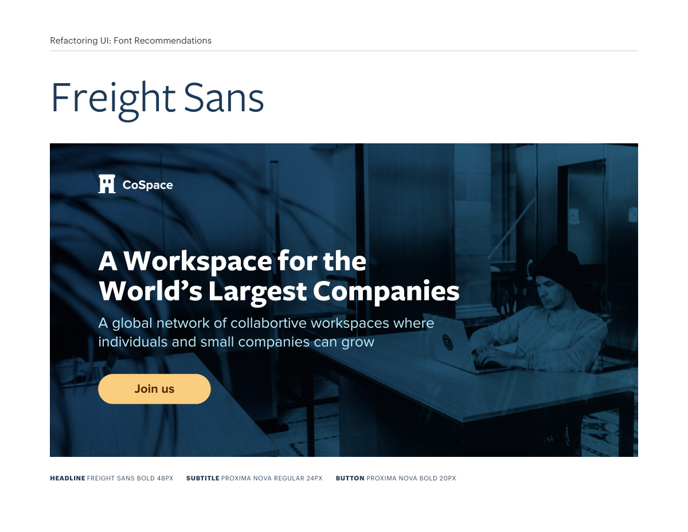
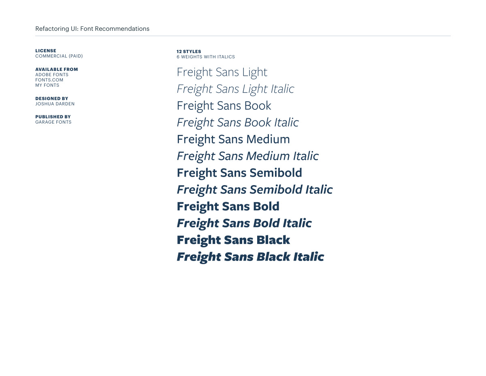
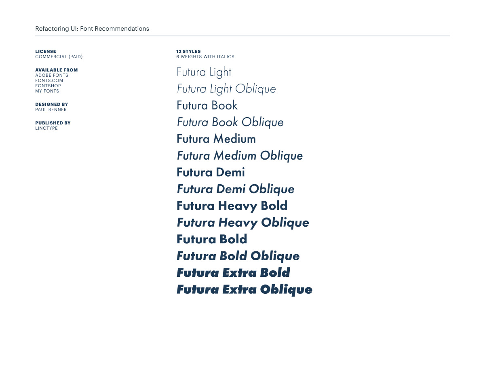
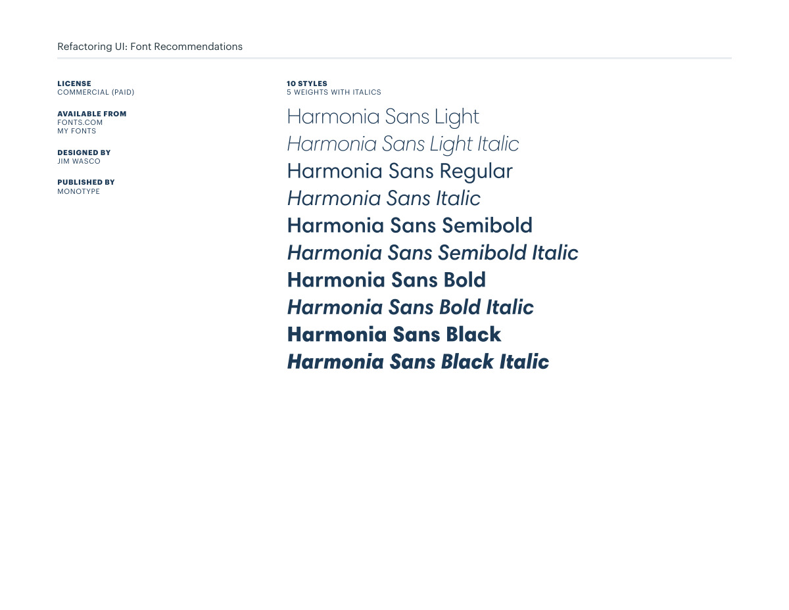
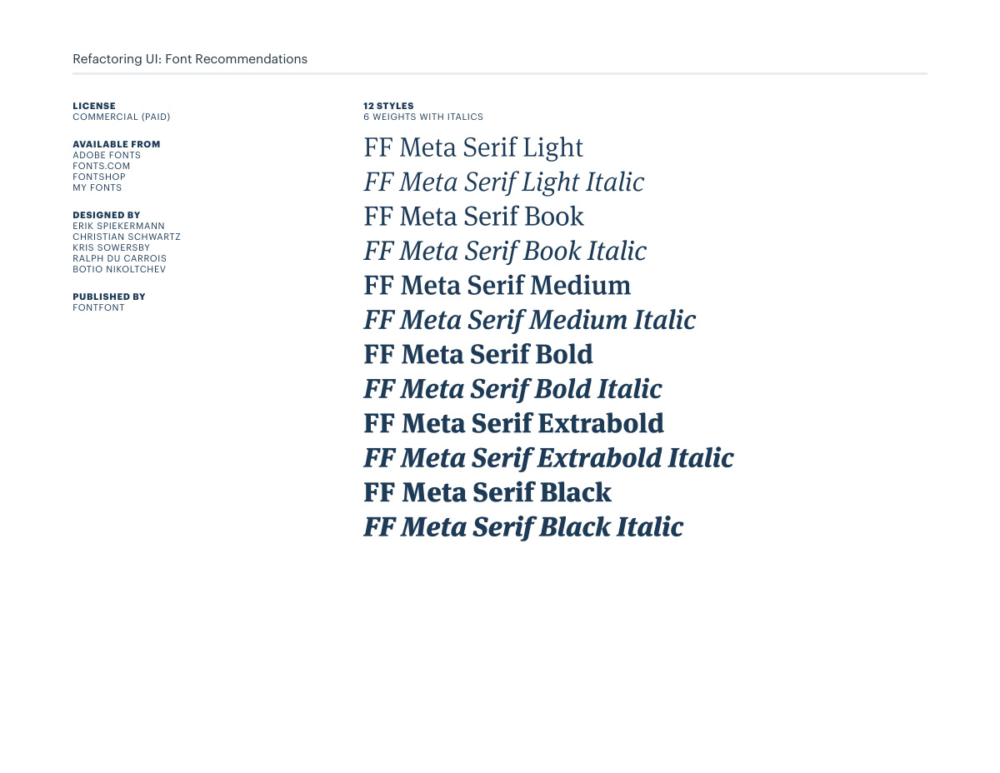

# Headline font pairings: Proxima through Meta Serif

## Apply this

- If headlines and supporting text feel unrelated, compare the complete pairings rather than a headline alone.
- Trial the displayed Proxima, Freight Sans, Futura, Harmonia Sans, Graphik, and Meta Serif treatments with real copy.
- Check wrapping, the actual available weights, and current license terms; specimen pixel sizes are examples, not mandatory tokens.

## Source

Source: `Font Recommendations v1.0.1.pdf`, version 1.0.1, PDF pages 3–15.
Apply this is new guidance; the source blocks below preserve the supplied pypdf extraction verbatim.
Page images preserve the original visual content, including text absent from extraction.

## Source pages

### Source page 3



```text
Headlines
Refactoring UI: Font Recommendations
```

### Source page 4



```text
Refactoring UI: Font Recommendations
HEADLINE PROXIMA BOLD 48PX SUBTITLE PROXIMA NOVA REGULAR 24PX BUTTON PROXIMA NOVA BOLD 20PX
```

### Source page 5



```text
Refactoring UI: Font Recommendations
LICENSE
COMMERCIAL (PAID)
AVAILABLE FROM
ADOBE FONTS
FONTS.COM
FONTSHOP
MY FONTS
DESIGNED BY
MARK SIMONSON
PUBLISHED BY 
MARK SIMONSON STUDIO
16 STYLES
8 WEIGHTS WITH ITALICS
```

### Source page 6



```text
Refactoring UI: Font Recommendations
HEADLINE FREIGHT SANS BOLD 48PX SUBTITLE PROXIMA NOVA REGULAR 24PX BUTTON PROXIMA NOVA BOLD 20PX
```

### Source page 7



```text
Refactoring UI: Font Recommendations
12 STYLES
6 WEIGHTS WITH ITALICS
LICENSE
COMMERCIAL (PAID)
AVAILABLE FROM
ADOBE FONTS
FONTS.COM
MY FONTS
DESIGNED BY
JOSHUA DARDEN
PUBLISHED BY 
GARAGE FONTS
```

### Source page 8


```text
Refactoring UI: Font Recommendations
HEADLINE FUTURA BOLD 36PX SUBTITLE TRADE GOTHIC NEXT REGULAR 24PX BUTTON TRADE GOTHIC NEXT BOLD 20PX
```

### Source page 9



```text
Refactoring UI: Font Recommendations
LICENSE
COMMERCIAL (PAID)
AVAILABLE FROM
ADOBE FONTS
FONTS.COM
FONTSHOP
MY FONTS
DESIGNED BY
PAUL RENNER
PUBLISHED BY 
LINOTYPE
12 STYLES
6 WEIGHTS WITH ITALICS
```

### Source page 10


```text
Refactoring UI: Font Recommendations
HEADLINE HARMONIA SANS BLACK 48PX SUBTITLE GRAPHIK REGULAR 24PX BUTTON GRAPHIK SEMIBOLD 20PX
```

### Source page 11



```text
Refactoring UI: Font Recommendations
LICENSE
COMMERCIAL (PAID)
AVAILABLE FROM
FONTS.COM
MY FONTS
DESIGNED BY
JIM WASCO
PUBLISHED BY 
MONOTYPE
10 STYLES
5 WEIGHTS WITH ITALICS
```

### Source page 12


```text
Refactoring UI: Font Recommendations
HEADLINE GRAPHIK BLACK 48PX SUBTITLE GRAPHIK REGULAR 24PX BUTTON GRAPHIK SEMIBOLD 18PX
```

### Source page 13


```text
Refactoring UI: Font Recommendations
LICENSE
COMMERCIAL (PAID)
AVAILABLE FROM
COMMERCIAL TYPE
DESIGNED BY
CHRISTIAN SCHWARTZ
PUBLISHED BY 
COMMERCIAL TYPE
18 STYLES
9 WEIGHTS WITH ITALICS
```

### Source page 14


```text
Refactoring UI: Font Recommendations
HEADLINE META SERIF BOLD 48PX SUBTITLE MYRIAD PRO REGULAR 24PX BUTTON MYRIAD PRO SEMIBOLD 20PX
```

### Source page 15



```text
Refactoring UI: Font Recommendations
LICENSE
COMMERCIAL (PAID)
AVAILABLE FROM
ADOBE FONTS
FONTS.COM
FONTSHOP
MY FONTS
DESIGNED BY
ERIK SPIEKERMANN
CHRISTIAN SCHWARTZ
KRIS SOWERSBY
RALPH DU CARROIS
BOTIO NIKOLTCHEV
PUBLISHED BY 
FONTFONT
12 STYLES
6 WEIGHTS WITH ITALICS
```
