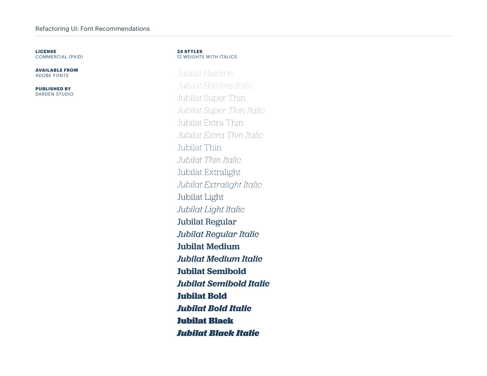
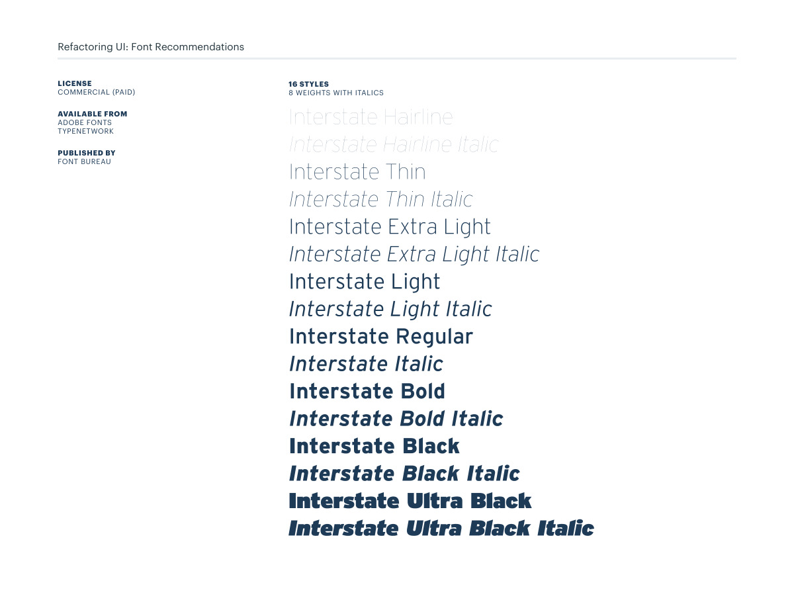
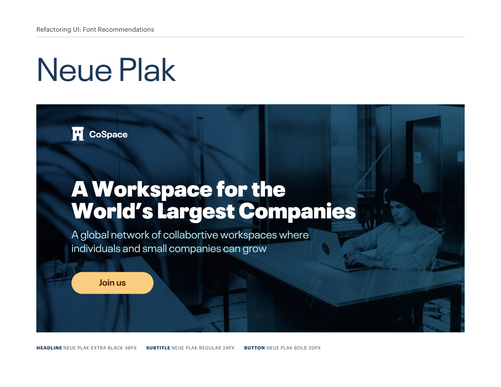
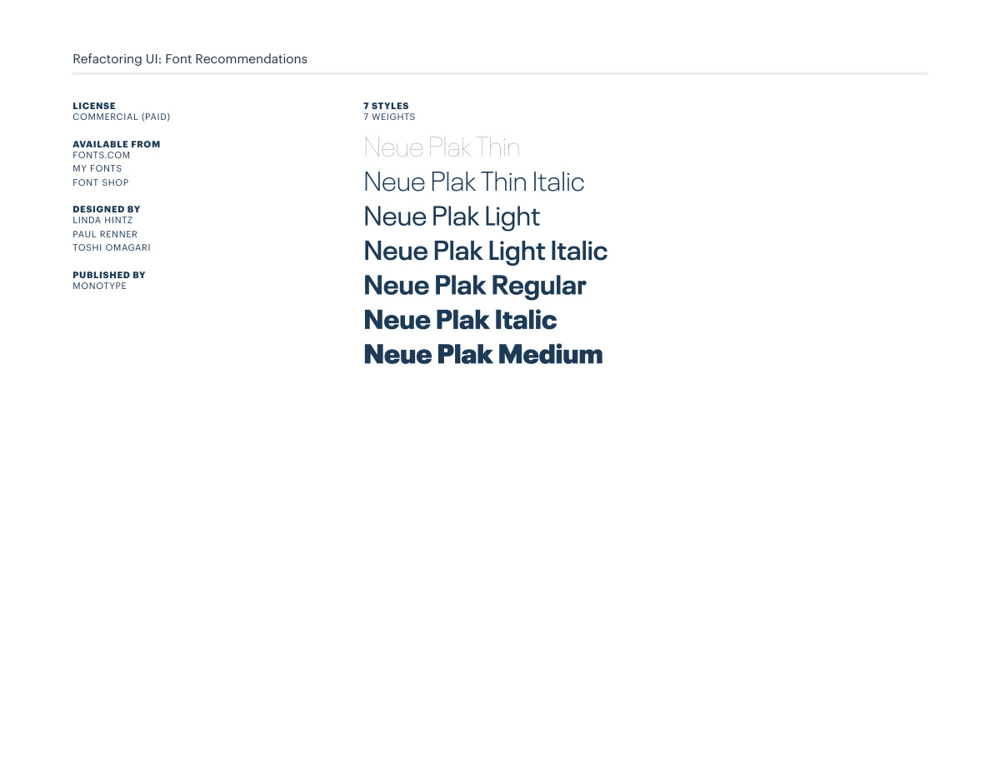
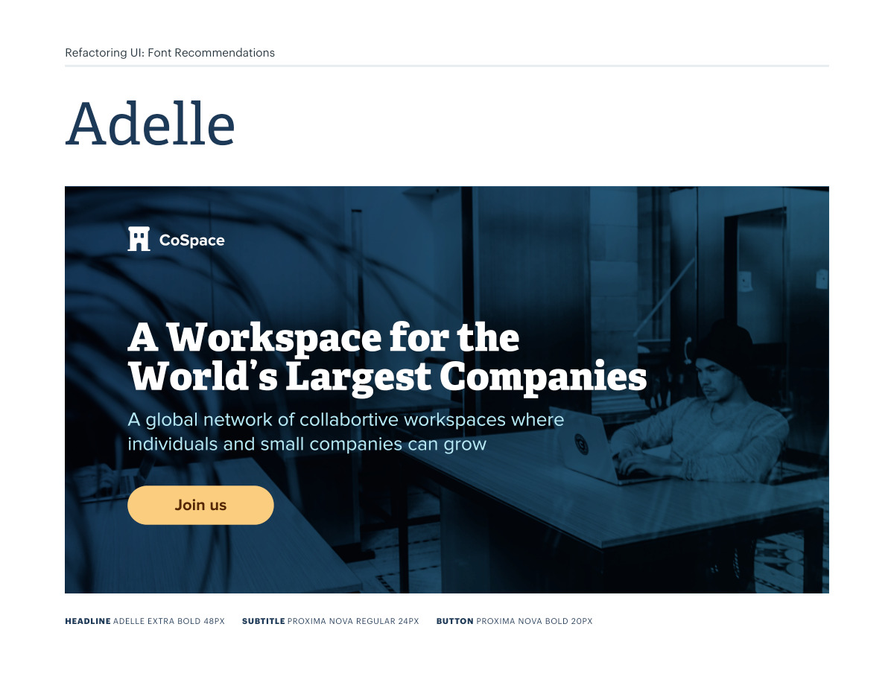
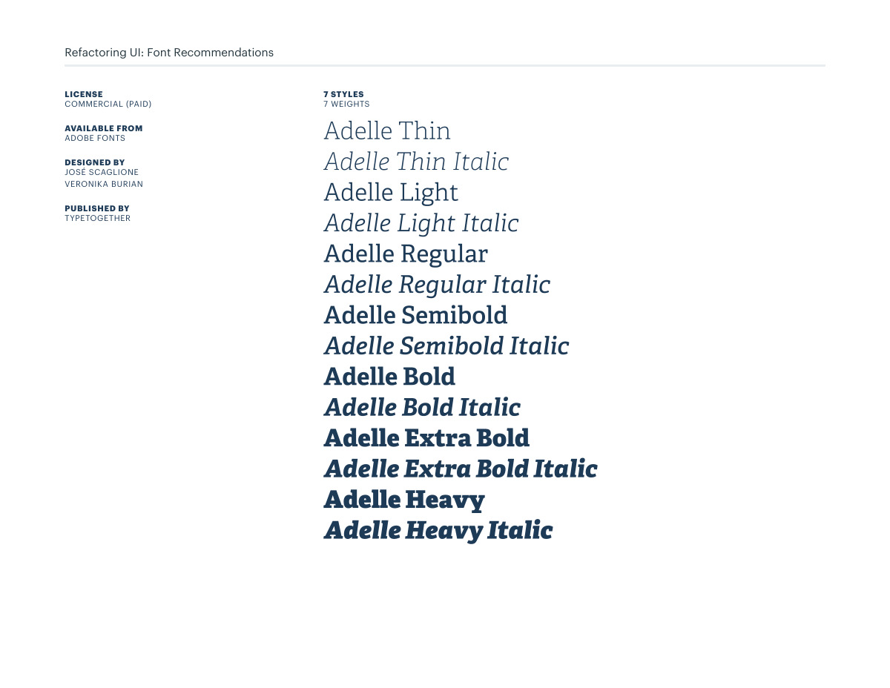

# Headline font pairings: Roboto through Adelle

## Apply this

- If the heading voice lacks distinction, compare the Roboto, Jubilat, Interstate, Neue Plak, and Adelle examples.
- Keep a readable supporting family and map the chosen hierarchy into existing heading and button tokens.
- Test long localized headings and verify current licenses; do not copy the source sizes without checking your layout.

## Source

Source: `Font Recommendations v1.0.1.pdf`, version 1.0.1, PDF pages 16–25.
Apply this is new guidance; the source blocks below preserve the supplied pypdf extraction verbatim.
Page images preserve the original visual content, including text absent from extraction.

## Source pages

### Source page 16


```text
Refactoring UI: Font Recommendations
HEADLINE ROBOTO BLACK 48PX SUBTITLE ROBOTO REGULAR 24PX BUTTON ROBOTO BOLD 20PX
```

### Source page 17


```text
Refactoring UI: Font Recommendations
LICENSE
APACHE LICENSE, VERSION 2.0 (FREE)
AVAILABLE FROM
ADOBE FONTS
GOOGLE FONTS
DESIGNED BY
CHRISTIAN ROBERTSON
PUBLISHED BY 
FONTFONT
12 STYLES
6 WEIGHTS WITH ITALICS
```

### Source page 18


```text
Refactoring UI: Font Recommendations
HEADLINE JUBILAT SEMIBOLD 48PX SUBTITLE PROXIMA NOVA REGULAR 24PX BUTTON PROXIMA NOVA BOLD 20PX
```

### Source page 19



```text
Refactoring UI: Font Recommendations
LICENSE
COMMERCIAL (PAID)
AVAILABLE FROM
ADOBE FONTS
PUBLISHED BY 
DARDEN STUDIO
24 STYLES
12 WEIGHTS WITH ITALICS
```

### Source page 20


```text
Refactoring UI: Font Recommendations
HEADLINE INTERSTATE BOLD 48PX SUBTITLE INTERSTATE LIGHT 24PX BUTTON INTERSTATE REGULAR 20PX
```

### Source page 21



```text
Refactoring UI: Font Recommendations
16 STYLES
8 WEIGHTS WITH ITALICS
LICENSE
COMMERCIAL (PAID)
AVAILABLE FROM
ADOBE FONTS
TYPENETWORK
PUBLISHED BY 
FONT BUREAU
```

### Source page 22



```text
Refactoring UI: Font Recommendations
HEADLINE NEUE PLAK EXTRA BLACK 48PX SUBTITLE NEUE PLAK REGULAR 24PX BUTTON NEUE PLAK BOLD 20PX
```

### Source page 23



```text
Refactoring UI: Font Recommendations
LICENSE
COMMERCIAL (PAID)
AVAILABLE FROM
FONTS.COM
MY FONTS
FONT SHOP
DESIGNED BY
LINDA HINTZ
PAUL RENNER
TOSHI OMAGARI
PUBLISHED BY 
MONOTYPE
7 STYLES
7 WEIGHTS
```

### Source page 24



```text
Refactoring UI: Font Recommendations
HEADLINE ADELLE EXTRA BOLD 48PX SUBTITLE PROXIMA NOVA REGULAR 24PX BUTTON PROXIMA NOVA BOLD 20PX
```

### Source page 25



```text
Refactoring UI: Font Recommendations
LICENSE
COMMERCIAL (PAID)
AVAILABLE FROM
ADOBE FONTS
DESIGNED BY
JOSÉ SCAGLIONE
VERONIKA BURIAN
PUBLISHED BY 
TYPETOGETHER
7 STYLES
7 WEIGHTS
```
