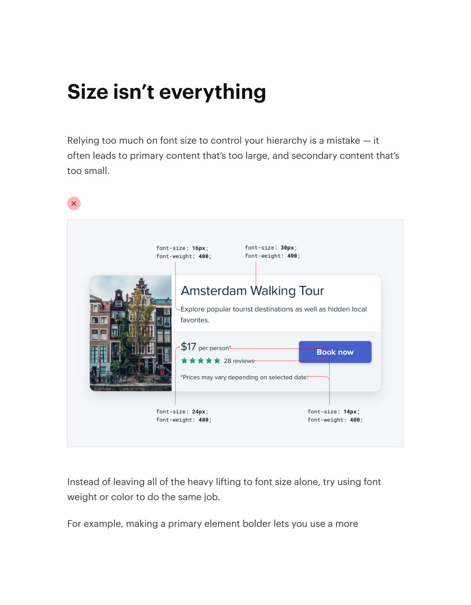
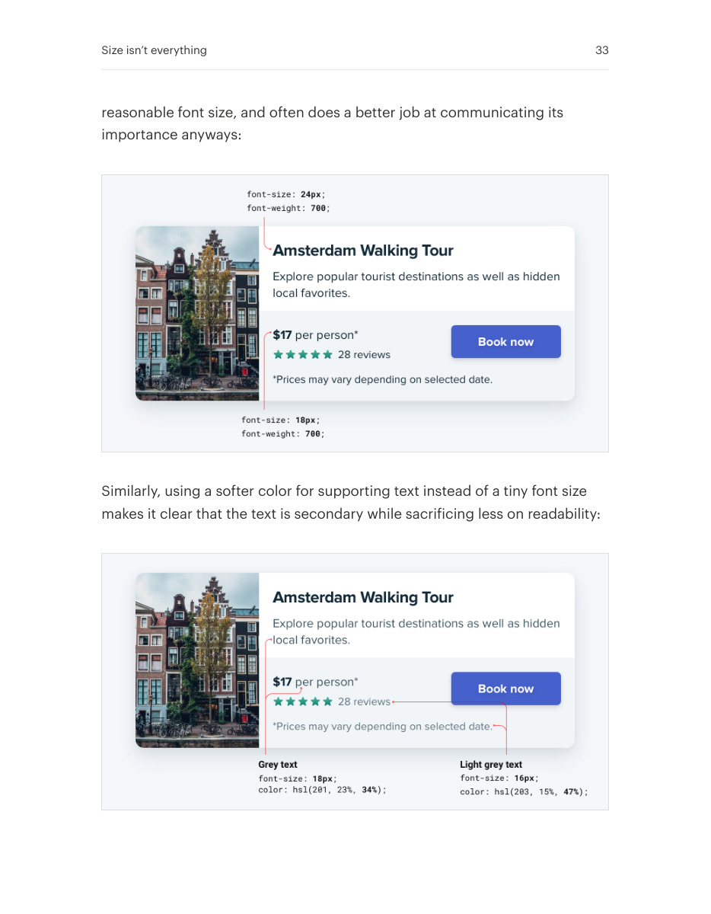
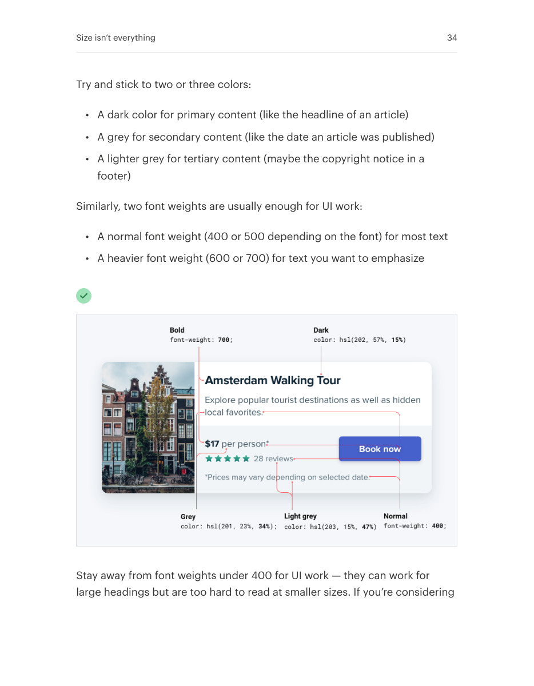

# Build hierarchy with weight and color

## Apply this

- If hierarchy relies on oversized text, separate importance from font size.
- Use restrained weight and contrast changes before adding more sizes.
- Check muted text on its actual surface; keep useful content readable.

## Source

Source: `Refactoring UI v1.0.2.pdf`, version 1.0.2, PDF pages 32–35.
Apply this is new guidance; the source blocks below preserve the supplied pypdf extraction verbatim.
Page images preserve the original visual content, including text absent from extraction.

### Source outline

- Size isn’t everything (source page 32)

## Source pages

### Source page 32



```text
Size isn’t everything
Relying too much on font size to control your hierarchy is a mistake — it
often leads to primary content that’s too large, and secondary content that’s
too small.
Instead of leaving all of the heavy lifting to font size alone, try using font
weight or color to do the same job.
For example, making a primary element bolder lets you use a more
```

### Source page 33



```text
reasonable font size, and often does a better job at communicating its
importance anyways:
Similarly, using a softer color for supporting text instead of a tiny font size
makes it clear that the text is secondary while sacrificing less on readability:
Size isn’t everything 33
```

### Source page 34



```text
Try and stick to two or three colors:
• A dark color for primary content (like the headline of an article)
• A grey for secondary content (like the date an article was published)
• A lighter grey for tertiary content (maybe the copyright notice in a
footer)
Similarly, two font weights are usually enough for UI work:
• A normal font weight (400 or 500 depending on the font) for most text
• A heavier font weight (600 or 700) for text you want to emphasize
Stay away from font weights under 400 for UI work — they can work for
large headings but are too hard to read at smaller sizes. If you’re considering
Size isn’t everything 34
```

### Source page 35


```text
using a lighter weight to de-emphasize some text, use a lighter color or
smaller font size instead.
Size isn’t everything 35
```
