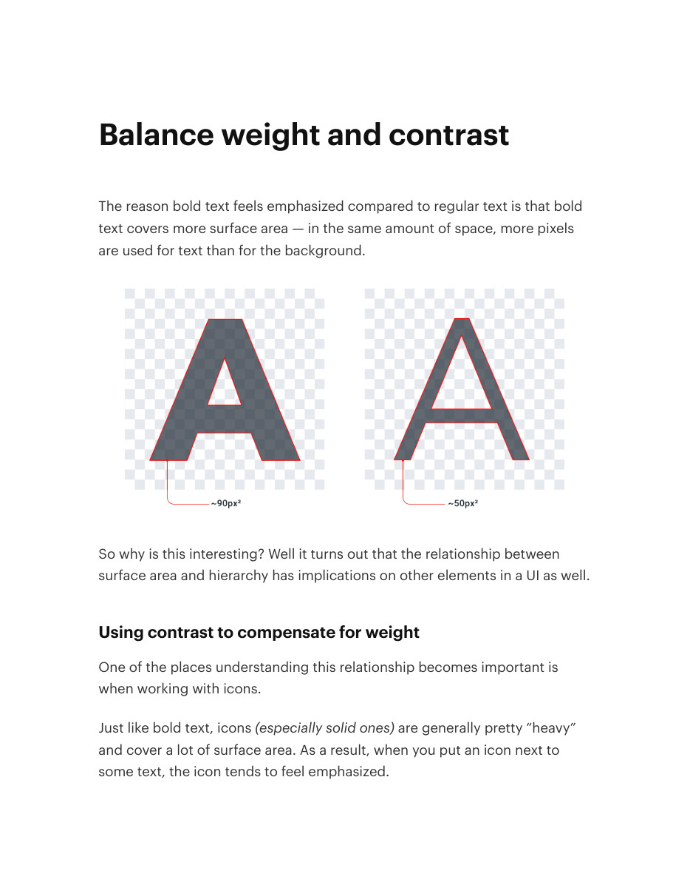
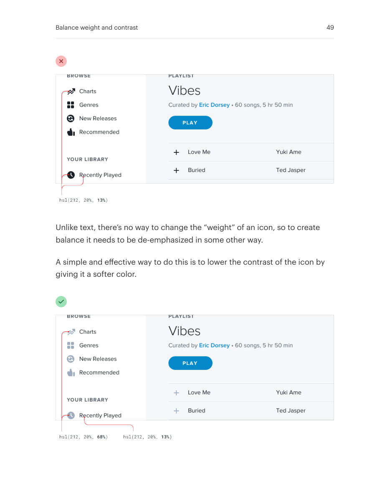
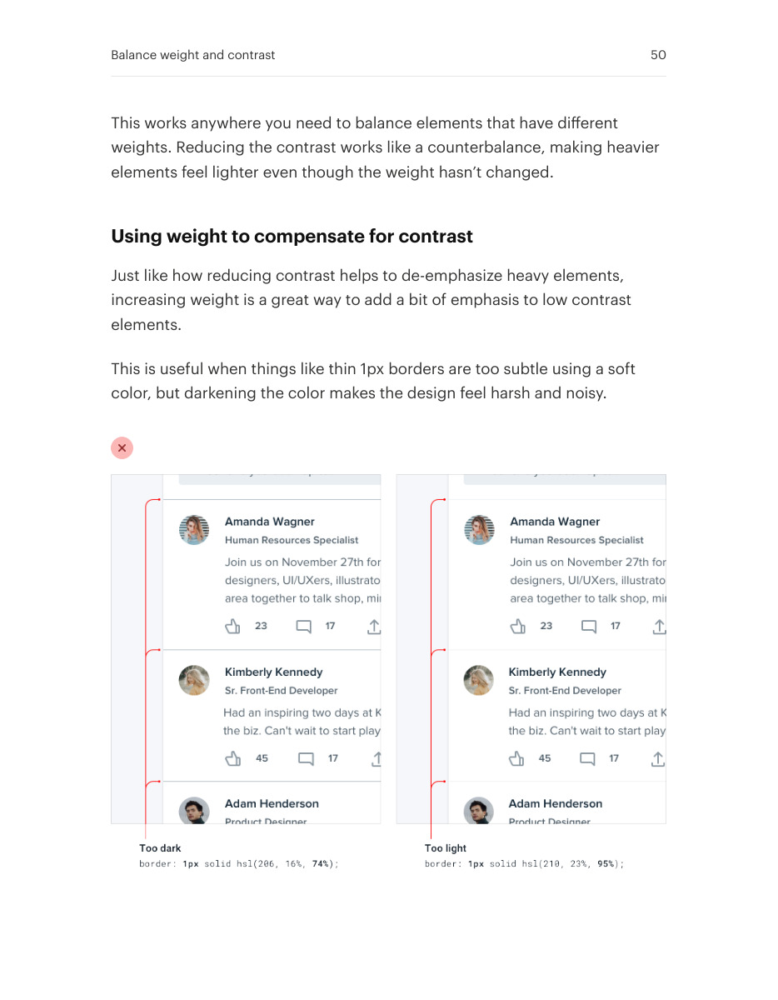
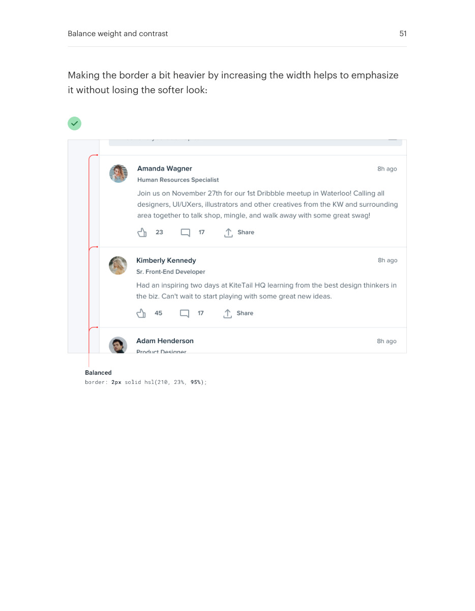

# Balance visual weight and contrast

## Apply this

- If a heavy icon overwhelms nearby text, compare both weight and contrast.
- Quiet the icon with lower contrast or strengthen a delicate separator with more weight.
- Check the pair at its actual size; never solve balance by making essential content disappear.

## Source

Source: `Refactoring UI v1.0.2.pdf`, version 1.0.2, PDF pages 48–51.
Apply this is new guidance; the source blocks below preserve the supplied pypdf extraction verbatim.
Page images preserve the original visual content, including text absent from extraction.

### Source outline

- Balance weight and contrast (source page 48)
  - Using contrast to compensate for weight (source page 48)
  - Using weight to compensate for contrast (source page 50)

## Source pages

### Source page 48



```text
Balance weight and contrast
The reason bold text feels emphasized compared to regular text is that bold
text covers more surface area — in the same amount of space, more pixels
are used for text than for the background.
So why is this interesting? Well it turns out that the relationship between
surface area and hierarchy has implications on other elements in a UI as well.
Using contrast to compensate for weight
One of the places understanding this relationship becomes important is
when working with icons.
Just like bold text, icons(especially solid ones) are generally pretty “heavy”
and cover a lot of surface area. As a result, when you put an icon next to
some text, the icon tends to feel emphasized.
```

### Source page 49



```text
Unlike text, there’s no way to change the “weight” of an icon, so to create
balance it needs to be de-emphasized in some other way.
A simple and effective way to do this is to lower the contrast of the icon by
giving it a softer color.
Balance weight and contrast 49
```

### Source page 50



```text
This works anywhere you need to balance elements that have different
weights. Reducing the contrast works like a counterbalance, making heavier
elements feel lighter even though the weight hasn’t changed.
Using weight to compensate for contrast
Just like how reducing contrast helps to de-emphasize heavy elements,
increasing weight is a great way to add a bit of emphasis to low contrast
elements.
This is useful when things like thin 1px borders are too subtle using a soft
color, but darkening the color makes the design feel harsh and noisy.
Balance weight and contrast 50
```

### Source page 51



```text
Making the border a bit heavier by increasing the width helps to emphasize
it without losing the softer look:
Balance weight and contrast 51
```
