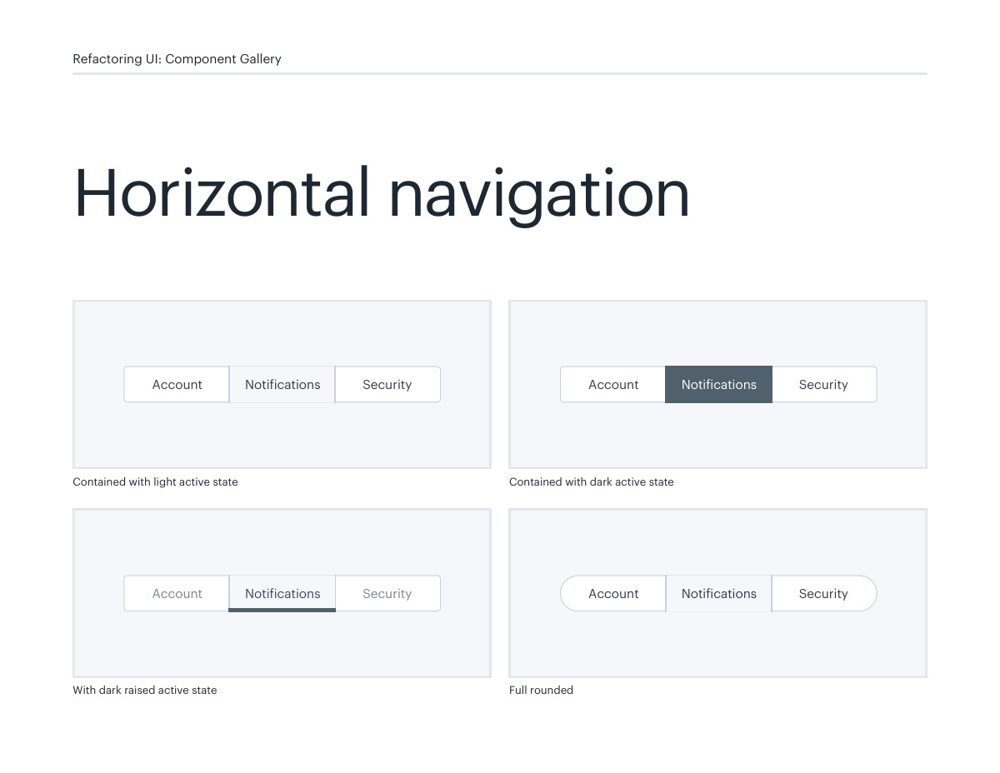
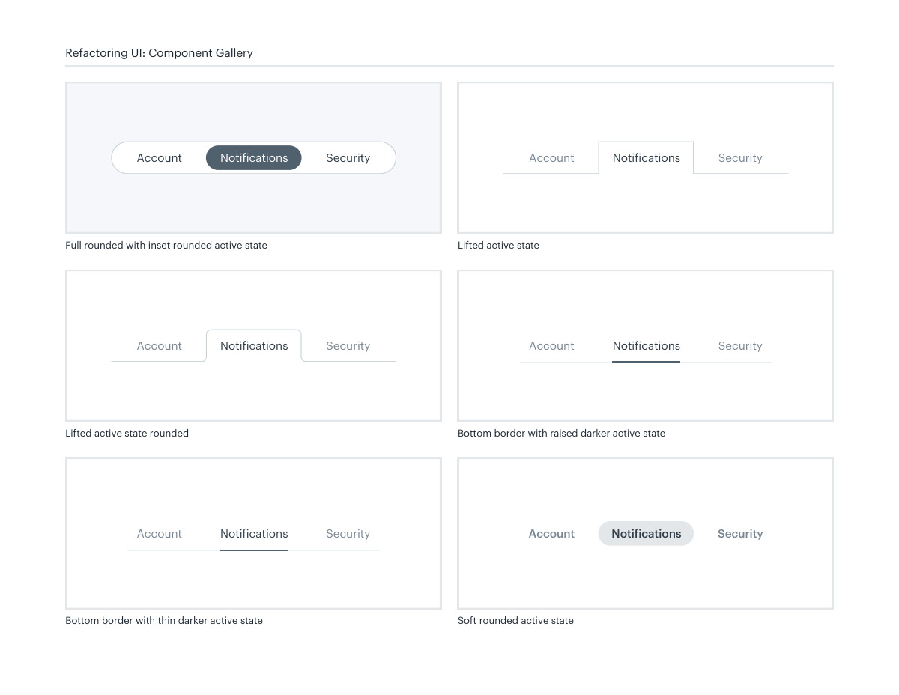
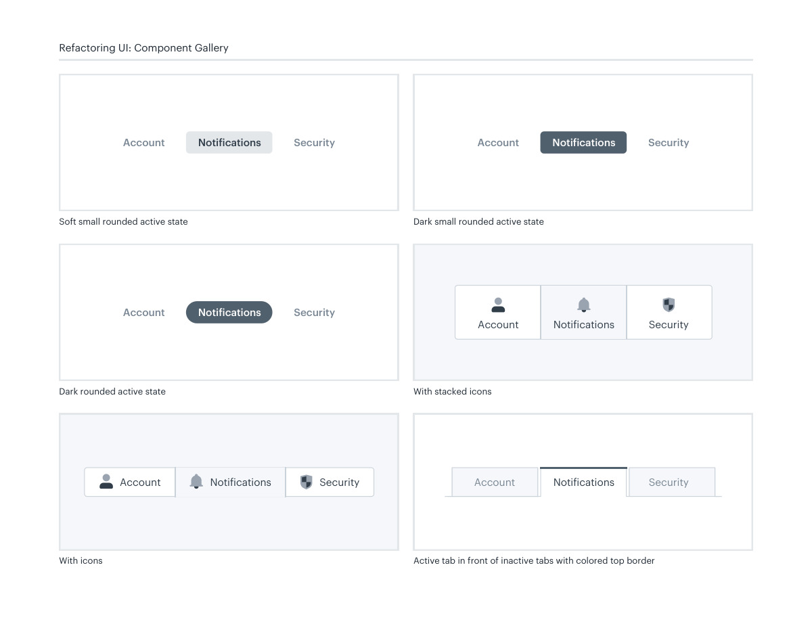
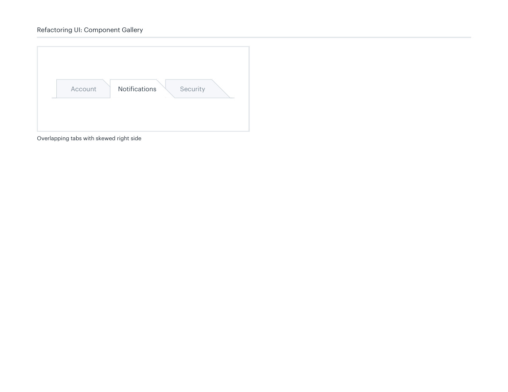

# Horizontal navigation states

## Apply this

- If horizontal choices lack a clear current item, choose one active-state treatment.
- Use a restrained fill, underline, or raised-tab pattern consistently.
- Distinguish navigation links from in-page tabs and verify focus and overflow behavior.

## Source

Source: `Component Gallery v1.1.0.pdf`, version 1.1.0, PDF pages 28–31.
Apply this is new guidance; the source blocks below preserve the supplied pypdf extraction verbatim.
Page images preserve the original visual content, including text absent from extraction.

## Source pages

### Source page 28



```text
Horizontal navigation
Refactoring UI: Component Gallery
Contained with light active state
Account Notifications Security
Full rounded
Account Notifications Security
Contained with dark active state
Account Notifications Security
With dark raised active state
Account Notifications Security
```

### Source page 29



```text
Refactoring UI: Component Gallery
Lifted active state
Account Notifications Security
Lifted active state rounded
Account Notifications Security
Bottom border with raised darker active state
Account Notifications Security
Bottom border with thin darker active state
Account Notifications Security
Soft rounded active state
Account Notifications Security
Full rounded with inset rounded active state
Account Notifications Security
```

### Source page 30



```text
Refactoring UI: Component Gallery
Active tab in front of inactive tabs with colored top border
Account Notifications Security
With icons
Account Notifications Security
Dark rounded active state
Account Notifications Security
Dark small rounded active state
Account Notifications Security
Soft small rounded active state
Account Notifications Security
With stacked icons
Account Notifications Security
```

### Source page 31



```text
Refactoring UI: Component Gallery
Overlapping tabs with skewed right side
Account SecurityNotifications
```
