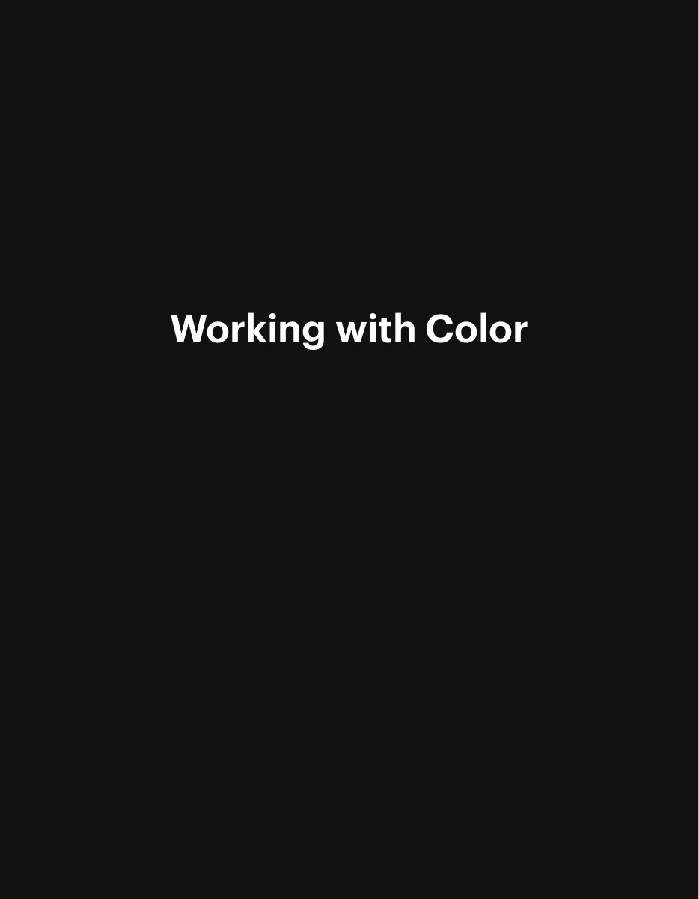
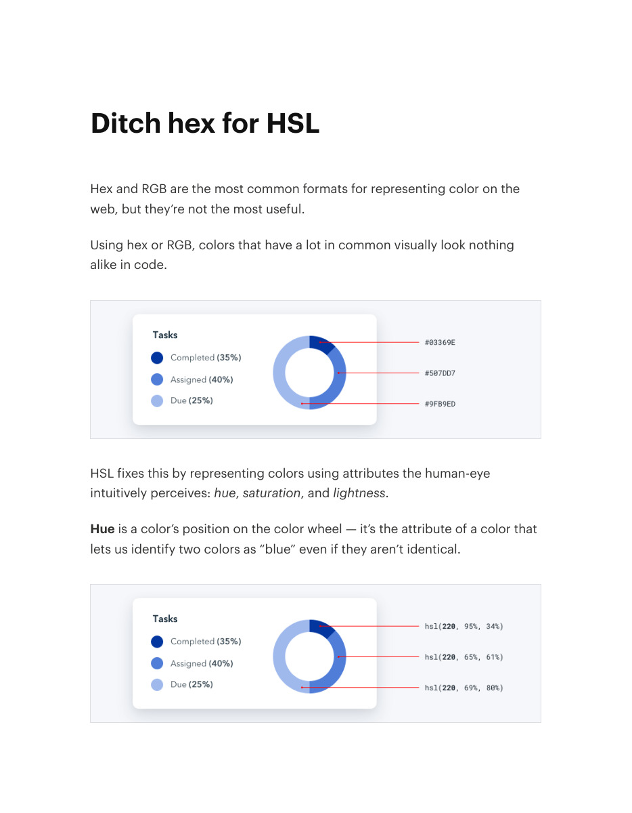
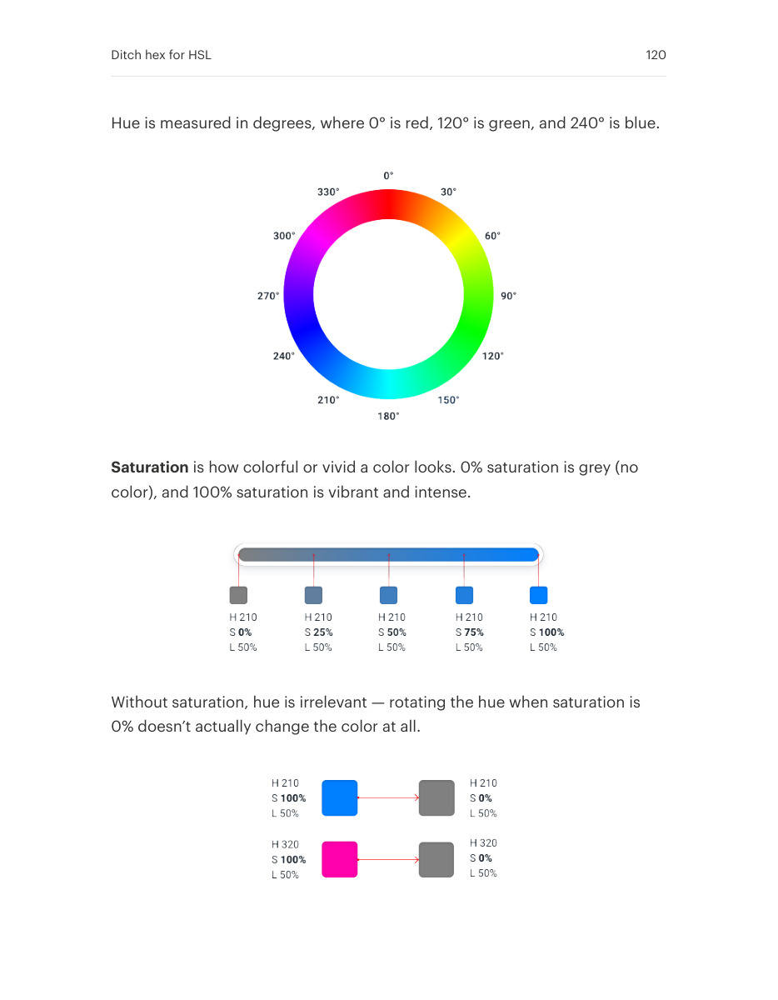
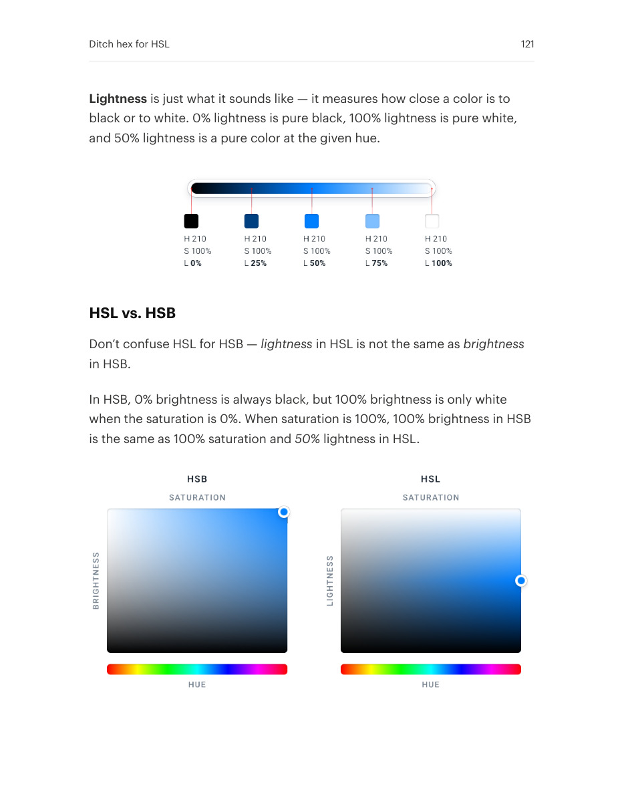
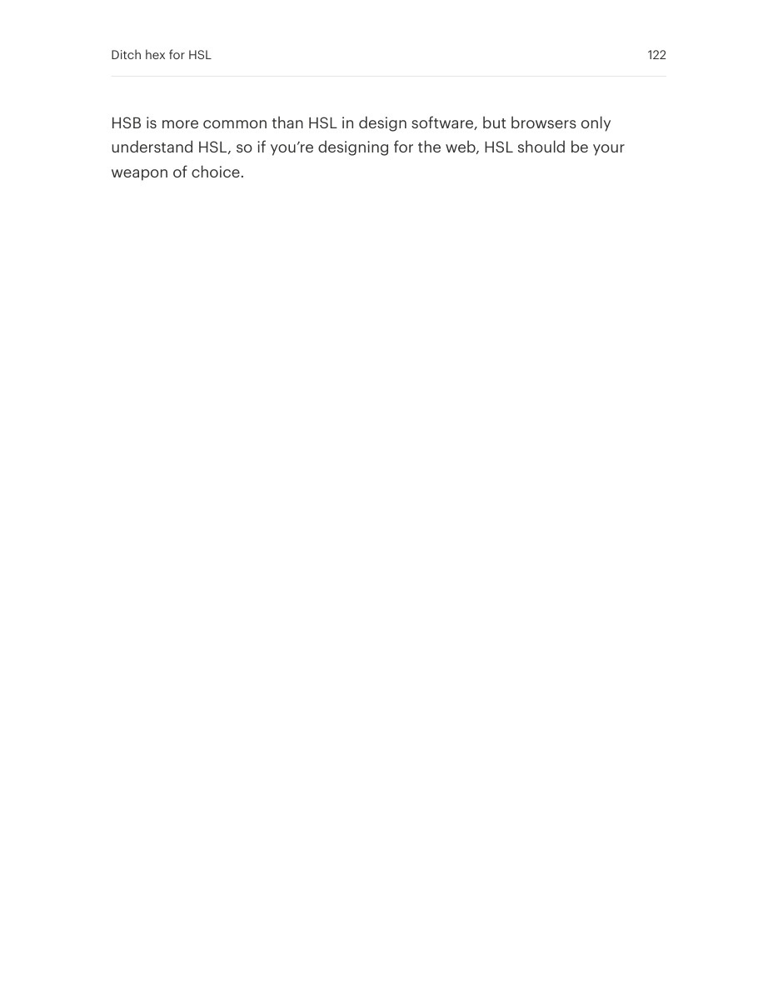

# Adjust colors using hue, saturation, and lightness

## Apply this

- If color changes feel opaque, work with HSL controls while exploring.
- Change hue, saturation, or lightness separately to understand the effect on the interface.
- Do not confuse HSL lightness with HSB brightness or with measured contrast; verify the rendered result.

## Source

Source: `Refactoring UI v1.0.2.pdf`, version 1.0.2, PDF pages 118–122.
Apply this is new guidance; the source blocks below preserve the supplied pypdf extraction verbatim.
Page images preserve the original visual content, including text absent from extraction.

### Source outline

- Working with Color (source page 118)
- Ditch hex for HSL (source page 119)
  - HSL vs. HSB (source page 121)

## Source pages

### Source page 118



```text
Working with Color
```

### Source page 119



```text
Ditch hex for HSL
Hex and RGB are the most common formats for representing color on the
web, but they’re not the most useful.
Using hex or RGB, colors that have a lot in common visually look nothing
alike in code.
HSL fixes this by representing colors using attributes the human-eye
intuitively perceives:hue,saturation, andlightness.
Hueis a color’s position on the color wheel — it’s the attribute of a color that
lets us identify two colors as “blue” even if they aren’t identical.

```

### Source page 120



```text
Hue is measured in degrees, where 0° is red, 120° is green, and 240° is blue.
Saturationis how colorful or vivid a color looks. 0% saturation is grey (no
color), and 100% saturation is vibrant and intense.
Without saturation, hue is irrelevant — rotating the hue when saturation is
0% doesn’t actually change the color at all.
Ditch hex for HSL 120
```

### Source page 121



```text
Lightnessis just what it sounds like — it measures how close a color is to
black or to white. 0% lightness is pure black, 100% lightness is pure white,
and 50% lightness is a pure color at the given hue.
HSL vs. HSB
Don’t confuse HSL for HSB —lightness in HSL is not the same asbrightness
in HSB.
In HSB, 0% brightness is always black, but 100% brightness is only white
when the saturation is 0%. When saturation is 100%, 100% brightness in HSB
is the same as 100% saturation and50% lightness in HSL.
Ditch hex for HSL 121
```

### Source page 122



```text
HSB is more common than HSL in design software, but browsers only
understand HSL, so if you’re designing for the web, HSL should be your
weapon of choice.
Ditch hex for HSL 122
```
