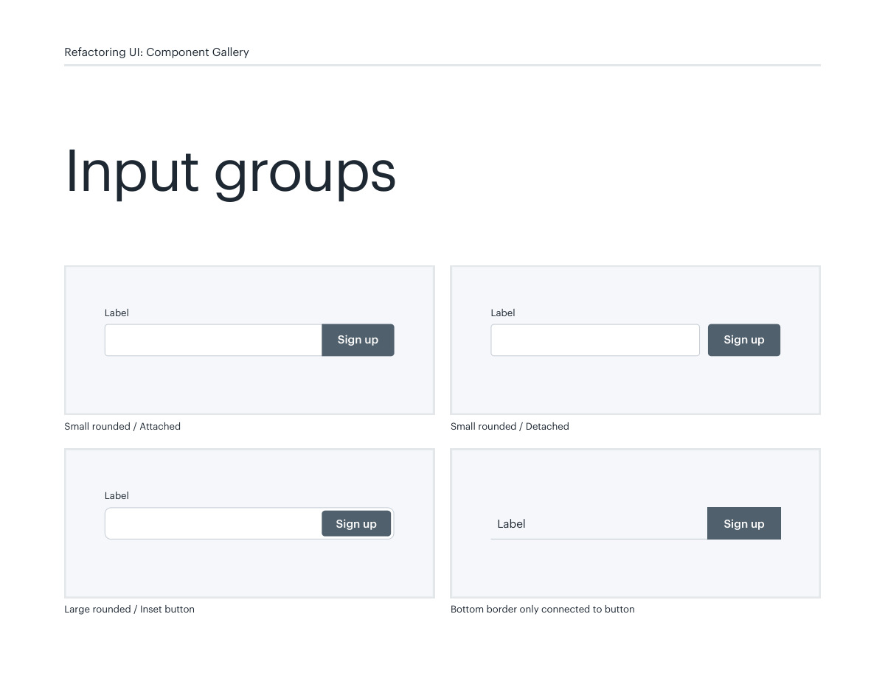
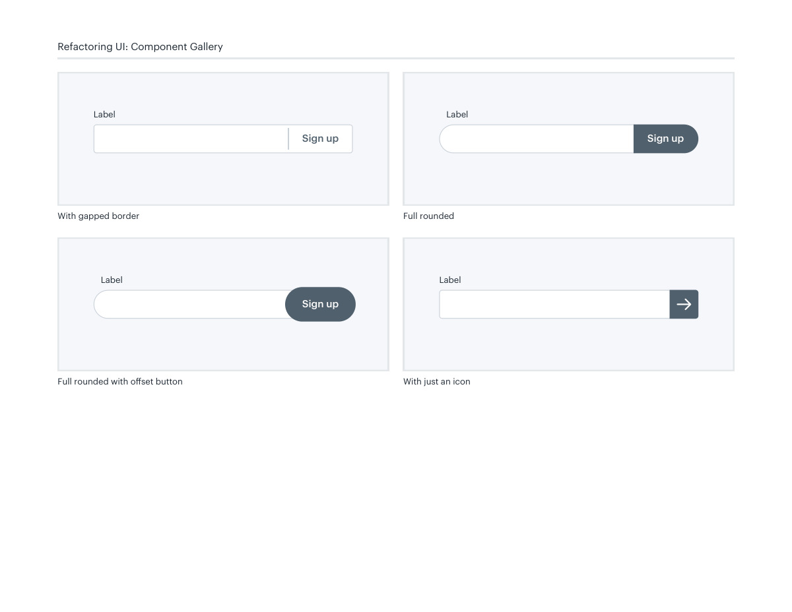

# Input and action groups

## Apply this

- If a field and its submit action feel unrelated, group them with shared alignment or a connected surface.
- Choose an attached or inset action treatment that suits the available width.
- Test long labels, narrow screens, and focus order; preserve each control’s accessible name.

## Source

Source: `Component Gallery v1.1.0.pdf`, version 1.1.0, PDF pages 10–11.
Apply this is new guidance; the source blocks below preserve the supplied pypdf extraction verbatim.
Page images preserve the original visual content, including text absent from extraction.

## Source pages

### Source page 10



```text
Input groups
Small rounded / Attached
Sign up
Label
Large rounded / Inset button
Sign up
Label
Bottom border only connected to button
Sign upLabel
Small rounded / Detached
Sign up
Label
Refactoring UI: Component Gallery
```

### Source page 11



```text
Full rounded with offset button
Sign up
Label
With just an icon
Label
With gapped border
Sign up
Label
Full rounded
Sign up
Label
Refactoring UI: Component Gallery
```
