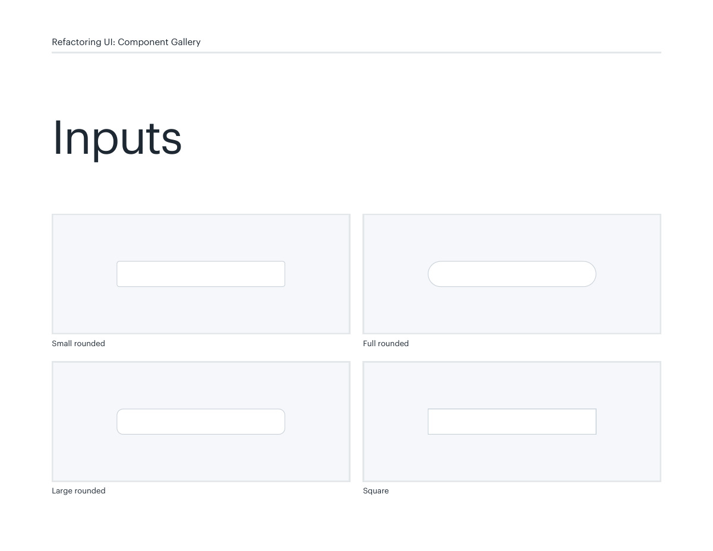
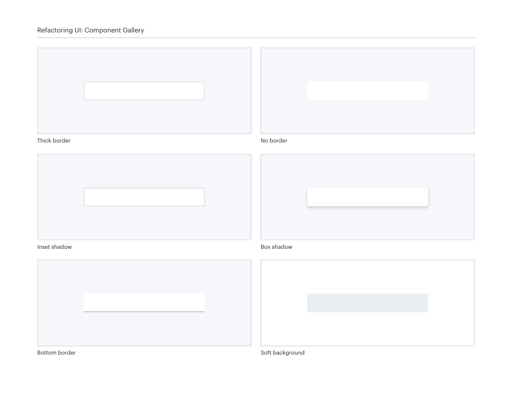
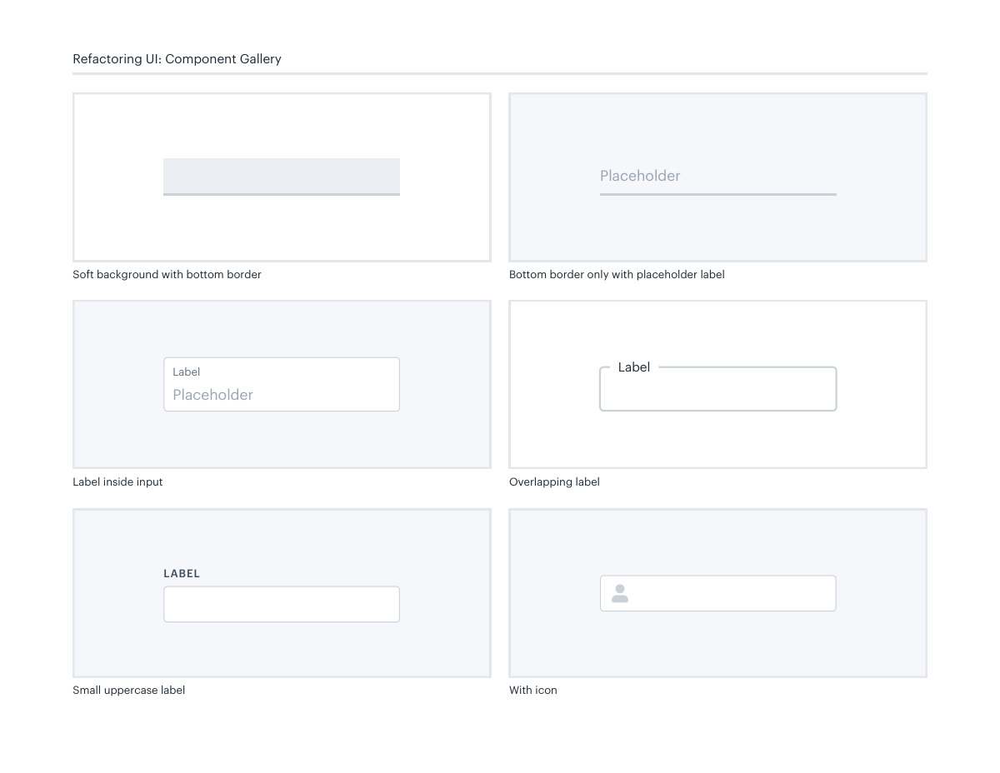
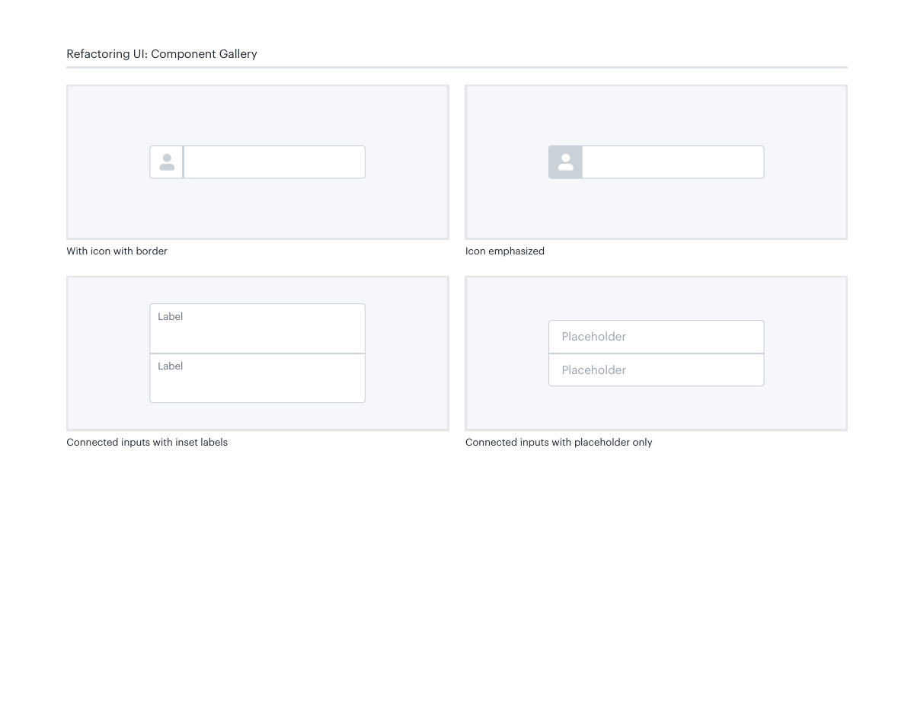

# Input surfaces and labels

## Apply this

- If fields are difficult to identify, choose a consistent input boundary and label placement.
- Compare border, soft-fill, inset, and floating-label treatments with real values.
- Keep persistent accessible labels and visible focus; placeholders are not a replacement for labels.

## Source

Source: `Component Gallery v1.1.0.pdf`, version 1.1.0, PDF pages 6–9.
Apply this is new guidance; the source blocks below preserve the supplied pypdf extraction verbatim.
Page images preserve the original visual content, including text absent from extraction.

## Source pages

### Source page 6



```text
Large rounded Square
Full rounded
Inputs
Small rounded
Refactoring UI: Component Gallery
```

### Source page 7



```text
Soft background
Refactoring UI: Component Gallery
Inset shadow
Thick border
Bottom border
No border
Box shadow
```

### Source page 8



```text
Soft background with bottom border
Placeholder
Bottom border only with placeholder label
Refactoring UI: Component Gallery
Label
Overlapping labelLabel inside input
Placeholder
Label
Small uppercase label
LABEL
With icon

```

### Source page 9



```text
Refactoring UI: Component Gallery
With icon with border 
Label
Label
Connected inputs with inset labels
Placeholder
Placeholder
Connected inputs with placeholder only
Icon emphasized

```
