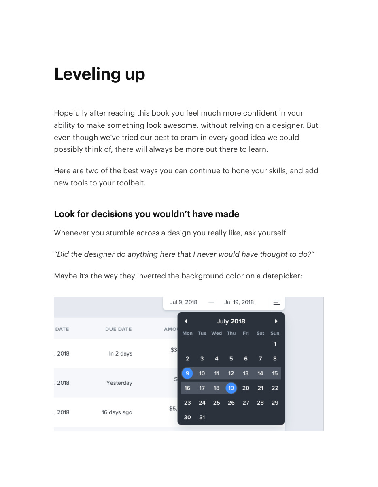

# Develop judgment by studying interfaces

## Apply this

- If your design decisions repeat by habit, inspect a strong interface for choices you would not have made.
- Rebuild a small example to understand its spacing, type, and hierarchy decisions.
- Transfer the reasoning, not an unrelated brand or layout; compare the result with your own task constraints.

## Source

Source: `Refactoring UI v1.0.2.pdf`, version 1.0.2, PDF pages 215–218.
Apply this is new guidance; the source blocks below preserve the supplied pypdf extraction verbatim.
Page images preserve the original visual content, including text absent from extraction.

### Source outline

- Leveling Up (source page 215)
- Leveling up (source page 216)
  - Look for decisions you wouldn’t have made (source page 216)
  - Rebuild your favorite interfaces (source page 217)

## Source pages

### Source page 215


```text
Leveling Up
```

### Source page 216



```text
Leveling up
Hopefully after reading this book you feel much more confident in your
ability to make something look awesome, without relying on a designer. But
even though we’ve tried our best to cram in every good idea we could
possibly think of, there will always be more out there to learn.
Here are two of the best ways you can continue to hone your skills, and add
new tools to your toolbelt.
Look for decisions you wouldn’t have made
Whenever you stumble across a design you really like, ask yourself:
“Did the designer do anything here that I never would have thought to do?”
Maybe it’s the way they inverted the background color on a datepicker:

```

### Source page 217


```text
…or the way they positioned a button within a text input instead of on the
outside:
…or something as simple as using two different font colors for a headline:
Paying attention to these sorts of unintuitive decisions is a great way to
discover new ideas that you can apply to your own designs.
Rebuild your favorite interfaces
The absolute best way to notice the little details that make a design look
Leveling up 217
```

### Source page 218


```text
really polished is to recreate that design from scratch,without peeking at the
developer tools.
When you’re trying to figure out why your version looks different than the
original, you’ll discover tricks like “reduce your line height for headings”,
“add letter-spacing to uppercase text”, or “combine multiple shadows” all on
your own.
By continually studying the work that inspires you with a careful eye, you’ll
be picking up design tricks for years to come.
— Adam Wathan & Steve Schoger
Leveling up 218
```
